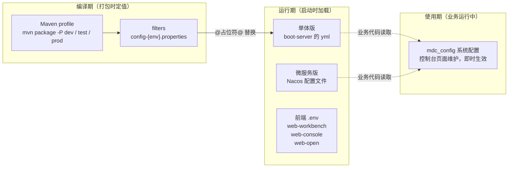

MDP 的配置分布在**编译期、运行期、使用期**三个阶段，覆盖后端、前端、单点登录客户端与开放平台网关。本文是「配置」板块的总览，帮您快速定位到要改的文件。

## 1. 配置体系全景

一句话理解：

- **编译期**：打包命令 `-P` 决定用哪份 filters 文件，把 yml 里的 `@占位符@` 替换成真实值——同一个 jar，不同环境连不同的 Nacos；
- **运行期**：单体版全部配置在本地 yml；微服务版托管在 Nacos 配置中心，本地 yml 只剩 Nacos 连接信息；
- **使用期**：`mdc_config` 表里的业务参数在控制台页面改，改完即时生效，无需重启。

## 2. 文档导读

按「我要改什么」找文档：

| 我想… | 看这篇 |
| ---- | ------ |
| 理解 `@config.nacos.ip@` 占位符 / 新增一套环境（如预发布） | [编译期配置（filters）](编译期配置filters.md) |
| 部署单体版，了解 yml 拆分与优先级 | [后端配置（单体版）](后端配置-单体版.md) |
| 部署微服务版，了解 Nacos 配置的拆分与加载顺序 | [后端配置（微服务版）](后端配置-微服务版.md) |
| 配置前端三个应用（.env、代理、架构模式切换） | [前端配置](前端配置.md) |
| 以客户端身份接入单点登录（ticket / OAuth2） | [单点登录客户端配置](单点登录客户端配置.md) |
| 配置开放平台网关（接口协议、上传限制） | [开放平台网关配置](开放平台网关配置.md) |
| 查某个配置项的含义、可选值、建议值、所在文件 | [重要配置项详解](重要配置项详解.md) |
| 在控制台页面改业务参数（密码策略、token 有效期） | [系统配置（mdc_config）](系统配置.md) |

## 3. 端口速查

本地开发环境的默认端口（生产按需修改）：

| 服务 | 端口 |
| ---- | ---- |
| web-workbench（前端·工作台） | 7700 |
| web-console（前端·控制台） | 7710 |
| web-open（前端·开发者平台） | 7720 |
| inner-gateway-server（内部网关，微服务版） | 23450 |
| console-server（控制台服务） | 23451 |
| open-server（开发者平台服务） | 23452 |
| workbench-server（工作台服务，含 SSO） | 23453 |
| api-server（开放接口服务） | 23454 |
| boot-server（单体版唯一后端） | 23455 |
| sop-gateway-server（开放平台网关） | 23456 |
