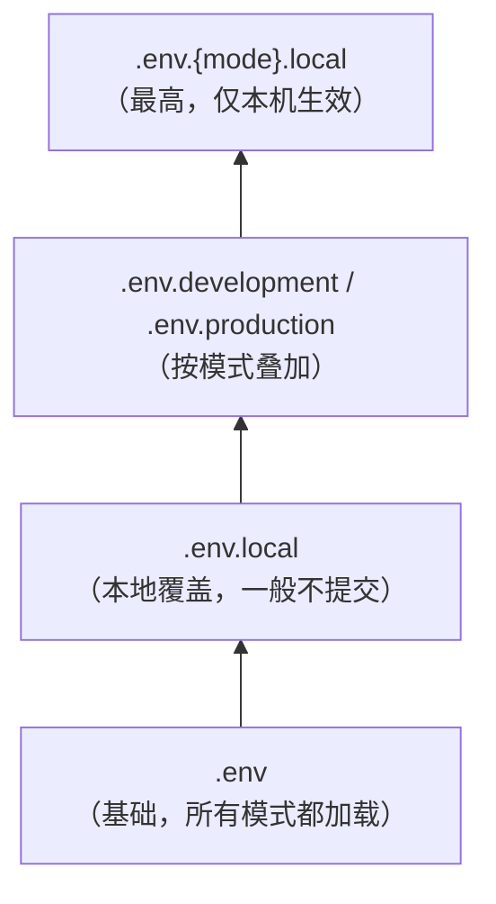

MDP 前端（`mdp-vben`）是 Vite + Vue3 的 monorepo，包含三个独立应用。本文介绍每个应用的配置文件、关键变量，以及与后端架构模式的联动。

## 1. 应用清单

| 应用 | 目录 | 开发端口 | 用途 |
| ---- | ---- | -------- | ---- |
| 工作台 | `apps/web-workbench` | 7700 | 统一登录页、工作台门户（`VITE_GLOB_APP_ID=1`） |
| 控制台 | `apps/web-console` | 7710 | 管理端（组织、用户、系统管理等）（`VITE_GLOB_APP_ID=2`） |
| 开发者平台 | `apps/web-open` | 7720 | 开放平台控制台（应用、秘钥、事件订阅等）（`VITE_GLOB_APP_ID=3`） |

三个应用的配置文件结构完全一致（`.env` + `.env.development` + `.env.production` + `vite.config.ts`），只是值不同。

## 2. 配置文件分层

```
apps/web-workbench/
├── .env                 # 全局基础配置：所有环境都会加载
├── .env.development     # 仅本地开发（pnpm dev）时叠加
├── .env.production     # 仅打包（pnpm build）时叠加
└── vite.config.ts      # 构建配置（一般无需改动）
```

加载与覆盖规则（Vite 标准，越靠后优先级越高，同名变量后者胜出）：



命令行注入的 `VITE_` 前缀变量优先级**高于以上所有文件**——Vite 的 `loadEnv` 会在合并完 env 文件后，再用 `process.env` 里的同名变量覆盖一遍。这正是 `pnpm dev:boot` / `dev:cloud` 不改文件就能切模式的原理。

## 3. 关键配置项

### 3.1 `.env`（所有环境生效）

| 变量 | 说明 | 示例 |
| ---- | ---- | ---- |
| VITE_APP_TITLE | 应用标题（浏览器标签页） | 主数据平台 / 控制台 / 开发者平台 |
| VITE_APP_NAMESPACE | 缓存、store 的命名空间前缀，多应用隔离 | mdp |
| VITE_GLOB_TOKEN_KEY | 请求头中携带 token 的 key | token |
| VITE_GLOB_APP_ID | 应用 ID | 1 / 2 / 3 |
| VITE_GLOB_APP_KEY | **客户端标识，必须与后端 `sa-token.sso-clients` 的 key 一致** | web-workbench / web-console / web-open |
| VITE_GLOB_MODE | **后端架构模式：boot（单体）/ cloud（微服务）** | boot |
| VITE_ROUTER_HISTORY | 路由模式 | hash |
| VITE_APP_STORE_SECURE_KEY | store 持久化加密密钥，**部署前务必替换** | （占位符） |
| VITE_GLOB_WORKBENCH_NAME | 单点登录平台系统名称（console/open 中跳转登录用） | 工作台 |
| VITE_GLOB_OPEN_PLATFORM_URL | 开发者中心项目地址（console 中跳转用） | http://localhost:7720 |

### 3.2 `.env.development`（仅本地开发）

| 变量 | 说明 |
| ---- | ---- |
| VITE_PORT | 本地开发端口（workbench 7700 / console 7710 / open 7720） |
| VITE_GLOB_API_URL | 接口地址前缀，固定 `/api` |
| VITE_PROXY | 开发代理规则（见 3.3） |
| VITE_NITRO_MOCK | 是否开启 Mock 服务 |
| VITE_DEVTOOLS | 是否开启 vue-devtools |

### 3.3 VITE_PROXY：开发代理的两种模式

以 `apps/web-workbench/.env.development:20` 为例（三个应用的这段规则**完全相同**，它们的 `.env.development` 里只有 `VITE_PORT` 一个键不同），`VITE_PROXY` 是一段 JSON，按 `VITE_GLOB_MODE` 分成两套：

```json
{
  "cloud": [{
    "proxyKey": "/api",
    "rewriteBefore": "/api",
    "rewriteAfter": "/api",
    "target": "http://localhost:23450"
  }],
  "boot": [{
    "proxyKey": "/api",
    "rewriteBefore": "/api/[A-Za-z0-9]+",
    "rewriteAfter": "",
    "target": "http://localhost:23455"
  }]
}
```

| 模式 | 目标 | 路径改写规则 | 说明 |
| ---- | ---- | ------------ | ---- |
| boot（单体） | `localhost:23455`（boot-server） | `/api/workbench/xxx` → `/xxx`（`/api` 与第一段服务名一起去掉） | 单体版一个进程承接全部请求，后端映射不含服务段 |
| cloud（微服务） | `localhost:23450`（inner-gateway） | `/api/workbench/xxx` 原样转发 | 服务段由网关消费：`context-path` 吃掉 `/api`，`StripPrefix=1` 吃掉 `/workbench` |

**前后端模式必须保持一致**：本地起单体版后端（boot-server）时，`VITE_GLOB_MODE=boot`；起微服务版（inner-gateway）时改为 `cloud`。切换有两种方式：

- 临时切换（推荐）：用 `pnpm dev:boot` / `pnpm dev:cloud`，脚本通过 `cross-env` 注入 `VITE_GLOB_MODE`，而 Vite 的 `loadEnv` 会用带 `VITE_` 前缀的 `process.env` 覆盖 env 文件的值，**不必改文件**；
- 改默认值：修改 `.env` 中的 `VITE_GLOB_MODE`（出厂为 `boot`），之后 `pnpm dev`、`pnpm dev:workbench` 等都按新模式启动。

两个模式的完整对照、启动命令与自检方法见[前端启动](../doc/start/前端启动.md)。

### 3.4 `.env.production`（打包）

| 变量 | 说明 |
| ---- | ---- |
| VITE_GLOB_API_URL | 接口地址前缀，生产部署时通常配合 nginx 反向代理保持 `/api` |
| VITE_COMPRESS | 打包压缩方式：none / gzip / brotli |
| VITE_PWA | 是否开启 PWA |
| VITE_ARCHIVER | 打包后是否生成 dist.zip |

::: warning 生产环境要自己复刻代理规则

`VITE_PROXY` 只作用于 Vite 开发服务器，打包后不生效，因此 `build:boot` 与 `build:cloud` 的产物功能等价。生产必须由 Nginx 接管 `/api`：

- **微服务版**：`/api` 原样反代到 inner-gateway（23450），服务段由网关消费；
- **单体版**：反代到 boot-server（23455）之前，要先像 dev 代理那样**剥掉 `/api` 和第一段服务名**，否则后端映射匹配不上、表现为接口全 404。

两段可用的 Nginx 示例见[前端启动 第六节](../doc/start/前端启动.md#六、生产打包)。
:::

## 4. 新增配置项的注意事项

- 变量必须以 `VITE_` 开头才会暴露给浏览器端代码（`import.meta.env.VITE_XXX`），否则只在构建脚本内可见；
- `VITE_GLOB_` 前缀的变量会附加到构建产物配置中，全局可用；
- 新增变量后注意**三个应用的 `.env` 都要同步**（如果它是公共变量），避免某个应用缺漏。

## 5. 常见问题

**Q1：登录报「非法 client」或单点登录失败？**

检查 `VITE_GLOB_APP_KEY` 是否与后端 `sa-token.sso-clients`（单体版在 `boot-server/application.yml`，微服务版在 Nacos `workbench-server.yml`）中的 key 完全一致。

**Q2：页面请求全部 404？**

模式不匹配：`VITE_GLOB_MODE=boot` 时后端必须是单体版、`cloud` 时必须是微服务版，且 `VITE_PROXY` 中对应模式的 target 端口与后端实际端口一致（boot-server 23455 / inner-gateway 23450）。

**Q3：三个应用怎么互相跳转？**

web-workbench 是统一登录入口；web-console和web-open 作为子应用对接到了 web-workbench 。
