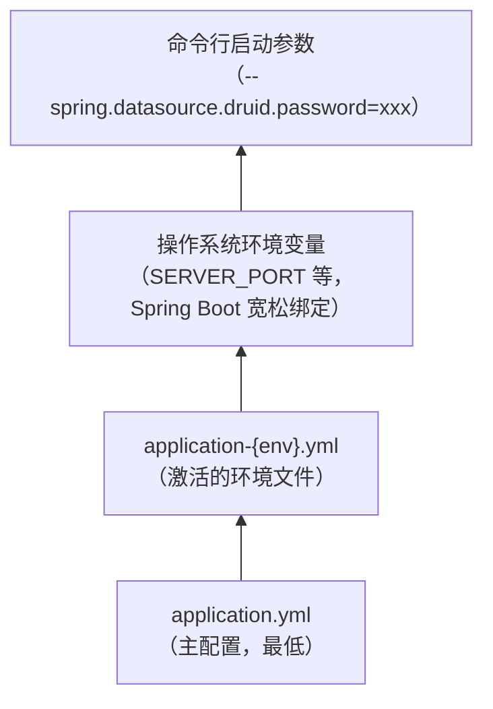

单体版（boot 模式）指通过 `mdp-apps/md-server/boot-server` 一个进程承载全部后端能力（工作台 + 控制台 + 开放平台）。本文介绍它的配置文件组成、拆分原则与优先级。

微服务版配置见[后端配置（微服务版）](后端配置-微服务版.md)；编译期占位符机制见[编译期配置（filters）](编译期配置filters.md)。

## 1. 配置文件组成

```
mdp-apps/md-server/boot-server/src/main/resources/
├── application.yml        # 主配置：全量配置（与环境无关的部分 + 开发环境默认值）
├── application-dev.yml    # 开发环境差异覆盖（仅 Redis、数据源）
├── application-test.yml   # 测试环境差异覆盖
└── application-prod.yml   # 生产环境差异覆盖
```

激活哪个环境由主文件中的 `spring.profiles.active: '@profile.active@'` 决定，该值在打包时由 Maven profile（`-P dev/test/prod`）写入，见[编译期配置（filters）](编译期配置filters.md)。

## 2. 文件拆分原则

| 文件 | 放什么 | 判断标准 |
| ---- | ------ | -------- |
| `application.yml` | 全量业务配置：`mdp.*`、`sa-token.*`、`mybatis-flex.*`、`springdoc.*`、`knife4j.*`、`dromara.x-file-storage`、`logging.*` 等 | **与环境无关**（或默认按开发环境取值） |
| `application-{env}.yml` | 仅放**随环境变化**的中间件连接：`spring.data.redis`、`spring.datasource.druid` | 换个环境部署，值一定会变的东西 |

这样拆的好处：新增环境时只复制一个很小的 env 文件、改连接信息即可，主配置不动，diff 审查也容易。

`application-dev.yml` 的全部内容只有两段：

```yaml
spring:
  data:
    redis:
      host: 127.0.0.1
      port: 16379
      password: '您的密码'
      database: 6
  datasource:
    druid:
      username: '您的账号'
      driverClassName: com.mysql.cj.jdbc.Driver
      password: '您的密码'
      url: jdbc:mysql://127.0.0.1:3306/mdp?serverTimezone=Asia/Shanghai&characterEncoding=utf8&useUnicode=true&useSSL=false&autoReconnect=true&zeroDateTimeBehavior=convertToNull&allowMultiQueries=true&nullCatalogMeansCurrent=true
```

## 3. 配置优先级与覆盖原则

Spring Boot 标准规则（优先级从高到低，**高优先级覆盖低优先级**）：



实际应用中的典型例子：

- 主文件中 `spring.data.redis.database: 6`，若 `application-prod.yml` 中写 `database: 5`，生产环境以 5 为准；
- 主文件中同样写了 redis / datasource（开发环境默认值），env 文件中的同名配置会覆盖它——这正是「env 文件只放差异」仍然生效的原因；
- 应急时可以用命令行参数临时覆盖任何配置，无需改文件：`java -jar boot-server.jar --server.port=23455`。

## 4. 单体版特征配置

以下配置项是理解单体版运行的钥匙，均位于 `application.yml`：

```yaml
mdp:
  system:
    # 架构模式：boot=单体，cloud=微服务。影响内部服务调用方式（本地调用 or RPC）
    mode: boot
  ignore:
    # 单体版在 boot-server 内直接完成 uri 鉴权
    authEnabled: true
    anyUser:
      ALL:
        - /**/anyUser/**
        - /**/sso/**          # SSO 单点登录接口免登录
        - /**/oauth2/**       # OAuth2 相关接口免登录

server:
  port: 23455                 # 单体版唯一后端端口

dubbo:
  enabled: false               # 单体版不需要 RPC，所有服务在同一个进程内

springdoc:
  group-configs:              # 单体版一个进程暴露三组接口文档
    - group: 'workbench'      # 工作台（包 top.mddata.workbench）
    - group: 'console'       # 控制台（包 top.mddata.console）
    - group: 'open'           # 开发者平台（包 top.mddata.open）

sa-token:
  sso-server:                 # 单体版同时是 SSO 服务端
    ticket-timeout: 300
  sso-client:                 # 也是默认 SSO 客户端（前端统一登录）
    serverUrl: http://localhost:${server.port}
    authUrl: 'http://localhost:7700/#/auth/login'
  sso-clients:                # 三个内置前端应用的客户端配置（web-workbench / web-console / web-open）
    web-workbench: { ... }
    web-console: { ... }
    web-open: { ... }
```

`sa-token.sso-clients` 是 MDP 对 sa-token 的增强（非官方功能），用于解决**一个后端对应多个前端应用**的问题：三个前端应用（工作台、控制台、开发者平台）各自持有独立的 client/secretKey，登录互不干扰。`VITE_GLOB_APP_KEY` 需与这里的 key 对应，详见[前端配置](前端配置.md)。

## 5. 各配置项详解

主配置文件中各配置项的含义、可选值、建议值，逐项整理在[重要配置项详解](重要配置项详解.md)，其中「所在位置」列标注了单体版对应的文件（基本都是 `boot-server/application.yml`，中间件连接在 `application-{env}.yml`）。

## 6. 常见问题

**Q1：改了 `application.yml` 不生效？**

先确认服务是重新打包启动还是热部署；再检查是否被 `application-{env}.yml` 或环境变量、命令行参数覆盖（启动日志会打印 `The following profiles are active`，可确认当前激活的环境）。

**Q2：想临时禁用验证码快速登录，要改哪里？**

`mdp.system.verifyCaptcha: false`（开发环境专用，生产保持 true）。也可以不改文件，直接用命令行参数覆盖：`java -jar boot-server.jar --mdp.system.verify-captcha=false`。
