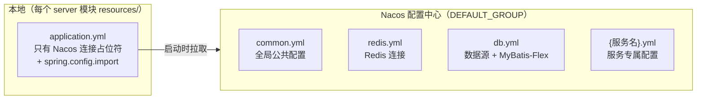
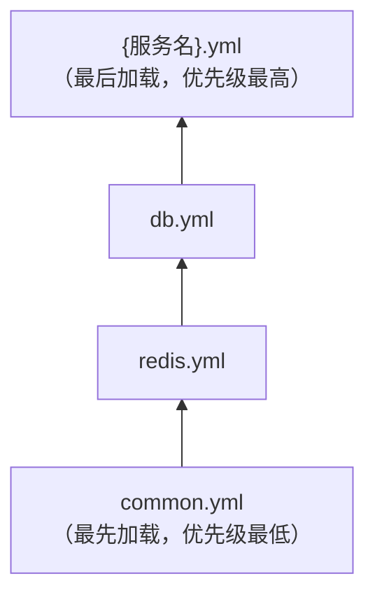

微服务版（cloud 模式）将后端拆分为多个独立服务（inner-gateway、console、open、workbench、api、sop-gateway），绝大多数配置托管在 **Nacos 配置中心**。本文介绍配置文件的拆分原则、加载顺序与覆盖优先级。

单体版配置见[后端配置（单体版）](后端配置-单体版.md)。

## 1. 配置文件的两层结构

微服务版的配置分布在两个地方：



以 `workbench-server` 的 `application.yml` 为例，本地文件只剩三部分：

```yaml
mdp:
  nacos:                          # Nacos 连接信息：环境变量优先，编译期占位符兜底
    ip: ${NACOS_IP:@config.nacos.ip@}
    port: ${NACOS_PORT:@config.nacos.port@}
    namespace: ${NACOS_NAMESPACE:@config.nacos.namespace@}
    username: ${NACOS_USERNAME:@config.nacos.username@}
    password: ${NACOS_PASSWORD:@config.nacos.password@}
    group: DEFAULT_GROUP

spring:
  application:
    name: '@project.artifactId@'
  profiles:
    active: '@profile.active@'
  config:
    import:                       # ← 关键：Nacos 配置的加载顺序
      - nacos:common.yml?group=${mdp.nacos.group}&refresh=true
      - nacos:redis.yml?group=${mdp.nacos.group}&refresh=true
      - nacos:db.yml?group=${mdp.nacos.group}&refresh=true
      - nacos:${spring.application.name}.yml?refresh=true
```

`@config.nacos.ip@` 等占位符来自编译期 filters 文件，详见[编译期配置（filters）](编译期配置filters.md)。

## 2. Nacos 配置文件的拆分原则

MDP 在 Nacos 的 `DEFAULT_GROUP` 中导出的配置文件（可在 `mdp/docs/nacos_config_export_*.zip` 中查看基准内容）：

| 文件 | 内容 | 拆分依据 |
| ---- | ---- | -------- |
| `common.yml` | 所有服务共用的公共配置：`mdp.system`、`mdp.echo`、`mdp.log`、`mdp.xss`、`mdp.captcha`、`mdp.msg`、`mdp.async`、`mdp.swagger`、`sa-token` 基础项、`spring` 公共项（mvc/freemarker/servlet）、`knife4j`、`springdoc`、`logging` | 全平台一致 |
| `db.yml` | `spring.datasource.druid`（数据源连接、连接池）、`mybatis-flex.*`、`mdp.database`（ID 生成策略等） | 所有连接数据库的服务共用 |
| `redis.yml` | `spring.data.redis`（连接信息）、`spring.cache`、`mdp.cache` | 所有连接 Redis 的服务共用 |
| `workbench-server.yml` | 端口 23453、`sa-token.sso-server` / `sso-client` / `sso-clients`（SSO 服务端在 workbench 服务中）、`springdoc.group-configs` | 仅该服务需要 |
| `console-server.yml` | 端口 23451、`mdp.file`、`dromara.x-file-storage`（文件存储在 console 服务中）、`sms`、`springdoc` 分组 | 仅该服务需要 |
| `open-server.yml` | 端口 23452、`springdoc` 分组 | 仅该服务需要 |
| `api-server.yml` | 端口 23454、`dromara.x-file-storage`、`dubbo` 配置（对外接口走 Dubbo 提供给网关调用） | 仅该服务需要 |
| `inner-gateway-server.yml` | 端口 23450、路由规则（`spring.cloud.gateway.routes`）、`mdp.ignore`、`mdp.echo/log` 关闭项 | 仅网关需要 |

**拆分原则总结**：按「变化频率」和「影响范围」两个维度拆——全平台一致的进 `common.yml`，按中间件维度复用的进 `db.yml` / `redis.yml`，服务个性化的留在 `{服务名}.yml`。服务自身的 yml 中**只放差异**，与 common 重复的项可以不写。

## 3. 加载顺序与覆盖优先级

`spring.config.import` 中**列表靠后的文件优先级更高**（后加载覆盖先加载）：



例如：`common.yml` 中定义了 `sa-token.timeout: 2592000`，而 `workbench-server.yml` 中也定义了 `sa-token.timeout`，则 workbench 服务以自己的为准，其他服务仍用 common 中的值。

这与单体版的规则本质相同：**越「个性化」的配置优先级越高**。

另外，`refresh=true` 表示该文件支持 Nacos **动态刷新**——修改 Nacos 上的配置并发布后，对应 `@RefreshScope` 标注的 Bean 会自动更新，**无需重启服务**（如 `SystemProperties`、`MsgProperties`）。

## 4. 微服务版特征配置

与单体版的差异点：

| 配置项 | 单体版 | 微服务版 | 所在位置 |
| ------ | ------ | -------- | -------- |
| `mdp.system.mode` | `boot` | `cloud` | Nacos `common.yml` |
| `dubbo.enabled` | `false` | `true`（api-server、sop-gateway） | Nacos `api-server.yml` |
| 端口 | 23455 一个 | inner-gateway 23450 / console 23451 / open 23452 / workbench 23453 / api 23454 / sop-gateway 23456 | 各服务 yml |
| uri 鉴权 | `mdp.ignore.authEnabled: true`（boot-server 内校验） | inner-gateway 统一鉴权，后端服务 `authEnabled: false` | Nacos `inner-gateway-server.yml` |
| SSO 服务端 | boot-server 内 | workbench-server | Nacos `workbench-server.yml` |
| 接口文档分组 | 一个进程三组 | 每个服务自己的 `springdoc.group-configs` | 各服务 yml |

### 4.1 inner-gateway 路由规则

`inner-gateway-server.yml`（Nacos）中维护服务路由，**新增一个后端服务时需要在这里追加路由**：

```yaml
spring:
  cloud:
    gateway:
      server:
        webflux:
          routes:
            - id: workbench
              uri: lb://workbench-server     # lb:// + Nacos 注册的服务名
              predicates:
                - Path=/workbench/**
              filters:
                - StripPrefix=1               # 去掉第一段前缀再转发
```

同时网关的 `context-path: /api`，所以前端访问路径为 `/api/workbench/xxx`。

## 5. 常见问题

**Q1：修改了 Nacos 上的配置为什么不生效？**

确认该配置所在的 Bean 是否标注了 `@RefreshScope`（如 `SystemProperties`、`MsgProperties` 支持，`DatabaseProperties` 等在启动期固定的不支持）；不支持动态刷新的配置需要重启服务。

**Q2：服务启动报「连接不上 Nacos」？**

按顺序排查：① 启动日志中打印的 `mdp.nacos.*` 实际值（是环境变量覆盖了，还是 filters 编译期的值）；② 命名空间是否正确（namespace 是 ID 不是名称）；③ Nacos 网络连通性。

**Q3：各服务的配置文件在 Nacos 上如何导入/导出？**

Nacos 控制台 → 配置管理 → 配置列表 → 勾选导出（或导入 zip）。`mdp/docs/nacos_config_export_*.zip` 即是一次导出的基准配置，可用于新环境初始化。

**Q4：本地想单独调试某个服务，不想连远程 Nacos？**

`config.import` 的 nacos 项支持临时禁用：启动参数加 `-Dspring.cloud.nacos.config.enabled=false`，并把需要的配置写进本地 `application.yml`（或激活本地 profile）。
