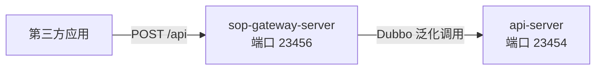

开放平台网关（`sop-gateway-server`）是对外提供开放接口的唯一入口：第三方应用的所有请求（[接口调用](../integration/接口调用.md)）都打到它的 `/api` 路径上，由它完成验签、token 校验后转发给 api-server。本文介绍它的专属配置。



## 1. 配置文件

```
mdp-apps/md-gateway/sop-gateway-server/src/main/resources/
├── application.yml        # 主配置
├── application-dev.yml    # 开发环境覆盖
├── application-test.yml   # 测试环境覆盖
├── application-prod.yml   # 生产环境覆盖
├── banner.txt             # 启动横幅
└── i18n/                  # 网关错误提示国际化文案
```

与单体版相同的机制：`application-{env}.yml` 覆盖主文件中的中间件连接（Redis / 数据源），激活环境由编译期 `@profile.active@` 决定，详见[编译期配置（filters）](编译期配置filters.md)。

## 2. 核心配置项

### 2.1 接口入口（mdp.gateway）

```yaml
mdp:
  gateway:
    path: /api        # 接口请求入口前缀（第三方应用请求提交地址）
    rest: /rest       # RESTful 风格接口请求入口前缀
    serialize:
      date-format: yyyy-MM-dd HH:mm:ss   # 响应中日期的序列化格式
```

### 2.2 请求协议参数（mdp.api）

```yaml
mdp:
  api:
    app-key-name: appKey           # 应用ID 参数名
    api-name: method                # 接口名 参数名
    version-name: version           # 接口版本 参数名
    format-name: format             # 响应格式 参数名
    charset-name: charset           # 编码 参数名
    sign-type-name: signType        # 签名算法 参数名
    sign-name: sign                  # 签名 参数名
    timestamp-name: timestamp        # 请求时间 参数名
    notify-url-name: notifyUrl       # 回调地址 参数名
    access-token-name: accessToken   # 访问令牌 参数名
    biz-content-name: bizContent      # 业务参数 参数名
    timeout-seconds: 300              # 请求有效时间（秒），timestamp 与平台时间差超过该值拒绝
    timestamp-pattern: yyyy-MM-dd HH:mm:ss   # timestamp 格式
    zone-id: Asia/Shanghai            # 校验时间戳使用的时区
```

这一段定义了开放接口的**协议参数名**（与[接口调用](../integration/接口调用.md)中第三方传参一一对应）。除非平台级协议变更，**不建议修改**——改了参数名会导致所有已接入应用的请求解析失败。

`timeout-seconds` 是防重放的窗口期：第三方服务器时间与平台时间差超过该秒数，请求即被拒绝（错误码 `ISV_INVALID_TIMESTAMP`）。第三方接入时若报请求超时，优先校准服务器时间。

### 2.3 上传大小（mdp.upload 与 spring.servlet.multipart 的联动）

```yaml
mdp:
  upload:
    one-file-max-size: 10MB    # 单文件最大值
    total-file-max-size: 50MB   # 单次请求总大小限制

spring:
  servlet:
    multipart:
      max-file-size: 60MB        # 必须大于 mdp.upload.one-file-max-size
      max-request-size: 200MB    # 必须大于 mdp.upload.total-file-max-size
                                  #   且大于 dubbo.protocol.payload
```

三层限制是**嵌套关系**，配置时必须保证：业务限制（`mdp.upload`）< 容器限制（`spring.servlet.multipart`）< RPC 载荷限制（`dubbo.protocol.payload`，默认 8MB，需要在 Dubbo 侧同步放大）。否则文件会被容器或 RPC 层先行拒绝，报出的错误信息对用户不友好。

### 2.4 Dubbo 与注册中心

网关通过 Dubbo 泛化调用 api-server 中的业务方法，`dubbo.consumer.timeout: 30000`（全局 30 秒）、`retries: 0`（关闭重试，防止业务重复执行）。

注册中心按 Maven profile 区分（`sop-gateway-server/pom.xml`）：

| profile | 注册中心 | 说明 |
| ------- | -------- | ---- |
| dev（默认） | zookeeper | 本地开发 |
| test / prod | nacos | 使用 filters 中的 `config.nacos.*` 连接 |

### 2.5 其他

- 网关自身也连接数据库与 Redis（读取路由配置、应用秘钥、token 等），数据源配置在 `application-{env}.yml`；
- `i18n/` 目录存放各错误码的国际化文案，新增错误提示语言时在此追加；
- 网关**不做** uri 权限鉴权（`mdp.ignore.authEnabled` 不适用），权限模型是「应用 + 接口授权」，由开放平台的秘钥与授权数据决定。

## 3. 常见问题

**Q1：网关和应用服务（api-server）的端口关系？**

sop-gateway-server 端口 23456 是第三方唯一可访问的入口；api-server 端口 23454 仅供网关通过 Dubbo 泛化调用，不应暴露公网。微服务版中还叠加了 inner-gateway（23450，内部前端用网关），两者职责不同，注意区分。

**Q2：调大上传限制后仍然上传失败？**

按嵌套关系逐层检查：`mdp.upload` → `spring.servlet.multipart` → `dubbo.protocol.payload`，三层都要大于等于业务需要的值；修改 dubbo payload 后 api-server 侧也要同步。

**Q3：接口文档在哪看？**

开发者可在平台「开发者中心」查看接口文档（`method` 清单），网关自身不提供 swagger 页面（它只承接 `/api` 协议请求）。
