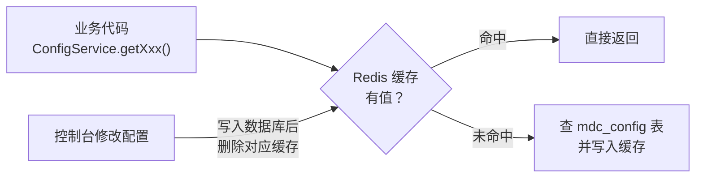

除了 yml / Nacos 配置文件，MDP 还有一套**数据库级**的运行期配置：`mdc_config` 表（系统配置）。它面向运维和管理员，在**控制台页面**维护，修改后**近实时生效**（无需重启服务）。

> 文档可能更新不及时导致与数据库中数据不一致，请以数据库存储数据为准。

与 yml 配置的分工：

| 维度 | yml / Nacos 配置 | mdc_config 系统配置 |
| ---- | ---------------- | ------------------- |
| 修改方式 | 改文件、发布配置中心 | 控制台页面直接改 |
| 生效方式 | 重启 / @RefreshScope 刷新 | 写库后清缓存，立即生效 |
| 面向人群 | 部署运维 | 业务管理员 |
| 典型内容 | 中间件连接、技术参数 | 密码策略、token 有效期等业务参数 |

## 1. 表结构

```sql
CREATE TABLE `mdc_config` (
  `id`           bigint NOT NULL COMMENT '参数ID',
  `config_group` varchar(100)  DEFAULT NULL COMMENT '参数分组',
  `uniq_key`     varchar(255)  NOT NULL COMMENT '参数标识',
  `name`         varchar(255)  NOT NULL COMMENT '参数名称',
  `value`        varchar(5120) NOT NULL COMMENT '参数值',
  `data_type`    char(1)       NOT NULL DEFAULT '1' COMMENT '数据类型 [1-字符串 2-整型 3-布尔]',
  `state`        bit(1)        DEFAULT b'1' COMMENT '状态 [1-启用 0-禁用]',
  `remark`       varchar(255)  DEFAULT NULL COMMENT '备注',
  `org_id`       bigint        DEFAULT NULL COMMENT '当前机构id',
  -- 审计字段 created_at/created_by/updated_at/updated_by/deleted_at/deleted_by 略
  UNIQUE KEY `uk_org_key` ((ifnull(`org_id`,0)), `uniq_key`, `deleted_at`)
) COMMENT='系统配置';
```

关键设计：

- **`uniq_key` 是代码读取的键**（不是 `name`），全局唯一性由「`org_id` + `uniq_key`」联合保证；
- **`org_id` 支持组织级配置**：为空表示全局默认；某组织设置了同 `uniq_key` 的配置时，该组织范围内优先取自己的值；
- **逻辑删除**：`deleted_at` 为删除标识（时间戳），删除后唯一约束自动释放，可新建同 key 配置。

## 2. 内置参数清单

MDP 出库自带的内置参数（`remark` 标注「内置参数，请勿删除」的项被代码依赖，**删除会导致功能异常**）：

### 2.1 system 组 —— 安全与账号策略

| uniq_key | 名称 | 默认值 | 说明 |
| -------- | ---- | ------ | ---- |
| LOGIN_CAPTCHA_ENABLED | 账号密码登录时验证码是否启用 | true | 关闭后登录不再校验图形验证码 |
| PASSWORD_EXPIRE_TIME | 密码有效期 | 3M | 支持单位：m 分钟 / h 小时 / d 天 / w 周 / M 月 / y 年 |
| PASSWORD_EXPIRE_NOT_ALLOW_LOGIN | 密码过期后是否禁止登录 | false | true 时密码过期的用户无法登录 |
| PASSWORD_ERROR_LOCK_ACCOUNT | 密码错误几次后锁定账号 | 5 | |
| PASSWORD_ERROR_LOCK_USER_TIME | 密码错误锁定用户时间 | 0 | 0 表示今天结束；也支持 1m / 1h / 4d / 2w / 3M / 5y |
| NOT_ALLOW_WRITE | 是否禁止新增修改数据 | false | **演示环境专用**，true 后平台只读 |
| BUILT_IN_DEVELOPER | 内置开发者公司ID | （系统分配） | 内置数据，请勿删除 |

### 2.2 open 组 —— 开放平台策略

| uniq_key | 名称 | 默认值 | 说明 |
| -------- | ---- | ------ | ---- |
| AppAccessTokenTimeout | Access-Token 有效期 | 7200 | 单位秒，开放接口访问令牌有效期 |
| AppRefreshTokenTimeout | Refresh-Token 有效期 | 2592000 | 单位秒 |
| AppClientTokenTimeout | Client-Token 有效期 | 7200 | 单位秒 |
| AppLowerClientTokenTimeout | Lower-Client-Token 有效期 | 7200 | 单位秒 |
| ApplicationNewRefresh | Refresh-Token 刷新策略 | false | true=每次刷新生成新 RefreshToken，false=延用旧的 |
| TornaServerAddr | Torna 服务器地址 | - | 【文档管理】界面同步第三方文档用，以 `/api` 结尾 |

### 2.3 message 组 —— 消息

| uniq_key | 名称 | 默认值 | 说明 |
| -------- | ---- | ------ | ---- |
| NOTICE | 站内信消息模板标识 | NOTICE | 值为 `mdc_msg_template` 表中 msgType 为站内信的 key，系统内置请勿删除 |

## 3. 如何维护

### 3.1 页面入口

控制台（web-console）→【系统管理】→【系统配置】（后端接口 `/system/config`，`ConfigController`）。

### 3.2 新增一条配置

1. 页面点击新增，填写：参数分组、**参数标识（uniq_key）**、参数名称、参数值、数据类型（字符串 / 整型 / 布尔）、状态；
2. 同一 `uniq_key` 在同一组织范围内只能存在一条（后端会校验重复）；
3. 保存后立即生效。

业务代码中的读取方式（`ConfigService`，console-service 提供）：

```java
// 按类型读取，第二个参数是读取不到时的默认值
Boolean enabled = configService.getBoolean("LOGIN_CAPTCHA_ENABLED", true);
Integer times   = configService.getInteger("PASSWORD_ERROR_LOCK_ACCOUNT", 5);
Long timeout    = configService.getLong("AppAccessTokenTimeout", 7200L);
String addr     = configService.getString("TornaServerAddr", "");
```

二次开发时如需新增自己的系统配置：**先和平台约定 uniq_key → 在页面新增 → 代码用 `ConfigService` 读取**，不要在代码中硬编码业务参数。

### 3.3 生效机制

读取链路带 Redis 缓存（按 `uniq_key` 缓存配置对象）：



因此：**修改保存后立即生效**（下一次读取会重新查库），无需重启服务。

### 3.4 组织级配置

在参数列表中可为某个组织单独配置同名 `uniq_key` 的值（`org_id` 非空），该组织范围内优先生效，其他组织仍用全局值。典型用法：某个演示组织单独开启 `NOT_ALLOW_WRITE=true`。

## 4. 常见问题

**Q1：改了参数没生效？**

确认参数 `state` 为启用状态；确认改的是正确组织下的配置（组织级会遮蔽全局值）；极少数情况下 Redis 缓存异常时，重新保存一次（触发缓存删除）即可。

**Q2：误删了内置参数怎么办？**

参照[第 2 节](#_2-内置参数清单)的清单重新插入同名 `uniq_key` 的记录，或从 `mdp/docs/mdp.sql` 中找到对应 `INSERT` 语句执行恢复。删除「请勿删除」标注的参数会导致相关功能（如登录验证码、密码策略）异常。

**Q3：参数值支持哪些类型？**

`data_type` 决定：1-字符串（最大 5120 字符）、2-整型、3-布尔（true/false）。代码读取时用对应类型的 `getXxx` 方法，类型不匹配时会按配置的 `data_type` 转换。

**Q4：和 Nacos 上的配置有什么区别？**

Nacos 管技术侧（连接、中间件、框架参数），改完可能需要重启；`mdc_config` 管业务侧（策略、阈值、开关），改完即时生效。判断一个参数在哪：需要管理员在页面上调的放 `mdc_config`，部署时定的放配置文件。
