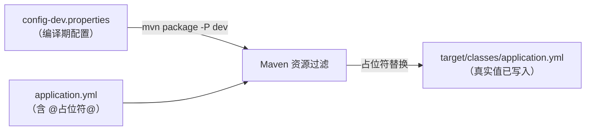

MDP 后端的配置分为**编译期**和**运行期**两个阶段。本文介绍编译期配置：`mdp-apps/src/main/filters` 目录下的 properties 文件，以及它在打包时如何把 yml 中的占位符替换成真实值。

为什么同一份代码、同一条打包命令，打出来的 jar 在开发环境连开发环境的 Nacos，在生产环境连生产的 Nacos？答案就在这一层：**Nacos 地址不是写在 yml 里的，而是打包时根据环境注入的**。

## 1. 它解决什么问题

yml 配置文件中不允许出现敏感信息（Nacos 地址、账号密码），也不希望在打包时手工修改 yml。MDP 采用 Maven 的 **Resource Filter（资源过滤）** 机制：



编译后的配置文件中，所有 `@xxx@` 占位符都会被 filters 文件中的同名配置替换，替换发生在 `target/classes` 中，**源码文件保持不变**。

## 2. 文件清单

```
mdp-apps/src/main/filters/
├── README.md               # 机制说明（英文注释）
├── config-dev.properties   # 开发环境
├── config-test.properties  # 测试环境
└── config-prod.properties   # 生产环境
```

三个文件包含的配置项完全相同，值随环境不同：

| 配置项 | 说明 |
| ------ | ---- |
| config.nacos.ip | Nacos 服务器地址 |
| config.nacos.port | Nacos 端口 |
| config.nacos.namespace | 命名空间 ID（用于隔离不同项目的配置，避免冲突） |
| config.nacos.username | Nacos 用户名 |
| config.nacos.password | Nacos 密码 |
| config.sentinel.dashboard | Sentinel 控制台地址 |
| config.logging.file.path | 日志存储路径（单体版和微服务版共用） |

> 上述配置项在**单体版和微服务版都会使用**。单体版（boot-server）用它们连接注册中心；微服务版各服务用它们连接 Nacos 配置中心与注册中心。

## 3. 哪些配置适合放在 filters 中

上面 7 个配置项不是随意挑的，它们共同满足一个条件：**这个 jar 要连哪套基础设施**。判断一条配置该不该进 filters，可以用下面三个问题筛：

| 判断标准 | 为什么 | 例子 |
| -------- | ------ | ---- |
| ① 随环境变化 | 同一份代码要在 dev/test/prod 跑，这类值每个环境都不同 | Nacos 地址、命名空间、Sentinel 控制台地址 |
| ② 启动早期就必须知道 | 微服务版要先连上 Nacos 才能拉取其余配置，这个"地址+账号"没法再靠 Nacos 下发——只能编译期写进 jar 或用环境变量注入 | `config.nacos.*` |
| ③ 多个项目都会使用的本地配置项 | 微服务项目中每个项目都会使用的全局配置单独写在各自服务的application.yml维护起来很麻烦 | `config.nacos.*` |

**三条中命中的越多，越适合放 filters**；三条全不命中的配置，说明它放错了地方，见下表：

| 配置类型 | 应该放在哪 | 原因 |
| -------- | ---------- | ---- |
| 与环境无关、全平台一致的框架参数（`mdp.echo.max-depth` 等） | `application.yml` / Nacos `common.yml` | 不需要按环境注入 |
| 随环境变的中间件连接（MySQL、Redis） | `application-{env}.yml`（单体）/ Nacos `db.yml`、`redis.yml`（微服务） | 启动后才加载，可走配置中心 |
| 业务策略参数（密码有效期、token 超时） | `mdc_config` 系统配置 | 管理员要能在页面上随时改，而 filters 的值打包后就固化在 jar 里了 |
| 随时可能调整、需要不发版生效的值 | Nacos 配置中心（`refresh=true`） | 同上 |

> 一句话原则：**filters 管「连到哪」，yml/Nacos 管「怎么跑」，mdc_config 管「业务规则」。** filters 的值编译后就写死在 jar 里，改一次要重新打包，所以只放那些"一个环境一个值、定下来就不轻易变"的基础设施接入信息。

## 4. 占位符如何被引用

### 4.1 server 模块的 pom 声明 filter

每个可启动的 server 模块（boot-server、worker-server、api-server、workbench-server、console-server、open-server、inner-gateway-server、sop-gateway-server）的 pom 中都有相同的一段：

```xml
<build>
    <filters>
        <!-- 根据 -P 参数选择 dev/test/prod 对应的 filters 文件 -->
        <filter>../../src/main/filters/config-${profile.active}.properties</filter>
    </filters>
    <resources>
        <resource>
            <directory>src/main/resources</directory>
            <includes>
                <include>**/*</include>
            </includes>
            <!-- 开启资源过滤，@xxx@ 占位符才会被替换 -->
            <filtering>true</filtering>
        </resource>
    </resources>
</build>
```

关键点：filter 文件名中的 `${profile.active}` 是动态的，由 Maven profile 决定，因此**新增环境时不需要改任何 server 模块的 pom**。

### 4.2 yml 中使用占位符

以微服务版 `workbench-server` 的 `application.yml` 为例：

```yaml
mdp:
  nacos:
    ip: ${NACOS_IP:@config.nacos.ip@}
    port: ${NACOS_PORT:@config.nacos.port@}
    namespace: ${NACOS_NAMESPACE:@config.nacos.namespace@}
    username: ${NACOS_USERNAME:@config.nacos.username@}
    password: ${NACOS_PASSWORD:@config.nacos.password@}
```

注意这一行的三层含义：

1. `@config.nacos.ip@`：**编译期**占位符，打包时被 filters 文件中的值替换；
2. `${NACOS_IP:...}`：**运行期**环境变量，如果启动时设置了 `NACOS_IP` 环境变量，会覆盖编译期的值（冒号后是默认值）；
3. 两者组合的效果：**默认用打包时写死的值，紧急情况下可用环境变量临时覆盖，无需重新打包**。

另一个常见占位符是 `@profile.active@`，用于决定激活哪个环境配置：

```yaml
spring:
  profiles:
    active: '@profile.active@'   # 打包后变成 dev / test / prod
```

### 4.3 占位符的三个来源与完整变量清单

`@xxx@` 能引用的值来自三个地方，MDP 全仓 yml/xml 中的实际使用频次已统计：

| 来源 | 定义位置 | MDP 中在用的占位符 | 使用处数 |
| ---- | -------- | ------------------ | -------- |
| ① filters 自定义属性 | `config-{env}.properties` | `@config.nacos.ip@`、`@config.nacos.port@`、`@config.nacos.namespace@`、`@config.nacos.username@`、`@config.nacos.password@` | 各 11 处 |
| | | `@config.sentinel.dashboard@` | 5 处 |
| ② Maven 内置项目属性 | 当前模块 pom 的 XML 节点 | `@project.version@` | 15 处 |
| | | `@project.description@`、`@project.artifactId@` | 各 8 处 |
| | | `@project.name@` | 5 处 |
| ③ pom `<properties>` 自定义属性 | `mdp-parent/pom.xml` 等 | `@profile.active@` | 8 处 |
| | | `@revision@`（1.5.0-SNAPSHOT）、`@project-prefix@`（md） | 打包配置用 |

Maven 内置项目属性的可用变量远不止上面这几个，完整清单见 4.3.1、4.3.2 两张表（均可在 yml 中用 `@…@` 引用，值取自 **pom 模型**，示例列以 boot-server 模块为准）。

#### 4.3.1 MDP 实际在用的 Maven 内置变量

| 占位符 | 取值来源 | boot-server 的实际值 |
| ------ | -------- | -------------------- |
| @project.artifactId@ | 当前模块 pom 的 `<artifactId>` | `boot-server` |
| @project.version@ | 当前模块版本（未声明时继承父级） | `1.5.0-SNAPSHOT`（父 pom 的 `${revision}`） |
| @project.description@ | 当前模块 pom 的 `<description>` | `内部服务-单体启动层` |
| @project.name@ | 当前模块 pom 的 `<name>` | `boot-server` |

> `@project.name@` 值得单独说一下：`boot-server/pom.xml` 里**没有** `<name>` 节点，它继承父 pom `md-server` 的 `<name>${project.artifactId}</name>`，而这个表达式是在**子模块的有效模型**上求值的，所以最终解析成子模块自己的 artifactId。也就是说，凡是 pom 中没写 `<name>` 的 server 模块，`@project.name@` 和 `@project.artifactId@` 拿到的值是同一个。

#### 4.3.2 Maven 还提供、但 MDP 未使用的变量

知道它们存在即可，二次开发或调整打包脚本时可以用：

| 占位符 | 含义 | 备注 |
| ------ | ---- | ---- |
| @project.groupId@ | 当前模块 groupId（未声明时继承父级） | boot-server 继承得到 `top.mddata.apps` |
| @project.url@ | 当前模块 `<url>` 节点 | MDP 未声明，替换后为空 |
| @project.packaging@ | 打包类型 | 未声明时默认 `jar` |
| @project.parent.groupId@ / @project.parent.artifactId@ / @project.parent.version@ | 父 pom 坐标 | boot-server 的父级为 `top.mddata.apps:md-server` |
| @groupId@ / @artifactId@ / @version@ / @parent.version@ 等 | 上面各项去掉 `project.` 前缀的简写 | 与全写法等价 |
| @maven.build.timestamp@ | 构建时间 | 格式由 pom 属性 `maven.build.timestamp.format` 控制 |
| @java.version@ / @java.vendor@ | **构建机**的 JDK 版本、厂商 | 是打包机信息，不是运行机 |
| @os.name@ / @os.arch@ / @os.version@ | **构建机**的操作系统信息 | 同上 |
| @env.XXX@ | **构建机**的环境变量 | 如 `@env.JENKINS_URL@`，多用于 CI 注入 |

典型用法（MDP 主配置中即如此，见 `boot-server/application.yml`）：

```yaml
mdp:
  system:
    applicationDescription: '@project.description@'   # 打包时写入本模块的描述
    version: '@project.version@'                       # 打包时写入版本号
spring:
  application:
    name: '@project.artifactId@'                       # 服务名即模块名
```

### 4.4 为什么 Maven 占位符用 `@…@` 而不是 `${…}`

`${…}` 是 Maven 资源过滤的**默认**分隔符，但会和 Spring 的 `${…}` 冲突——yml 里 `${server.port}` 这类写法是留给 Spring 启动时解析的，不能被 Maven 提前替换掉。

MDP 后端继承自 `spring-boot-starter-parent`，它已经把 `maven-resources-plugin` 的分隔符改为**只认 `@`**（`useDefaultDelimiters=false`），所以形成了固定分工：

```
@xxx@    → Maven 编译期替换（打包时定值）
${xxx}   → Spring 运行期解析（启动时取值）
```

这正是 4.2 节 `${NACOS_IP:@config.nacos.ip@}` 能嵌套书写的前提：外层 `${}` 归 Spring，内层 `@…@` 归 Maven，打包后变成 `${NACOS_IP:127.0.0.1}`，再由 Spring 按环境变量决定。

> 提醒：`@java.version@`、`@env.XXX@` 这类构建机属性反映的是**打这台包**的机器信息，不要用在运行期逻辑判断里（CI 上打包时取到的是 CI 机器的 JDK 版本，不是生产机）。

## 5. Maven profile 与打包命令

`mdp-parent/pom.xml` 中定义了三个 profile：

| profile | profile.active 值 | 说明 |
| ------ | ----------------- | ---- |
| dev | dev | **默认激活**（activeByDefault），本地开发直接 `mvn package` 即可 |
| test | test | 测试环境 |
| prod | prod | 生产环境 |

打包命令：

```bash
# 开发环境（默认，-P dev 可省略）
mvn clean package -P dev

# 测试环境
mvn clean package -P test

# 生产环境
mvn clean package -P prod
```

在 IDEA 中，打开 Maven 面板 → Profiles，勾选对应 profile 后再执行打包，效果相同。

## 6. 如何新增一个环境（如预发布环境 pre）

**第 1 步**：在 `mdp-apps/src/main/filters/` 下新建 `config-pre.properties`，内容复制自现有的 prod 文件，按预发布环境修改各值：

```properties
config.nacos.ip=您的预发布Nacos地址
config.nacos.port=8848
config.nacos.namespace=您的预发布命名空间ID
config.nacos.username=您的账号
config.nacos.password=您的密码
config.sentinel.dashboard=您的Sentinel控制台地址
config.logging.file.path=./logs
```

**第 2 步**：在 `mdp-parent/pom.xml` 的 `<profiles>` 中新增（紧挨着现有的 dev/test/prod）：

```xml
<profile>
    <id>pre</id>
    <properties>
        <profile.active>pre</profile.active>
    </properties>
</profile>
```

**第 3 步**：打包验证：

```bash
mvn clean package -P pre
# 解压任意 server 的 jar，检查 BOOT-INF/classes/application.yml
# 中 @config.nacos.ip@ 已被替换为 config-pre.properties 中的值
```

同时别忘了配套新增各 server 的 `application-pre.yml`（详见[后端配置-单体版](后端配置-单体版.md)），以及微服务版 Nacos 上对应命名空间中的配置文件。

**无需修改**：8 个 server 模块的 pom（filter 路径通过 `${profile.active}` 动态引用，自动生效）。

## 7. 常见问题

**Q1：`@xxx@` 和 `${xxx}` 有什么区别？**

`@xxx@` 是 Maven 编译期占位符，打包时被 filters 文件或 pom 属性替换，之后固定不变；`${xxx}` 是 Spring 运行期表达式，服务启动时才解析（可来自环境变量、系统属性、其他配置项）。前者管「打包时定值」，后者管「启动时取值」。

**Q2：打包后发现 yml 里的 `@config.nacos.ip@` 没被替换？**

检查该模块 pom 是否开启了 `<filtering>true</filtering>`，以及执行打包时是否漏了 `-P` 参数导致 `profile.active` 未定义（此时 filter 文件路径拼不出来，Maven 会静默跳过）。

**Q3：不想重新打包，临时换个 Nacos 地址行不行？**

可以，这正是 `${NACOS_IP:@config.nacos.ip@}` 写法的作用——启动前设置环境变量：

```bash
NACOS_IP=新地址 NACOS_PORT=8848 java -jar boot-server.jar
```

支持覆盖的变量：`NACOS_IP`、`NACOS_PORT`、`NACOS_NAMESPACE`、`NACOS_USERNAME`、`NACOS_PASSWORD`、`SENTINEL_DASHBOARD`。

**Q4：filters 文件和 `application-{env}.yml` 是什么关系？**

filters 是**编译期**变量池（管 Nacos 等基础设施连接信息）；`application-{env}.yml` 是**运行期**环境配置（管数据源、Redis 等中间件差异）。两者由 `@profile.active@` 串联：打包时 `-P prod` 同时决定了「用哪份 filters」和「激活哪个 profile 的 yml」。详见[后端配置-单体版](后端配置-单体版.md)。
