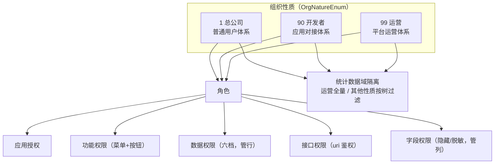

本章节面向**在 MDP 平台上做二次开发**的工程师，讲清平台最核心的四块领域模型：用户与组织、角色与权限、菜单与接口、数据统计。读完您应当能够：

- 理解「组织性质」这一贯穿全平台的设计主线，知道新增一类身份体系该动哪里；
- 独立完成「建菜单 → 关联接口 → 建角色 → 授权 → 绑用户」的完整权限配置；
- 在业务代码中正确使用功能权限（按钮权限码）、数据权限（`@DataScope`）、接口权限（uri 鉴权）三套机制；
- 看懂统计页面的数据口径，按组织体系/组织性质扩展新的统计指标。

## 一条主线：组织性质

平台用**组织性质**（`OrgNatureEnum`：1-总公司 / 90-开发者 / 99-运营）把用户划分为三套身份体系，三棵内置组织根树物理隔离。角色、权限、菜单、统计全部挂在这条主线上：

## 篇目导航

| 篇目 | 内容 | 关键收获 |
| --- | --- | --- |
| [用户和组织体系](用户和组织体系.md) | Org 树形结构、组织性质、内置组织、注册与身份判定 | 机构性质 ↔ 角色性质的四条关联逻辑 |
| [菜单管理](菜单管理.md) | 5 种菜单类型、关联接口、字段配置 | 权限体系的配置中心：菜单如何配 |
| [角色管理](角色管理.md) | 三种角色分类、角色模板 vs 角色管理、授权面板全貌 | 权限集合是"可授权范围上限"的枢纽 |
| [应用权限](应用权限.md) | 应用可见性的配置/授权/鉴权 | 其他授权 Tab 的前置边界；取消授权级联清空三维度 |
| [菜单和按钮权限](菜单和按钮权限.md) | 功能权限的配置/授权/鉴权 | 权限码 = 菜单 code，前端指令 + 后端兜底 |
| [接口权限](接口权限.md) | uri 鉴权的配置/授权/鉴权 | 5 步判定链与两级缓存 |
| [数据权限](数据权限.md) | 行级权限的配置/授权/鉴权 | 六档数据范围 + `@DataScope` SQL 改写 |
| [字段权限](字段权限.md) | 列级权限的配置/授权/鉴权 | 隐藏/脱敏两种动作与编辑页防回写 |
| [数据统计](数据统计.md) | 用户与组织、系统概览 | 按组织树/组织性质统计的口径与扩展方法 |

权限篇目统一以「用户管理」菜单（`console:organization:user`）为示例，各自走完**配置 → 授权 → 鉴权**闭环。

## 与其他章节的关系

- 机制层的源码剖析（`ApiPermChecker`、`@DataScope` 引擎、缓存 Builder 等）见[后端源码分析](../source/README.md)，本章节讲**怎么用**，那里讲**怎么实现的**；
- 平台整体架构与单体/微服务双形态见[架构介绍](../info/架构介绍.md)；
- 第三方系统接入（单点登录、接口调用）见[应用接入](../integration/README.md)。
