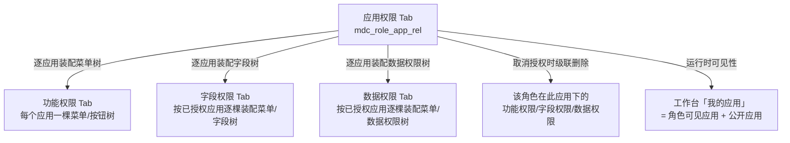

应用权限控制"用户在工作台「我的应用」能看到并进入哪些应用"，是其他权限维度的**前置边界**：功能权限、字段权限、数据权限的授权面板都只会显示"该角色已授权的应用"，取消应用授权会级联清掉该应用下的全部权限授权。

## 1. 配置

应用维护在开放平台（`mdo_app` 表，管理入口为开放平台的应用管理 `/admin/app/*`）。与应用可见性相关的两个开关：


| 字段 | 说明 |
| --- | --- |
| `show` | 是否在工作台展示（false 时即使授权了也不出现在「我的应用」） |
| `isPublic` | 公开应用——**无需授权，人人可见**（如平台自有的工作台、控制台入口） |
| `state` | 启用状态（停用后任何用户不可见） |
| `weight` | 排序权重（「我的应用」按 weight 降序排列） |

## 2. 授权


角色管理页 → 选中角色 →「应用权限」Tab：

- 列表展示**已授权应用**；点击「授权」按钮弹出**未授权应用**列表（支持跨页勾选）→ `POST /permission/roleAppRel/save`（增量保存，已存在的自动去重）；
- 行内/批量「取消」→ `POST /permission/roleAppRel/delete`；
- 可勾选范围受**同性质权限集合角色**封顶（`GET /permission/role/assignableAppIds`，见[角色管理](角色管理.md) §2）。

::: warning 取消应用授权的级联删除
`roleAppRel/delete` 在事务内按序级联删除该角色在此应用下的**全部授权**（`RoleAppRelServiceImpl.delete`）：

```
① 删数据权限授权（RoleDataScopeRel，按涉及菜单失效 RoleDataScope 缓存）
② 删字段权限受限关系（RoleFieldRel）
③ 删功能权限/菜单授权（RoleResourceRel，统一失效用户接口放行集与字段受限集缓存）
```

即：取消应用授权 = 该角色在此应用下的功能/数据/字段权限**全部失效**，重新授权应用后需重新配置。
:::

## 3. 鉴权

应用权限的鉴权分两层：**展示层**决定「我的应用」显示什么，**进入层**在免密跳转进入应用前再校验一次。

### 3.1 「工作台」-「我的应用」：listMyApp（显示能访问的应用）


用户打开工作台「我的应用」时调 `POST /admin/app/listMyApp`（`AppServiceImpl.listMyApp`）：

```
用户可见应用 = 角色可见应用 + 公开应用，按 weight 降序
```

### 3.2 Ticket模式单点登录：getRedirectUrl（免密跳转进入前再校验）

从工作台点击应用图标、以 ticket 模式免密跳转进入应用时，SSO 服务端的 `POST /anyUser/sso/getRedirectUrl`（md-workbench 的 `SsoServerController`）会逐项校验，任一不通过即拦截：

```
① 未登录 → 返回 401（前端强制先登录）
② 应用不存在（按 appKey 查 mdo_app）→ "无效的AppId"
③ 应用被禁用（state=false）→ "当前应用 [xx] 已被禁用，无法使用"
④ checkAppByUserId 不通过 → "当前账号暂无权限登入此应用，请联系管理员授权"
全部通过 → 构建带 ticket 的重定向地址，并记录"免密自动登录"日志
```

其中第 ④ 步的 `checkAppByUserId` 与展示层共用同一判定（四表 join：`mdo_app ⋈ mdc_role_app_rel ⋈ mdc_role(state=1) ⋈ mdc_user_role_rel`，要求 `app.show=1 AND app.state=1`），也有独立入口 `GET /admin/app/checkAppByUserId` 供其他场景做单应用可见性校验。


## 4. 与其他权限维度的关联

应用权限是其他授权 Tab 的**前置边界**——其他 Tab 的可操作内容都基于"该角色已授权的应用"：



| 授权 Tab | 受应用权限限制？ | 实际边界（源码行为） |
| --- | --- | --- |
| 功能权限 | ✅ 是 | 每个**已授权应用**渲染一棵菜单树卡片，卡片内才是该应用的菜单/按钮勾选树；未授权应用根本不出现 |
| 字段权限 | ✅ 是 | 按**已授权应用**逐棵装配 菜单+字段 树（`AppApi.pageByRoleId` → 逐个应用调用 `treeByRoleId`） |
| 数据权限 | ✅ 是（前端面板边界） | 面板按**已授权应用**分组展示（与功能权限一致，无可用菜单的应用保留空面板）；面板内的可配置菜单树由后端按**权限集合角色**下发——未授权的应用不生成面板，但其既有授权随保存原样提交、不会被误清 |
| 工作台「我的应用」 | ✅ 直接决定 | 用户可见应用 = 各角色可见应用并集 + 公开应用 |

**实操建议**：授权顺序应为 **应用权限 → 功能权限 → 数据/字段权限**。先授应用，后续 Tab 才有内容可勾；若发现功能权限/字段权限 Tab 里找不到目标应用，先检查应用权限是否已勾选。

## 5. 示例：「控制台」应用的授权与生效

**配置**：开放平台已有「控制台」应用（`show=1`、`isPublic=0`、`state=1`）——非公开应用，必须授权才可见。

**授权**：角色管理页 →"人事专员"→ 应用权限 Tab →「授权」勾选「控制台」保存。

**鉴权效果**：

- 该角色用户登录工作台 →「我的应用」出现「控制台」图标，点击进入；
- 功能权限 Tab 出现「控制台」卡片，可继续勾选菜单/按钮（见[菜单和按钮权限](菜单和按钮权限.md)）；
- 若取消「控制台」授权 →「我的应用」中消失，且该角色在控制台下的菜单/数据/字段授权**被级联清空**；
- 若某用户没有任何角色授权控制台、控制台又是非公开应用 → 该用户在工作台完全看不到控制台入口。

## 6. 排障速查

| 现象 | 排查 |
| --- | --- |
| 用户看不到应用 | 应用 `show`/`state` → 是否公开应用（`isPublic`）→ 角色是否授权（`mdc_role_app_rel`）→ 角色是否启用 → 用户是否绑角色 |
| 授权时勾不到某应用 | 同性质**权限集合**角色是否已授权该应用（上限未放开） |
| 取消授权后菜单/数据/字段权限全没了 | 这是设计行为（级联删除），重新授权应用后需重新配置 |
| 应用授权了但功能权限 Tab 没有该应用卡片 | 刷新角色页面；仍无则检查应用授权是否保存成功（列表是否在"已授权"中） |
