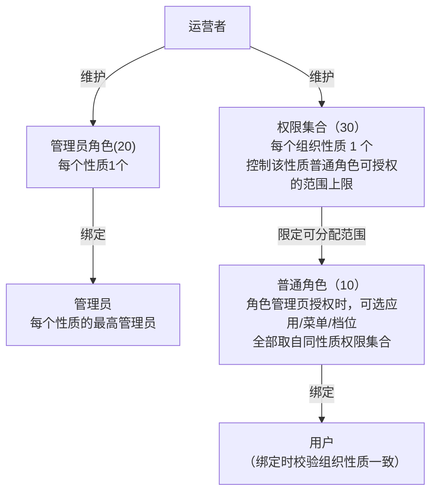
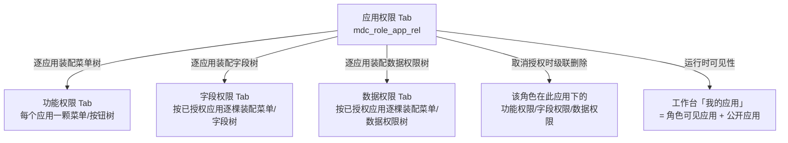

角色可以管控四个权限维度：应用权限、功能权限（菜单和按钮、接口权限）、数据权限、字段权限，全部通过"给角色授权 → 给用户绑角色"生效。本篇讲清角色的三种分类、角色模板与角色管理的区别，以及授权操作的全流程；各权限维度的配置/鉴权细节见对应篇目。

## 1. 角色模型：组织性质（orgNature） + 角色分类（roleCategory） 双维度

角色表 `mdc_role` 的核心字段：

| 字段 | 说明 |
| --- | --- |
| `code` / `name` | 编码（同分类下唯一）/ 名称；内置保留编码见 `RoleCode.BUILT_IN_CODES`，普通角色禁止使用 |
| `roleCategory` | 角色分类：`10`-普通角色 / `20`-管理员角色 / `30`-权限集合 |
| `orgNature` | 组织性质：`1`-总公司 / `90`-开发者 / `99`-运营（存mdc_org表的组织性质编码） |
| `templateRole` | 是否角色模板（在「角色模板」页创建的角色=1；在「角色管理」页创建的角色=0） |

## 2. 三种角色分类的区别和联系

| roleCategory | 含义 | 维护入口 | 数量约束 | 能否绑用户 |
| --- | --- | --- | --- | --- |
| `10` 普通角色 | 各管理员自建的业务角色（如"人事专员"） | 角色管理页 | 不限 | ✅ |
| `20` 管理员角色 | 该组织性质下的最高权限角色 | 角色模板页 | 每性质最多 1 个 | ✅ |
| `30` 权限集合 | 控制该性质下「角色管理」页面创建的角色能分配的应用/菜单/数据/字段权限范围 | 角色模板页 | 每性质最多 1 个 | ❌ |

三者的联系（授权范围自上而下约束）：



- **权限集合管控"普通角色"的授权范围**：「角色管理」页加载可分配的应用/菜单/数据/字段权限数据时，一律从**同性质的权限集合角色**已授权内容读取，与操作人自身权限无关。运营者通过维护权限集合，控制各性质体系内权限的边界；
  - 拉取权限代码见： `RoleServiceImpl.getPermSetRoleOfCurrentOperator`
  - 权限集合不能绑定用户
- **管理员角色**：可以绑定给具体用户（如 `ADMIN` 总公司管理员），拥有该性质最高权限；
  - 该角色是内置的每个性质的最高权限管理员，不能给普通用户管理和使用，防止普通用户误操作导致最高管理员权限被降级。

- **普通角色**是日常授权的最小单元，授权范围被权限集合控制。

通俗来讲：==权限集合==划定==普通角色==可分配权限的上限，解决"能授什么"；==管理员角色==是平台方为每个组织性质预置的最高权限角色，只绑定给该性质的管理员用户；==普通角色==则是业务管理员日常自建、分配给业务人员使用的角色，回答"实际授了什么"。三层约束的好处：业务人员只能在平台划定的边界内分配权限，避免没有技术基础的业务人员因误操作角色权限，导致系统权限混乱甚至崩溃。

内置角色编码（`RoleCode`，属 `BUILT_IN_CODES` 保留编码，普通角色禁止使用）：

| 编码 | 名称 | 角色分类<br/>roleCategory | 组织性质<br/>orgNature | 说明 |
| --- | --- | --- | --- | --- |
| `OPERATIONS_ADMIN` | 运营管理员 | 20 <br/>管理员角色 | 99 <br/>运营 | 平台最高权限，受硬保护（不可删除/禁用，见 §7 ） |
| `OPERATIONS_ADMIN_COLL` | 运营管理员权限集 | 30 <br/>权限集合 | 99 <br/>运营 | 运营性质的可授权范围上限，受硬保护 |
| `ADMIN` | 总公司管理员 | 20 <br/>管理员角色 | 1 <br/>总公司 | 总公司体系最高权限 |
| `ADMIN_COLL` | 总公司管理员权限集 | 30 <br/>权限集合 | 1 <br/>总公司 | 总公司体系的可授权范围上限 |
| `DEVELOPER_ADMIN` | 开发者管理员 | 20 <br/>管理员角色 | 90 <br/>开发者 | 开发者体系管理员最高权限 |
| `DEVELOPER_ADMIN_COLL` | 开发者管理员权限集 | 30 <br/>权限集合 | 90 <br/>开发者 | 开发者体系的可授权范围上限 |
| `DEFAULT_DEVELOPER` | 开发者 | 10 <br/>普通角色 | 90 <br/>开发者 | 新注册的开发者默认角色 |
| `DEFAULT_USER` | 普通用户 | 10<br/> 普通角色 | 1 <br/>总公司 | 普通用户注册默认角色 |

## 3. 角色模板页面 vs 角色管理页面

| 对比项 | 角色管理页 | 角色模板页（运营专属） |
| --- | --- | --- |
| 维护对象 | 普通角色（10） | 管理员角色（20）/ 权限集合（30） |
| orgNature | 不可选，自动赋值为操作人的顶级公司性质 | 表单自行选择 |
| 表单字段 | code/name/state/remarks | `roleCategory`、`orgNature` |
| 「角色用户」Tab | 有 | 权限集合不绑用户，只作可授权范围载体 |
| 访问后端地址 | `/permission/role/*` | `/permission/roleTemplate/*` |

## 4. 如何授权

选中角色后，右侧 Tab 对应各维度的授权操作：

| Tab | 操作 | 接口 | 详见 |
| --- | --- | --- | --- |
| 应用权限 | 勾选应用（决定该角色可访问的应用） | `POST /permission/roleAppRel/save`、`/delete` | 本篇 §5 |
| 功能权限 | 按应用勾选菜单/按钮树（接口随菜单一并授权） | `POST /permission/role/saveRoleResource` | [菜单和按钮权限](菜单和按钮权限.md)、[接口权限](接口权限.md) |
| 数据权限 | 菜单树按节点选择数据范围档位 | `POST /permission/role/saveRoleDataScope` | [数据权限](数据权限.md) |
| 字段权限 | 勾选角色被限制查看的字段（隐藏/脱敏） | `POST /permission/role/saveRoleField` | [字段权限](字段权限.md) |
| 角色用户 | 勾选用户绑定角色 | `POST /organization/userRoleRel/save`、`/delete` | [用户和组织体系](用户和组织体系.md) |

通用规则：

- 保存均为**全量覆盖**（事务内先删后插），并精准失效相关 Redis 缓存；
- 可授权范围受**同性质权限集合角色**控制（见 §2）；
- 角色停用/删除会失效该角色下所有用户的接口放行集与字段受限集缓存，立即生效。

## 5. 应用权限

控制用户在工作台「我的应用」能看到并进入哪些应用。

- **配置**：应用维护在开放平台（`mdo_app` 表）。`show` 控制是否在工作台展示；`isPublic` 为公开应用（无需授权人人可见）；
- **授权**：角色管理页 →「应用权限」Tab → 点击「授权」按钮勾选未授权应用 → `POST /permission/roleAppRel/save`；取消授权会**级联清掉该角色在该应用下的全部授权**：数据权限（`RoleDataScopeRel`）、字段权限（`RoleFieldRel`）、功能权限/菜单授权（`RoleResourceRel`），并同步失效相关缓存；
- **鉴权**（用户可见应用 = 角色可见应用 + 公开应用，`POST /admin/app/listMyApp`）：

### 5.1 应用权限与其他授权维度的关联

应用权限是其他授权的**前置条件**——其他 Tab 的可操作内容都基于"该角色已授权的应用"：



| 授权 Tab | 受应用权限限制？ | 实际边界（源码行为） |
| --- | --- | --- |
| 功能权限 | ✅ 是 | 每个**已授权应用**渲染一颗菜单树卡片，卡片内才是该应用的菜单/按钮勾选树；未授权应用根本不出现 |
| 字段权限 | ✅ 是 | 按**已授权应用**逐棵装配 菜单+字段 树（`AppApi.pageByRoleId` → 逐个应用调用 `treeByRoleId`） |
| 数据权限 | ✅ 是（前端面板边界） | 面板按**已授权应用**分组展示（与功能权限一致，无可用菜单的应用保留空面板）；面板内的可配置菜单树由后端按**权限集合角色**下发——未授权的应用不生成面板，但其既有授权随保存原样提交、不会被误清 |
| 工作台「我的应用」 | ✅ 直接决定 | 用户可见应用 = 各角色可见应用并集 + 公开应用 |

另外两个联动细节：

- **取消应用权限的级联**（`RoleAppRelServiceImpl.delete`，事务内按序执行）：先删该角色在此应用下的**数据权限**授权（按涉及菜单失效 `RoleDataScope` 缓存）→ 再删**字段权限**受限关系 → 最后删**功能权限**/菜单授权（`removeByRoleIdAndAppIds`，统一失效用户接口放行集与字段受限集缓存）——三个维度的授权随应用一并失效，重新授权应用后需重新配置；
- **数据权限 Tab 的"双重边界"**：展示边界在前端（按已授权应用分组面板），内容边界在后端（权限集合角色决定可配置菜单与档位）。因此可能出现"角色未授权某应用，但权限集合下发了该应用的数据权限"——这些菜单不生成面板，其既有授权在保存时原样保留，不会被误清。

**实操建议**：授权顺序应为 **应用权限 → 功能权限 → 数据/字段权限**。先授应用，后续 Tab 才有内容可勾；若发现功能权限/字段权限 Tab 里找不到目标应用，先检查应用权限是否已勾选。

## 6. 示例：配置一个"人事专员"角色

目标：总公司体系下的"人事专员"，能进控制台，使用「用户管理」页面查询用户，但不能新增/删除，手机号只能看脱敏值，数据范围限本公司及以下。

```
① 权限集合检查（运营者，角色模板页）
   确认总公司权限集合（ADMIN_COLL）已授权：控制台应用、用户管理菜单及按钮、
   用户管理菜单的数据权限档位「全部」、phone 字段规则
        ↓ 上限已就位
② 创建角色（管理员，角色管理页）
   新增角色 code=hr_specialist、name=人事专员
   （orgNature 自动=1 总公司、roleCategory 强制=10 普通角色）
        ↓
③ 应用权限 Tab：勾选「控制台」
④ 功能权限 Tab：控制台卡片中勾选「用户管理」菜单 + user.view / user.edit 按钮
   （不勾 user.add / user.delete）
⑤ 数据权限 Tab：用户管理节点选择「本公司及以下」
⑥ 字段权限 Tab：勾选「用户管理 → phone（脱敏）」
⑦ 角色用户 Tab：勾选目标用户绑定（系统自动校验用户组织性质=1）
        ↓
⑧ 生效验证
   该用户登录 → 工作台可见控制台 → 菜单出现用户管理 → 无新增/删除按钮
   → 列表手机号显示 138****5678 → 只能查到本公司子树的用户
```

## 7. 硬保护规则

- 持启用中 `OPERATIONS_ADMIN` 角色的用户不可删除/解绑；`OPERATIONS_ADMIN` 及其权限集角色不可删除/禁用（`SystemProtectServiceImpl`）；
- 内置角色编码（`RoleCode.BUILT_IN_CODES`）普通角色禁止使用；
- 角色绑定用户时校验组织性质一致性（用户所属组织的 nature 必须等于角色 orgNature），见[用户和组织体系](用户和组织体系.md)第 4 节。

## 8. 常用排障路径

| 现象 | 排查顺序 |
| --- | --- |
| 用户看不到应用 | 应用 show/state → 角色是否授权应用（role_app_rel）→ 角色是否启用 → 用户是否绑角色 |
| 授权时勾不到某菜单/应用/档位 | 同性质**权限集合**角色是否已授权该项（上限未放开） |
| 用户看不到菜单/按钮 | 角色功能权限是否勾选 → 菜单 state → 前端 resourceList 是否含该 code → 按钮权限码拼写 |
| 接口提示无权限 | 接口是否录入 resource_api → 录入的资源是否授权给角色 → `mdp.ignore.auth-enabled`/`not-config-uri-allow` 配置 → 用户放行集缓存是否失效 |
| 查询查不到数据 | 菜单 data_scope_state → 角色数据权限档位（未授权=无数据）→ @DataScope 的 orgColumn/userColumn 是否配对 |
