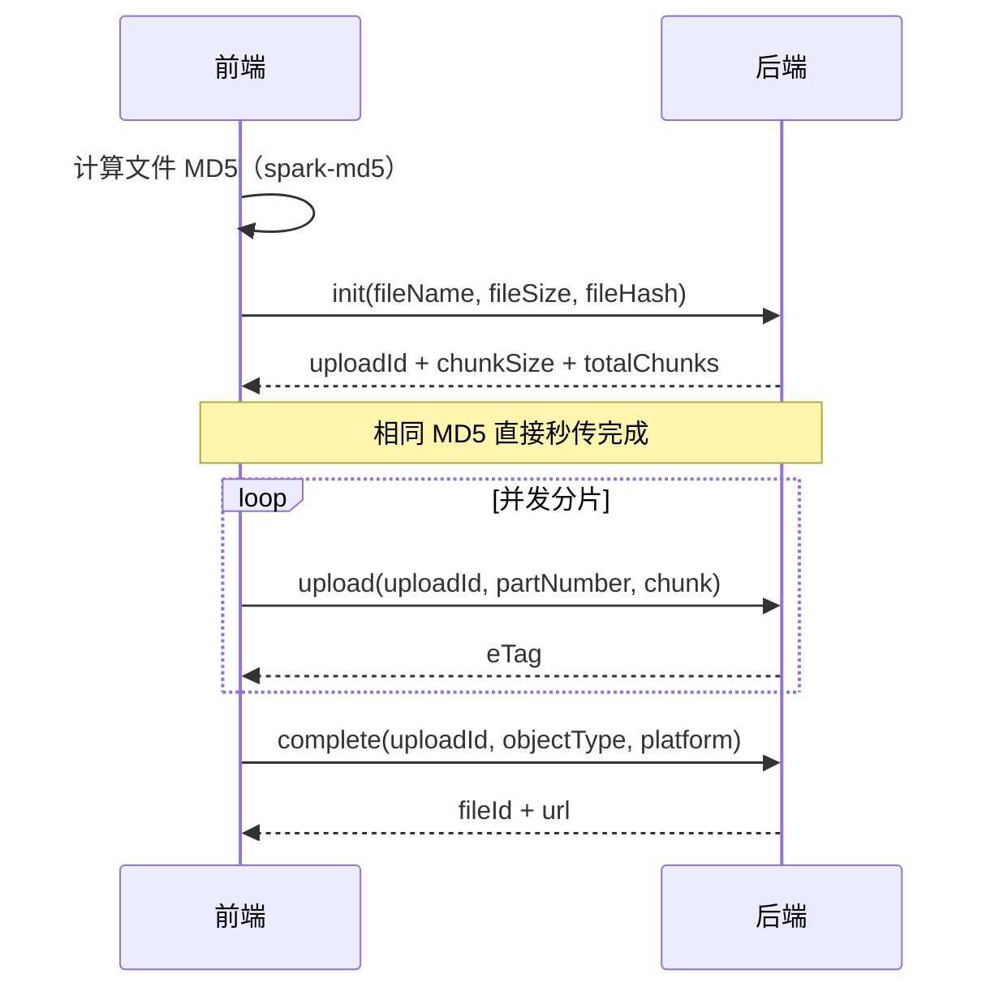

`@vben/components/multipart-upload` 提供大文件分片上传能力：**分片并发、断点续传、MD5 秒传、暂停/恢复/取消**，包含开箱即用的 `MultipartUploadModal` 弹窗组件和底层的 `useMultipartUploader` composable。

## 1. 上传协议

分片上传对接后端 `/console/anyone/filePart/*` 系列接口（`api/part-api.ts`）：



断点续传通过 `progress(uploadId)` 查询已上传分片，从未完成的分片继续；`abort(uploadId)` 取消会话。

## 2. MultipartUploadModal 上传弹窗

开箱即用的多文件上传弹窗：支持拖拽、文件夹上传、任务列表管理（暂停/恢复/重试/移除）、实时进度。通过 `ref` 控制：

```vue
<script setup lang="ts">
import { MultipartUploadModal } from '@vben/components/multipart-upload';

const multipartUploadModalRef = ref();
</script>

<template>
  <Button @click="multipartUploadModalRef?.open()">分片上传</Button>
  <MultipartUploadModal ref="multipartUploadModalRef" />
</template>
```

实际示例：文件管理页 `apps/web-console/src/views/console/system/file/index.vue`。

## 3. useMultipartUploader

需要自定义上传 UI 时使用 composable：

```ts
import { useMultipartUploader } from '@vben/components/multipart-upload';

const {
  fileTasks,        // Ref<FileTask[]> 任务列表（含状态、进度、错误信息）
  addFiles,         // 添加文件到队列
  startAllUpload,   // 开始全部
  startTask,        // 开始单个
  pauseTask,        // 暂停
  resumeTask,       // 恢复（断点续传）
  cancelTask,       // 取消
  retryTask,        // 失败重试
  removeTask,       // 移除任务
  clearAllTasks,    // 清空
} = useMultipartUploader({
  objectType: 'system.file',   // 业务对象类型
  platform: 'oss',             // 存储平台
  maxConcurrentFiles: 2,       // 最大并发文件数（默认 2）
  maxConcurrentChunks: 3,      // 单文件分片并发数
  maxUploadWorkers: 2,         // MD5 计算 Worker 数
});
```

### FileTask 任务状态机

```
waiting → uploading ─→ completed
              │  ↕ pause/resume
              paused
              ├──→ failed ──(retry)──→ waiting
              └──→ cancelled
```

| 字段 | 说明 |
| ---- | ---- |
| `uid` | 任务唯一标识 |
| `file` / `fileName` / `fileSize` / `fileType` | 文件信息 |
| `status` | `waiting/uploading/paused/completed/failed/cancelled` |
| `progress` | 0-100 进度 |
| `errorMessage` | 失败原因 |
| `uploadId` / `chunkSize` / `totalChunks` / `uploadedChunks` | 分片会话信息 |
| `md5Calculating` | 正在计算 MD5（秒传校验前置步骤） |
| `relativePath` / `parentPath` | 文件夹上传时的相对路径 |

::: tip 何时用哪种上传
- 小文件（头像、普通附件）：用 [FileUpload / ImageUpload](表单组件.md#_5-fileupload-imageupload-文件与图片上传)；
- 大文件（视频、数据包）：用本篇的分片上传；表单内使用可用 `FilePartUpload` 表单项。
:::
