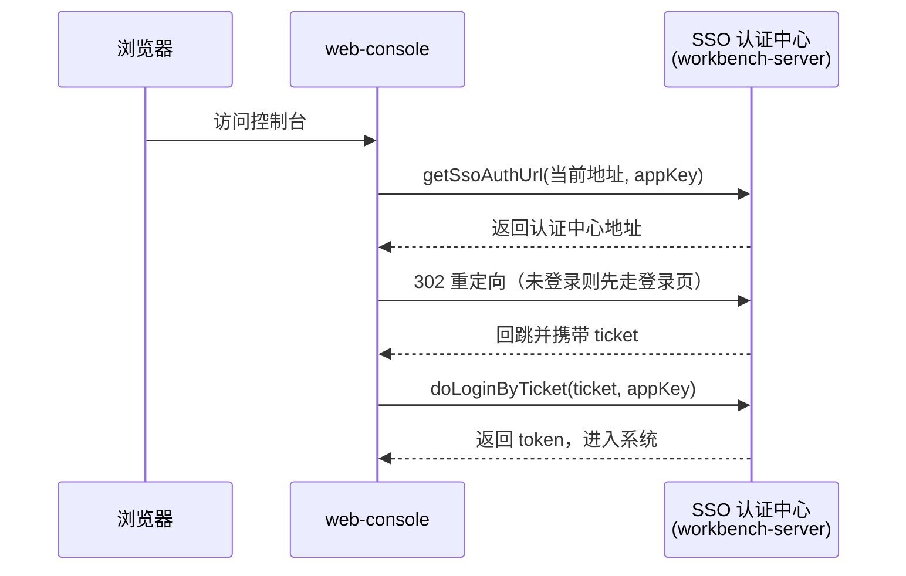

`mdp-vben` 基于 Vue Vben Admin 5.x（monorepo 版本）定制，会定期合并官方更新。本文列出 mdp 相对官方的**全部关键改动**，帮助你在阅读官方文档或合并官方代码时快速定位差异点。

## 1. 差异总览

| 维度 | 官方 vben 5.x | mdp-vben | 影响 |
| ---- | ------------- | -------- | ---- |
| 应用 | 6 个演示应用（web-antd/web-ele/web-naive 等） | 仅 3 个业务应用（workbench/console/open） | 官方文档中 `web-antd` 的路径，对应到 mdp 的三个应用 |
| UI 组件库 | ant-design-vue | **antdv-next** | 组件 import 自 `antdv-next`，API 基本一致 |
| 登录方式 | 账号密码表单 + mock | **SSO ticket 单点登录** | 登录流程完全不同，见下文 |
| token 传递 | `Authorization: Bearer xxx` | 自定义头（默认 `token`），**裸 token 无 Bearer 前缀** | 对接后端网关/sa-token 的格式 |
| 请求头 | 无 | 新增 `Path`、`gray_version` 头 | 后端页面数据权限、灰度路由依赖 |
| 业务组件 | 无 | 新增 `packages/effects/components` 包 | mdp 业务组件库 |
| 后端模式 | 单 mock 服务 | **boot/cloud 双模式** | 代理与 URL 前缀处理不同 |

## 2. apps：删除演示应用，改为三个业务应用

官方的 `backend-mock`、`web-antd`、`web-ele`、`web-naive`、`web-tdesign` 等演示应用全部删除，替换为：

| 应用 | 包名 | 业务页面规模 |
| ---- | ---- | ------------ |
| `apps/web-workbench` | `@vben/web-workbench` | 约 28 个页面，业务菜单主要由后端动态下发 |
| `apps/web-console` | `@vben/web-console` | 约 182 个页面，mdp 的主要管理端 |
| `apps/web-open` | `@vben/web-open` | 约 34 个页面，开放平台控制台 |

三个应用的结构、技术栈完全一致，仅 `.env` 与业务模块不同。

## 3. UI 库：antdv-next

所有应用的 UI 组件统一从 `antdv-next` 引入（pnpm catalog 版本 `^1.5.0`）：

```ts
import { message } from 'antdv-next';
```

表单、表格的组件适配层在各应用的 `src/adapter/` 与 `packages/effects/components/adapter/` 中完成映射，业务代码用法与官方文档一致，只是底层组件库不同。

## 4. 登录：SSO ticket 单点登录

官方登录是「账号密码表单 → 本地 mock 换 token」。mdp 改为 **SSO 认证中心 + ticket** 模式，登录页代码见 `apps/web-console/src/views/_core/authentication/login.vue`：



关键接口（`apps/web-console/src/api/common/auth.ts`，URL 前缀 `/workbench/anyUser/client/*`）：

| 接口 | 用途 |
| ---- | ---- |
| `getSsoAuthUrl` | 获取 SSO 认证中心登录地址 |
| `doLoginByTicket` | ticket 换 token |
| `logout` | 退出当前应用 |
| `signout` | 单点注销（所有应用同时退出） |

配套地，`packages/effects/common-ui` 新增了 `sso-login.vue`、`forget-password-update.vue`、`ui/oauth2/`（授权确认页）、`ui/sso/` 等页面级组件；`packages/@core/ui-kit/shadcn-ui` 新增了图形验证码、行为验证码组件。

## 5. 请求层定制

各应用的 `src/api/request.ts` 基于 `@vben/request`，差异点：

```ts
// 1. token 通过自定义头携带，且不带 Bearer 前缀
config.headers[VITE_GLOB_TOKEN_KEY] = token;   // 默认头名为 token

// 2. 新增 Path 头：当前路由 fullPath，后端据此判断页面级数据权限
config.headers.Path = router?.currentRoute?.value?.fullPath;

// 3. 新增 gray_version 头：灰度发布时固定路由到指定节点
config.headers.gray_version = VITE_GLOB_GRAY_VERSION;
```

响应解析适配 mdp 后端统一格式：`successCode: 0`、`codeField: 'code'`、`dataField: 'data'`。刷新 token 未启用（`doRefreshToken` 返回空串），token 过期直接跳转重新登录。

## 6. boot / cloud 双后端模式

官方只有单一后端地址。mdp 支持单体（boot）与微服务（cloud）两种后端架构，通过 `VITE_GLOB_MODE` 切换：

- **boot（单体）**：所有服务合并为一个 boot-server，请求时 **rewrite 去掉服务前缀**（`/workbench/**` → `/**`）；
- **cloud（微服务）**：请求走网关，**保留服务前缀**，由网关按 `/workbench`、`/console`、`/open` 路由到对应服务。

服务前缀枚举定义在 `packages/constants` 新增的 `ServicePrefixEnum`。代理逻辑在 `internal/vite-config/src/config/application.ts`，各应用 `.env.development` 的 `VITE_PROXY` 按模式配置了两套代理，对应 `dev:boot` / `dev:cloud` 两个启动脚本。详见 [前端配置](../../config/前端配置.md)。

## 7. packages 层改动清单

| 包 | 改动 |
| -- | ---- |
| `effects/components` | **全新增**：mdp 业务组件库（表单、上传、字典、布局等），见 [业务组件总览](components/index.md) |
| `effects/common-ui` | 新增图形验证码、忘记密码、SSO 登录、OAuth2 授权页等 |
| `effects/plugins` | 新增 `vxe-tree`（vxe-table 树组件封装） |
| `effects/hooks` | 新增 `use-boolean`、`use-count-down`、`use-load`、`use-timeout`、`use-intersection-observer`、`use-scroll-to`、`use-device-info` |
| `effects/layouts` | 新增 `src/doc`（文档链接头部，含备案图标） |
| `constants` | 新增 `ServicePrefixEnum`、`dict.ts` |
| `stores` | 新增 `api-cache.ts`、`dict.ts`（字典 store）；改造 `access.ts`、`user.ts` |
| `utils` | 新增 `is.ts`、`mask.ts`；改造 `generate-routes-backend.ts`（后端动态菜单） |
| `types` | 新增 `axios.d.ts`、`vue-office.d.ts`；定制 `user.ts` |
| `icons` | 新增 iconify 离线图标包及 gitee、message、qq 等 svg 图标 |
| `locales` | 四组语言文件大量定制，删除官方繁体中文（zh-TW） |
| `@core/ui-kit/shadcn-ui` | 新增行为验证码、input-captcha、list、title、spinner（`createLoading`） |
| `@core/composables` | 新增 `use-device.ts` |

## 8. 合并官方更新时的注意事项

1. **不要直接覆盖**上表列出的定制文件，合并时逐个比对；
2. 官方文档中涉及 `web-antd`、`ant-design-vue`、`Authorization: Bearer` 的描述，在 mdp 中对应三个业务应用、`antdv-next`、自定义 token 头；
3. mdp 的合并节奏记录在 `feature/merge/*` 分支（按月合并官方 main）。
