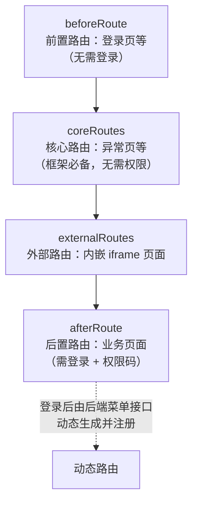

本文介绍 `mdp-vben` 的 monorepo 目录划分、单个应用的内部结构，以及路由的四层组织方式。

## 1. Monorepo 总览

```shell
mdp-vben/
├── apps/                    # 三个可独立部署的应用
│   ├── web-workbench/       # 工作台（用户门户，端口 7700）
│   ├── web-console/         # 控制台（后台管理，端口 7710）
│   └── web-open/            # 开发者平台（端口 7720）
├── packages/                # 共享包
│   ├── @core/               # 核心包（基础类型、设计、composables、ui-kit）
│   ├── constants/           # 常量与枚举
│   ├── effects/             # 业务层共享包
│   │   ├── access/          # 访问控制（权限码、按钮权限）
│   │   ├── common-ui/       # 通用 UI（登录页、验证码、OAuth2 授权页等）
│   │   ├── components/      # ★ mdp 新增：业务组件库（详见「业务组件」章节）
│   │   ├── hooks/           # 组合式 API
│   │   ├── layouts/         # 布局
│   │   ├── plugins/         # 大型第三方依赖封装（vxe-table、vxe-tree、echarts 等）
│   │   └── request/         # axios 封装
│   ├── icons/               # 图标（含 mdp 新增的离线图标包）
│   ├── locales/             # 国际化语言包
│   ├── preferences/         # 偏好设置（主题、布局默认值）
│   ├── stores/              # Pinia store（用户、权限、字典等）
│   ├── styles/              # 全局样式
│   ├── types/               # 全局类型定义
│   └── utils/               # 工具函数
├── internal/                # 内部工具（不发布）
│   ├── lint-configs/        # eslint / oxlint / oxfmt / stylelint / commitlint 配置
│   ├── tsconfig/            # 共享 tsconfig
│   └── vite-config/         # 共享 Vite 构建配置（boot/cloud 代理逻辑在此）
├── scripts/
│   ├── deploy/              # 部署脚本（Jenkinsfile、Dockerfile、nginx.conf）
│   ├── turbo-run/           # 交互式选择应用执行命令
│   └── vsh/                 # 工程化脚本（lint、依赖检查等）
├── docs/                    # 项目内部文档
└── turbo.json               # Turbo 任务编排
```

依赖方向是单向的：`apps` → `packages/effects` → `packages/@core`，禁止反向引用（`pnpm check:circular` 会校验循环依赖）。

## 2. 单应用结构（以 web-console 为例）

```shell
apps/web-console/
├── src/
│   ├── api/                 # 接口定义（按后端服务分目录）
│   │   ├── common/          # 登录、上传、当前用户等公共接口
│   │   ├── console/         # console-server 的接口
│   │   └── open/            # open-server 的接口
│   ├── components/          # 应用内业务组件
│   ├── constants/           # 枚举、常量、权限码
│   ├── layouts/             # 应用级布局
│   ├── router/
│   │   ├── routes/          # 路由模块（见下文四层结构）
│   │   ├── guard.ts         # 全局路由守卫（登录态、权限、动态路由注册）
│   │   └── index.ts
│   ├── stores/              # 应用级 Pinia store
│   ├── views/
│   │   ├── _core/           # 框架级页面（登录、异常页、首页）
│   │   └── console/         # 业务页面（按模块划分）
│   ├── adapter/             # UI 组件适配层（form/vxe-table 的组件映射）
│   └── preferences.ts       # 应用偏好覆盖（主题、版权信息等）
├── .env                     # 基础环境变量
├── .env.development         # 开发环境（代理配置在此）
├── .env.production          # 生产环境
└── vite.config.ts
```

三个应用结构完全一致，只是 `views`、`api` 下的业务模块不同：

| 应用 | 主要业务模块（`src/views`） |
| ---- | -------------------------- |
| web-console | `console/`：message（消息）、organization（组织/岗位/用户）、permission（资源/角色/模板）、statistics（统计）、system（配置/字典/文件/日志）；`open/`：第三方接入应用管理 |
| web-workbench | `workbench/user`：登录日志、安全设置、通知、个人资料、我的应用 |
| web-open | `open/client/`：应用、应用申请、授权码、文档、帮助文档、签名 |

## 3. 路由四层结构

mdp-vben 的路由按职责分四层组织，定义在各应用的 `src/router/routes/` 下：



要点：

- **业务菜单由后端动态下发**：登录后 `guard.ts` 调用菜单接口，由 `packages/utils` 的 `generate-routes-backend.ts` 转换为路由记录动态注册；本地 `afterRoute` 只保留少数固定页面。
- **权限码控制按钮**：页面内的按钮级权限通过 `packages/effects/access` 提供的权限码机制控制，权限码在各应用的 `constants/` 下定义。
- **路由模式**：默认 `hash`（`VITE_ROUTER_HISTORY`），见 [前端配置](../../config/前端配置.md)。

## 4. 包之间的关键约定

- `@vben/components`（`packages/effects/components`）是 mdp 新增的业务组件包，三个应用共用，详细用法见 [业务组件总览](components/index.md)。
- `packages/effects/common-ui` 存放跨应用的页面级 UI：SSO 登录页、OAuth2 授权页、图形/行为验证码等。
- 后端接口的 URL 前缀（`/workbench`、`/console`、`/open`）定义在 `packages/constants` 的 `ServicePrefixEnum`，请求时按 `VITE_GLOB_MODE` 决定是否保留前缀，详见 [与官方 vben 的差异](与官方vben的差异.md)。
