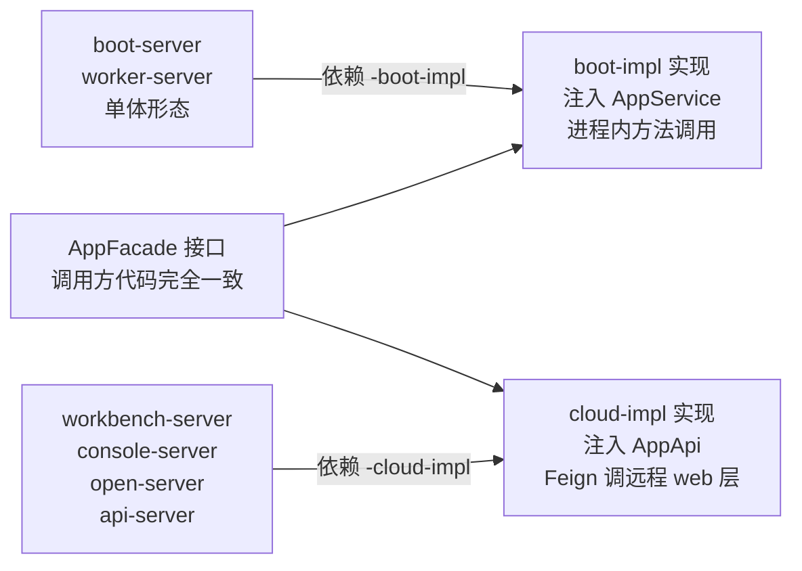
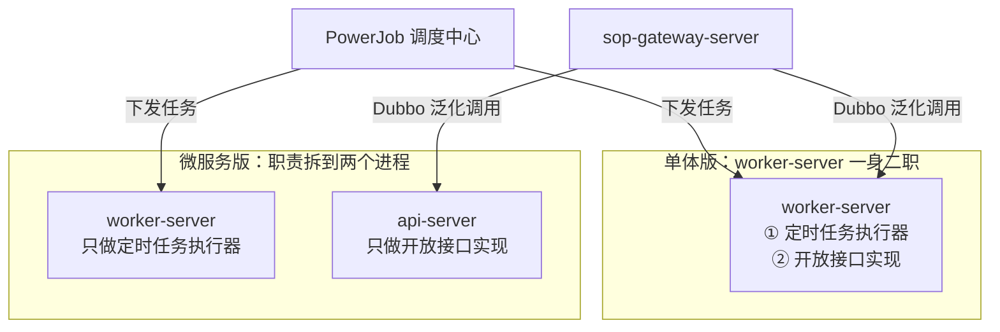

<!-- @include: ../../架构图.snippet.md -->

## 1. 一套代码，两种部署形态

MDP 从设计之初就按**同一套代码同时支持单体版和微服务版**来做，而不是维护两个分支。做到这一点的关键机制是：**每个业务域只有一套 Facade 接口，但提供两份同名实现，启动模块按需引入哪一份，就决定了这次是本地调用还是远程调用。**

以开发者平台域（`md-open`）为例：

```
md-open/open-facade/
├── open-api             # AppFacade 接口定义（调用方只认这个）
├── open-boot-impl       # AppFacadeImpl → 注入 AppService，进程内直调
└── open-cloud-impl      # AppFacadeImpl → 注入 AppApi（@FeignClient），HTTP 远程调用
```

三个业务域（`md-workbench`、`md-console`、`md-open`）都是同样的 `{域}-api` / `{域}-boot-impl` / `{域}-cloud-impl` 三件套结构：



> 业务代码里 `@Autowired AppFacade` 这一行**在两种形态下完全相同**，差异只体现在 pom 依赖了哪个 impl 模块。这也是为什么单体版切到微服务版不需要改业务代码。

这里要区分清楚项目里**两套远程调用机制各管什么**，否则很容易混淆：

| 机制 | 用在哪 | 例子 |
| ---- | ------ | ---- |
| **OpenFeign（HTTP）** | 业务域之间通过 facade 的跨域调用，走目标服务的 web 层 | `open-cloud-impl` 的 `AppApi`：`@FeignClient(name = AppConstants.OPEN_SERVER, path = "/admin/app")` |
| **Dubbo（RPC）** | 只用于开发者平台链路：`sop-gateway-server` 泛化调用开放接口实现方 | `md-api/api-service` 的 4 个 `@DubboService` 实现类 |

`@EnableFeignClients` 也只出现在 5 个微服务启动类（api / workbench / console / open / inner-gateway），boot-server、worker-server、sop-gateway-server 都不开。

此外还有一个配置开关 `mdp.system.mode`（`boot` / `cloud`）配合区分形态，详见[重要配置项详解](../../config/重要配置项详解.md)。

## 2. 服务分三组，只有一组被合并

按职责把所有后端进程分成三组，能一眼看出「等价」到底等价的哪部分：

| 分组 | 微服务版 | 单体版 | 是否被合并 |
| ---- | -------- | ------ | ---------- |
| 核心业务（Web 端 / 移动端接口） | inner-gateway-server + workbench-server + console-server + open-server | boot-server | **是**，4 合 1 |
| 开放平台（对第三方提供接口） | sop-gateway-server + api-server | sop-gateway-server + worker-server | **否**，两版都要启动 |
| 定时任务调度 | PowerJob（开源）+ worker-server | PowerJob（开源）+ worker-server | **否**，两版都要启动 |

**需要注意**：这里说的"单体版"只是**核心功能单体**——即面向 Web 端、移动端的业务接口全部收进 boot-server 一个进程。而**开发者平台对外提供接口的能力**和**定时任务调度能力**，单体版和微服务版的部署形态是一致的，都要额外起网关和执行器进程，区别只在执行器承担的职责多少（见第 3 节）。

boot-server 本身 `dubbo.enabled: false`，也不引任何 Dubbo 相关依赖——单体版的核心业务链路是纯进程内调用，完全不依赖注册中心。

## 3. worker-server 与 api-server 的区别（重点）

区别先说结论：**两者对外提供的开放接口来自同一批实现（都依赖 `api-web` + `sop-spring-boot-starter`），而定时任务只有 worker-server 能执行**（PowerJob 执行器只装在它身上）。于是同一份「对外开放接口 + 执行定时任务」的职责，在两种形态下是这样分配的：

- **单体版**：worker-server 一个进程兼两职，既对外提供开放接口，又执行定时任务；
- **微服务版**：这两职拆开——api-server 只对外提供开放接口，worker-server 只执行定时任务。

下面分别从依赖（3.1）和分工（3.2）两个方向验证这个结论。

### 3.1 依赖对比

从 pom 依赖看，差别集中在下面几行：

| 依赖 | worker-server | api-server | 说明 |
 | ---- | :-----------: | :--------: | ---- |
 | `api-web` | ✅ | ✅ | 开放接口的业务实现（消息、组织、用户等） |
 | `sop-spring-boot-starter` | ✅ | ✅ | 把业务接口暴露成开放平台接口（SOP 能力） |
 | `md-powerjob-worker-spring-boot-starter` | ✅ | ❌ | **全仓只有 worker-server 引入**，即定时任务执行器 |
 | `{域}-boot-impl`（本地直调） | ✅ | ❌ | 能直接调用三大业务域的全部 service |
 | `{域}-cloud-impl`（Feign 远程调用） | ❌ | ✅ | 通过 HTTP 调用其他域的 web 层 |
 | `dubbo-zookeeper-curator5-spring-boot-starter` | ✅（dev） | ❌ | 由 pom profile 按环境切换注册中心 |
 | `dubbo-nacos-spring-boot-starter` | ✅（test/prod） | ✅ | api-server 固定用 Nacos；两处的 Dubbo 都是为开放接口链路服务的，与 facade 的 Feign 无关 |

对应的配置文件也是同样结论：`powerjob.worker` 配置段只存在于 `worker-server/src/main/resources/application.yml`。

> 上面说的"同一批实现"是实指：开放接口的 Dubbo provider 全部在 `md-api/api-service`（`OrgOpenServiceImpl`、`UserOpenServiceImpl`、`MsgOpenServiceImpl`、`TokenOpenServiceImpl` 4 个带 `@DubboService` 的实现类），随 `api-web` 一起同时打进 worker-server 和 api-server 两个进程。所以两者的开放接口行为一致，差别只在这份能力**有没有被打开**。

### 3.2 分工差异



- **为什么单体版要身兼两职**：①单体版为了尽量少启动服务，特意将==开放接口==和==定时任务执行器==合并到一起； ②worker-server 引的是 `*-boot-impl`，进程内就有三大业务域的全部 service，所以定时任务和开放接口都能直接调本地逻辑，不需要通过 Dubbo或Feign 。
- **为什么微服务版要拆分为2个服务**：微服务架构就是尽可能的将不相关的业务独立出去，确保服务低耦合、高可用。

> 一个容易纠结的细节：worker-server 的 pom 里同样有 `sop-spring-boot-starter` 和 `api-web`（单体版需要它兼任接口实现），所以**依赖层面它始终具备**承接开放接口调用的能力。微服务版把它变成"纯执行器"靠的是配置开关而不是删依赖——`dubbo.enabled=false`，详见 [3.3 节](#_3-3-用两个开关裁剪-worker-server-的能力)。
>
> ——注意：如果两个进程都注册成了同一个 Dubbo 服务的 provider，网关会轮询到 worker-server。

### 3.3 用两个开关裁剪 worker-server 的能力

worker-server 是唯一把「开放接口」和「定时任务执行器」两种能力装进同一个进程的服务，MDP 为这两种能力各留了一个独立开关，**不改 pom、不拆包**就能按需关掉：

| 开关 | 关掉的是 | 源码依据 | 不配时 |
| ---- | -------- | -------- | ------ |
| `dubbo.enabled=false` | 开放接口能力 | `SopAutoConfiguration.java:24-29` 的条件注解；该类在 `:46-48` 才扫描 `@DubboService` 的 bean 并通过 `ApiRegisterRunner.reg(...)` 把接口上报给网关 | 开（`matchIfMissing=true`） |
| `powerjob.worker.enabled=false` | 定时任务执行器能力 | `PowerJobAutoConfiguration.java:24` 的条件注解；该类在 `:29` 才创建 `PowerJobSpringWorker` 去连调度中心 | 开（`matchIfMissing=true`） |

两个开关互不影响，四种组合对应四种角色：

| `dubbo.enabled` | `powerjob.worker.enabled` | worker-server 实际角色 | 典型场景 |
| --------------- | ------------------------- | ---------------------- | -------- |
| true | true | 开放接口 + 定时任务执行器 | 单体版完整形态 |
| false | true | 只做定时任务执行器 | **微服务版部署 worker-server 时建议这样配** |
| true | false | 只做开放接口（角色等价于 api-server） | 只用开发者平台、不用定时任务 |
| false | false | 两种能力都关，等于空跑一个进程 | 不要这么配 |

**出厂配置的实际取值**（两处都由 env 文件控制，注释就是作者留的使用提示）：

| 环境 | `dubbo.enabled` | `powerjob.worker.enabled` | 实际效果 |
| ---- | --------------- | ------------------------- | -------- |
| dev | `true` | **`false`** | 本地默认**不**连 PowerJob；要在本地跑定时任务，手动改成 `true` 并启动 PowerJob |
| test / prod | 未配置 → 开 | 未配置 → `true` | 两种能力全开，即单体版完整形态 |

> 也就是说：**微服务版部署 worker-server 时，test/prod 的出厂值是"两项全开"**，需要您在 `application-{env}.yml` 里显式补一行 `dubbo.enabled: false`，否则它会和 api-server 一起注册成同一批开放接口的 provider。


> 另有一个更弱的替代开关 `powerjob.worker.allow-lazy-connect-server`（`PowerJobProperties.java:152`，默认 false，true 表示连不上调度中心也允许启动），仅用于"本地没有 PowerJob 但想启动进程"的调试场景，**不要拿它当关闭执行器的手段**——该角色压根不需要时直接 `enabled=false` 更干净。

写法（worker-server 的配置全在本地 yml，它不接 Nacos 配置中心，见第 4 节说明）：

```yaml
# worker-server/src/main/resources/application-{env}.yml
dubbo:
  enabled: false      # 关闭开放接口能力：不导出 provider，也不向网关上报接口
powerjob:
  worker:
    enabled: false    # 关闭定时任务执行器：不连 PowerJob 调度中心
```

临时验证可以直接用启动参数覆盖，无需改文件、无需重新打包：

```bash
java -jar md-worker-server.jar --dubbo.enabled=false
```

> `dubbo.enabled` 这个 key 不是 MDP 自定义的，而是 Dubbo 自动装配自身的开关；MDP 的 `SopAutoConfiguration` 复用了同一个属性，因此关一次就把「导出 provider」和「上报开放接口」同时关掉，不会留下"注册了但没接口"的半开状态。boot-server 也是用这个开关彻底关掉 Dubbo 的（见第 2 节）。

## 4. 单体版为什么也离不开网关和worker-server

开放平台这条链路天生就是一个**独立的小微服务集群**，原因有两个：

1. 开发者平台的接口要对第三方开放，必须由 `sop-gateway-server` 作为统一入口做鉴权、验签、限流、路由，不能和业务进程混部；
2. 网关拿到请求后，是通过 **Dubbo 泛化调用**（`GenericServiceInvoker`）打到真正的接口实现方（worker-server / api-server）的——既然是 RPC，就**必须有注册中心**做服务发现。

为了让单体版尽量轻量，MDP 内置了一个开发用的注册中心：`mdp-apps/md-gateway/zookeeper-server`，直接运行 `ZookeeperRegistryServer` 的 main 方法即可在 2181 端口拉起一个嵌入式 ZooKeeper。

| 环境 | 服务发现中心 | 切换机制 |
 | ---- | ------------ | -------- |
| 开发（dev） | 内置 zookeeper-server，或自行部署 ZooKeeper | `worker-server/pom.xml` 的 `dev` profile 引入 `dubbo-zookeeper-curator5-spring-boot-starter`；`application-dev.yml` 中 `dubbo.registry.address: zookeeper://localhost:2181` |
| 测试 / 生产 | **必须用 Nacos** | `test` / `prod` profile 换成 `dubbo-nacos-spring-boot-starter`，地址由 `@config.nacos.*@` 编译期注入 |

> 内置 zookeeper-server **仅供开发演示，生产环境禁止使用**（代码里启动时会打 WARN 日志提示）。

单体版完整启动顺序：

```
zookeeper-server（或 Nacos） → worker-server → sop-gateway-server → PowerJob → boot-server
```

其中只有 boot-server 与注册中心无关；boot-server 单独启动即可提供全部 Web/移动端功能，其余三个进程只在需要「对外开放接口」或「定时任务」时才启动。

## 5. 启动清单速查

| 形态 | 后端进程 | 数量 |
 | ---- | -------- | :--: |
 | 单体版 | boot-server、worker-server、sop-gateway-server、PowerJob | 4（开发环境另加 zookeeper-server） |
 | 微服务版 | inner-gateway-server、workbench-server、console-server、open-server、api-server、worker-server、sop-gateway-server、PowerJob | 8 |

各服务的具体功能清单见[服务介绍](../start/服务介绍.md)。

## 6. 依赖的两个开源项目

MDP 的开放平台与分布式调度能力不是从零实现，而是在两个开源项目之上做了二次封装：

| 能力 | 开源项目 | MDP 中的封装位置 |
 | ---- | -------- | ---------------- |
 | 开发者平台（应用管理、验签、接口授权、调用日志） | [SOP（Simple Open Platform）](https://gitee.com/durcframework/SOP) | `mdp-base/md-sop-support`（`sop-service-support` + `sop-spring-boot-starter`，保留 `com.gitee.sop` 包名）；网关侧在 `sop-gateway-server` |
 | 分布式定时任务调度 | [PowerJob](https://gitee.com/KFCFans/PowerJob) | 调度中心直接用开源发行包；执行器侧封装为 `mdp-base/md-powerjob-worker-spring-boot-starter`，仅 worker-server 引入 |

执行器与调度中心的连接参数在 `worker-server/src/main/resources/application.yml`：`powerjob.worker.app-name`、`powerjob.worker.server-address`（默认 `127.0.0.1:17700`）、`powerjob.worker.protocol: http`，注意 server 与 worker 之间要放通相应端口。

## 7. 小结

- **同一套代码**：靠 `{域}-boot-impl` / `{域}-cloud-impl` 双实现 + 启动模块换依赖，实现单体/微服务双形态，业务代码零改动；
- **单体的边界**：只有面向 Web/移动端的核心业务被合并成 boot-server，**开放平台和定时任务两版都是多进程**；
- **worker-server 是唯一执行器**：`md-powerjob-worker-spring-boot-starter` 全仓只装在这一个服务上，微服务版不能只靠 api-server 跑定时任务；
- **能力靠开关裁剪，不靠删依赖**：`dubbo.enabled=false` 关开放接口、`powerjob.worker.enabled=false` 关执行器，两个开关独立，微服务版部署 worker-server 时推荐显式关掉前者（见 3.3）；
- **注册中心看环境**：dev 用内置 zookeeper-server（2181），test/prod 必须 Nacos，由 pom profile 与 `@config.nacos.*@` 共同决定，详见[编译期配置（filters）](../../config/编译期配置filters.md)。
