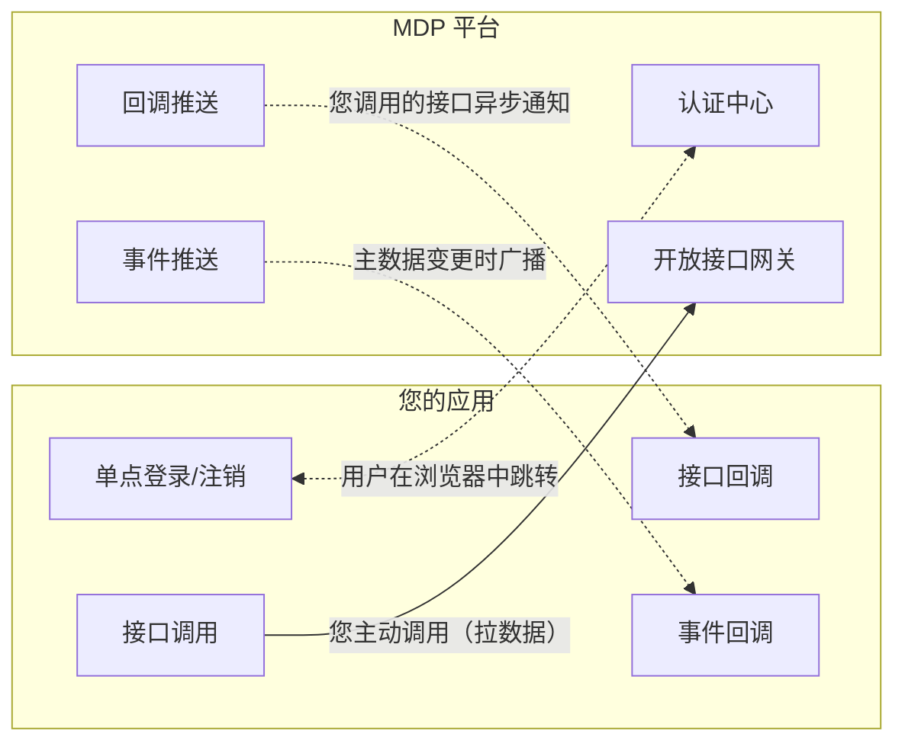

## 本章节面向谁

本章节面向**需要将自有应用接入 MDP 平台的第三方开发者**——无论您的应用已经在线上运行，还是正在开发中，都可以按照本章节的指引完成接入。

接入后您的应用将获得以下能力：

- **统一登录**：用户在 MDP 登录后可直接进入您的应用，无需重复注册、登录；
- **统一注销**：任意一处退出，全域应用同步下线；
- **数据互通**：调用平台开放接口获取组织、用户等主数据，或接收平台推送的数据变更事件。

## 能力地图

MDP 开放能力分为 4 条链路，按「谁来发起」可以快速区分：

| 能力 | 方向 | 解决的问题 | 文档 |
| ---- | ---- | ---------- | ---- |
| 单点登录（ticket 模式） | 浏览器跳转 | 用户一处登录、处处通行；基于一次性 ticket 换取用户身份 | [单点登录-ticket模式](单点登录/ticket模式.md) |
| 单点登录（OAuth2 模式） | 浏览器跳转 | 标准 OAuth2 协议对接，支持 scope 授权范围与 openid/unionid 隐私保护 | [单点登录-oauth2模式](单点登录/oauth2模式.md) |
| 接口调用 | 您 → 平台 | 主动拉取平台主数据（组织、用户、消息发送等） | [接口调用](接口调用.md) |
| 事件回调 | 平台 → 您 | 平台主数据（组织、用户）变更时自动推送给订阅应用 | [事件回调](事件回调.md) |
| 接口回调 | 平台 → 您 | 您调用的耗时接口处理完成后，异步通知您结果 | [接口回调](接口回调.md) |

## 单点登录如何选择模式

| 对比项 | ticket 模式 | OAuth2 模式 |
| ------ | ----------- | ----------- |
| 协议 | sa-token 私有 SSO 协议（ticket 换 userId） | 标准 OAuth2（code 换 access_token） |
| 客户端拿到的凭证 | MDP 用户 id（loginId） | access_token / refresh_token |
| 隐私保护 | 直接暴露 userId | openid（应用隔离）/ unionid（主体联合） |
| 授权范围控制 | 无 | scope 机制（userinfo / openid / unionid） |
| 适用场景 | 简单内部系统对接 | 需要标准协议、需要控制授权范围、需要多应用统一身份 |

## 接入的推荐顺序

1. 阅读 [准备工作](准备工作.md)，在 MDP 平台创建应用并获取 `appKey`、`appSecret` 等凭证；
2. 按需选择 ticket 或 OAuth2 模式，完成单点登录与单点注销对接；
3. 如需拉取平台数据，继续阅读 [接口调用](接口调用.md)；
4. 如需接收平台推送（数据变更、异步结果），阅读 [事件回调](事件回调.md) 与 [接口回调](接口回调.md)；
5. 参考若依实战案例，对照完整的可运行代码逐项自检。

## 常用地址

| 地址 | 用途 |
| ---- | ---- |
| https://workbench.mddata.top | 统一登录页（认证中心前端） |
| https://console.mddata.top | 控制台（管理员创建应用、配置密钥） |
| https://open.mddata.top | 开发者中心（开发者自助申请应用、订阅事件、查看接口文档） |

> 开放接口网关（`/api` 入口）的地址以平台分配为准，本地联调默认为 `http://localhost:23456/api`。
