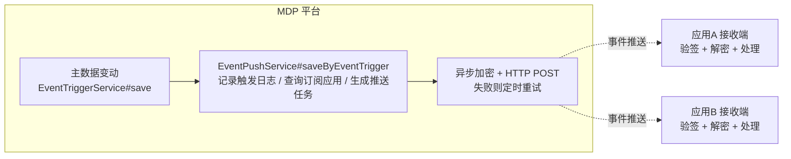

事件回调（事件推送，推数据）是指：**平台侧主数据发生变化**（如组织机构编辑、用户新增）时，平台主动将变动事件推送给所有**订阅了该事件**的应用。事件推送由平台触发，一对多分发。

与接口回调的区别见[接口回调](接口回调.md)。

## 1. 链路概述



> 推送失败后由平台定时重试（每 8 分钟扫描一次，梯度间隔），详见第 5 节[重试机制](#_5-重试机制)。

## 2. 接入前准备

详见[准备工作](准备工作.md)，本链路需要：

1. 在开放平台控制台为您的应用**订阅感兴趣的事件类型**（如 `org.edit`、`user.add`）。只有订阅了某事件的应用，在该事件触发时才会收到推送；
2. 配置应用密钥（`AppKeys`）：

| 参数名 | 说明 |
| ------ | ---- |
| 通知地址（notifyUrl） | 事件推送地址（事件推送**只使用此处配置的地址**，无请求参数覆盖） |
| 事件订阅状态（notifyState） | 通知开关，必须开启才会被推送 |
| 加密类型（notifyEncryptionType） | 加密模式：0-明文模式、1-兼容模式、2-安全模式（推荐） |
| 签名校验令牌（notifyToken） | 生成和验证 signature / msgSignature |
| 消息加解密秘钥（notifyEncodingAesKey） | AES 加解密密钥，43 字符（用于消息体加解密） |

## 3. 推送消息格式

### 3.1 URL 参数

平台以 HTTP POST 请求您的回调地址，URL 上追加以下参数（小写驼峰）：

| 参数 | 说明 |
| ---- | ---- |
| signature | 签名：`SHA1(sort(token, timestamp, nonce, ""))`，所有模式都携带 |
| msgSignature | 消息签名：`SHA1(sort(token, timestamp, nonce, encrypt))`，仅加密模式（兼容/安全）携带 |
| timestamp | 秒级时间戳 |
| nonce | 16 位随机字符串 |
| encryptType | 加密类型，加密模式下为 `aes`（明文模式不传） |

### 3.2 请求体（明文部分）

```json
{
  "type": "EVENT_PUSH",
  "method": "org.edit",
  "appKey": "您的appKey",
  "timestamp": "1754280000",
  "eventTriggerId": 9876543210,
  "bizContent": { ... 事件内容，由触发方传入 ... }
}
```

### 3.3 加解密

#### 3.3.1 密钥派生

- `AESKey` = `Base64Decode(encodingAesKey + "=")`，32 字节；
- 加密算法：AES-256-CBC，**IV 取 AESKey 的前 16 字节**，PKCS7 填充（块大小 32 字节）。

#### 3.3.2 加密流程（平台侧执行）

1. 构造明文串：`random(16字节) + msgLen(4字节网络字节序) + msg(明文JSON) + appKey`；
2. AES-CBC 加密 + PKCS7 填充；
3. Base64 编码得到密文 `encrypt`；
4. 计算签名：`signature = SHA1(sort(token, timestamp, nonce, ""))`，`msgSignature = SHA1(sort(token, timestamp, nonce, encrypt))`（sort 为四个参数字典序排序后拼接）。

#### 3.3.3 解密流程（您需要实现）

1. 校验 `signature`（或加密模式下校验 `msgSignature`）；
2. Base64 解码密文，AES-CBC 解密（key/IV 同上），PKCS7 去填充；
3. 从明文串中按偏移切出：跳过前 16 字节随机串 → 4 字节消息长度 → 取出消息体 → 剩余部分为 appKey；
4. 校验解密出的 appKey 与您的 appKey 一致（防串扰）；
5. 得到明文 JSON。

#### 3.3.4 三种加密模式下实际发送的请求体

| 模式 | 请求体 |
| ---- | ------ |
| 0-明文模式 | 明文 JSON 本身（无 encrypt 字段，URL 无 encryptType/msgSignature） |
| 1-兼容模式 | 明文字段展开 + `encrypt`（密文）+ `appKey` |
| 2-安全模式 | 仅 `encrypt`（密文）+ `appKey` |

## 4. 接收端实现

与接口回调可以共用同一个接收端——按 `type` 字段区分消息类别，按 `method` 字段分发业务处理。接收端完整实现（含验签与解密全过程，平台 SDK 的 `mdp-sdk-core` 模块中 `top.mddata.sdk.core.aes.MdpBizMsgCrypt` 已封装全部加解密逻辑）：

```java
@PostMapping("/notify/event")
public ApiResponse event(HttpServletRequest request, @RequestBody String content) {
    // 1. 从URL获取验签参数
    String signature = request.getParameter("signature");
    String timestamp = request.getParameter("timestamp");
    String nonce = request.getParameter("nonce");
    String msgSignature = request.getParameter("msgSignature");
    String encryptType = request.getParameter("encryptType");

    // 2. 从请求体提取 appKey（明文/兼容模式在body中；安全模式body里也有appKey字段）
    JSONObject body = JSON.parseObject(content);
    String appKey = body.getString("appKey");

    // 3. 用本地配置的 token / encodingAesKey 构建加解密实例
    MdpBizMsgCrypt crypt = new MdpBizMsgCrypt(token, encodingAesKey, appKey);

    // 4. 验签 + 解密
    String plaintext;
    if (StrUtil.isBlank(encryptType)) {
        // 明文模式：验 signature，消息体即明文
        boolean verified = crypt.verifySignature(timestamp, nonce, "", signature);
        if (!verified) { return ApiResponse.error("验签失败"); }
        plaintext = body.toJSONString();
    } else {
        // 加密模式（兼容/安全）：decryptMsg 内部完成 msgSignature 验签 + AES 解密
        plaintext = crypt.decryptMsg(body.getString("encrypt"), timestamp, nonce, msgSignature);
    }

    // 5. 按 type 分发：EVENT_PUSH 为事件推送（CALLBACK 为接口回调）
    JSONObject bizData = JSON.parseObject(plaintext);
    if ("EVENT_PUSH".equals(bizData.getString("type"))) {
        String method = bizData.getString("method");            // 事件编码，如 org.edit
        Long eventTriggerId = bizData.getLong("eventTriggerId"); // 事件触发ID，可用于幂等去重
        Object bizContent = bizData.get("bizContent");           // 事件内容

        switch (method) {
            case "org.edit" -> handleOrgEdit(bizContent);
            case "user.add" -> handleUserAdd(bizContent);
            default -> log.warn("未订阅的事件: {}", method);
        }
    }

    // 6. 处理成功必须返回 code=0，否则平台会判定失败并重试
    return ApiResponse.success("");
}
```

> **判定成功的唯一标准：您的接收端返回 HTTP 200 且响应体 JSON 中 `code=0`**（即 `{"code": 0, "msg": ""}`）。返回其他任何格式或非 0 值都会触发重试。

建议：

- 以 `eventTriggerId` 做幂等键——同一事件理论只推送一次，但网络异常配合重试可能产生边界情况；
- 事件内容结构由各事件的触发方定义，接入前向平台确认目标事件的 `bizContent` 结构；
- 回调方法超时时间是 5 分钟，若您的业务比较复杂，请先存储事件后立即返回，再异步处理业务逻辑。

## 5. 重试机制

- 推送失败（网络异常、超时、响应非 `code=0`、响应无法解析）后按梯度重试；
- 默认最多 5 次，间隔 `2分钟 → 5分钟 → 30分钟 → 6小时 → 12小时`（平台每 8 分钟扫描一次失败任务）；
- 次数用尽后任务置为"重试结束"，可在管理端手动重推或结束；
- 每次推送均有日志（请求体、响应体、错误原因）可供查询。

## 6. 常见问题

**Q1：订阅了事件但收不到推送？**

- 确认应用密钥中 `notifyState` 通知开关已开启、`notifyUrl` 已配置；
- 确认事件编码正确（订阅的是 `org.edit` 而触发的编码必须完全一致）；
- 在管理端事件推送列表确认是否生成了推送任务以及任务状态。

**Q2：收到了推送但验签失败？**

确认您本地保存的 `notifyToken` 与平台配置一致；signature 计算时 encrypt 参数在明文模式下为空字符串。

**Q3：解密失败或 appKey 校验不通过？**

- `encodingAesKey` 必须为 43 字符（平台生成规则：32 字节随机数 Base64 后去掉末尾 `=`）；
- 解密后尾部的 appKey 与您的 appKey 必须一致，确认您用对了应用的密钥。

**Q4：如何只接收部分事件？**

在平台订阅管理中只勾选需要的事件类型；接收端也建议对未知 `method` 做忽略处理并记录日志。
