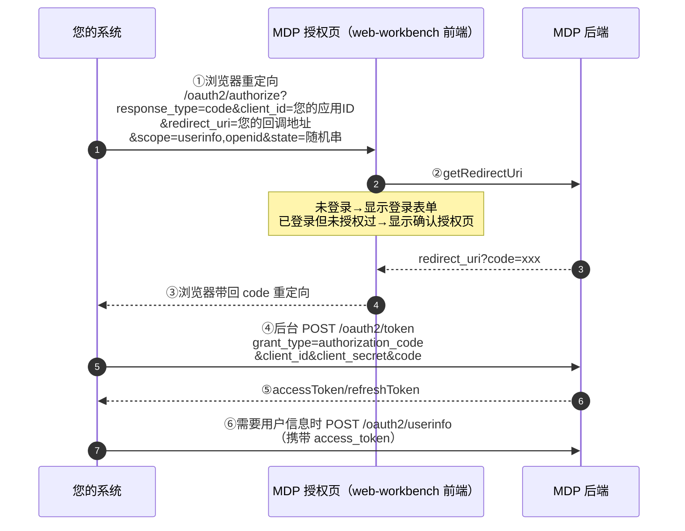

MDP 平台支持两种单点登录方式：

| 对比项 | [ticket 模式](ticket模式.md) | OAuth2 模式（本文档） |
| ------ | --------------------------- | --------------------- |
| 协议 | sa-token 私有 SSO 协议（ticket 换 userId） | 标准 OAuth2（code 换 access_token） |
| 客户端拿到的凭证 | MDP 用户 id（loginId） | access_token / refresh_token |
| 隐私保护 | 直接暴露 userId | **openid（应用隔离）/ unionid（主体联合）** |
| 授权范围控制 | 无 | **scope 机制**（userinfo / openid / unionid） |
| 适用场景 | 简单内部系统对接 | 需要标准协议、需要控制授权范围、需要多应用统一身份 |

## 1. 支持的授权模式

MDP 基于 sa-token OAuth2 实现，支持以下模式（应用可用的模式由平台侧「应用的允许授权类型」配置决定）：

| 模式 | grant_type / response_type | 说明 |
| ---- | -------------------------- | ---- |
| **授权码模式（推荐）** | `response_type=code` → `grant_type=authorization_code` | 最完整、最安全的模式，走完整授权流程 |
| 隐藏式 | `response_type=token` | 授权后直接下放 access_token，无 code 环节，适合纯前端应用（无后台换 token） |
| 密码式 | `grant_type=password` | 第三方后台直接用 MDP 用户的账号密码换 token（仅信任度极高的系统使用） |
| 凭证式 | `grant_type=client_credentials` | 与用户无关，应用身份换 client_token（调用平台开放接口类场景） |
| 刷新令牌 | `grant_type=refresh_token` | 用 refresh_token 换新的 access_token |

## 2. 接入前准备

在 MDP 平台创建应用（详见[准备工作](../准备工作.md)）后，需要配置：

| 参数 | 说明 |
| ---- | ---- |
| `client_id`（appKey，应用ID） | 系统生成，即 OAuth2 的客户端标识 |
| `client_secret`（appSecret，应用秘钥） | 系统生成，**请妥善保管，切勿泄露到前端** |
| `oauth2AllowRedirectUris` | 允许的重定向地址白名单（多个用逗号分隔），`redirect_uri` 必须在白名单内 |
| `oauth2AllowGrantTypes` | 该应用允许的授权模式 |
| `oauth2AccessTokenTimeout` 等 | access_token / refresh_token / client_token 有效期，`-1` 表示使用平台全局默认值 |
| `oauth2IsConfirm` | 是否自动确认授权。**关闭时每次授权需用户手动确认（推荐）；开启则跳过确认页（高危，仅对可信应用开放）** |

### 授权范围（scope）

应用需向平台申请签约 scope，常见内置 scope：

| scope | 说明 |
| ----- | ---- |
| `userinfo` | 可调用 `/oauth2/userinfo` 获取用户昵称、头像、邮箱、手机号等 |
| `openid` | 授权结果中返回 openid——**该用户在您应用下的唯一标识**（不同应用拿到的 openid 不同，平台借此保护用户 id） |
| `unionid` | 授权结果中返回 unionid——同一主体（同一企业/开发者）下所有应用共享的用户标识，用于识别"同一个人" |

## 3. 授权码模式完整流程



### 3.1 引导用户授权（步骤①③）

将浏览器重定向到 MDP 授权页（**标准入口**）：

```
{MDP统一登录页地址}/oauth2/authorize?response_type=code&client_id={您的应用ID}&redirect_uri={您的回调地址}&scope=userinfo,openid&state={随机串}
```

- `state`：建议必传，原样返回，用于防 CSRF（回调时校验一致性）；
- `redirect_uri`：必须与平台登记的白名单完全匹配；
- 用户在 MDP 登录（账号密码 / 手机验证码 / 邮箱验证码）并确认授权后，浏览器被重定向回：

```
{您的回调地址}?code={一次性授权码}&state={原样返回的随机串}
```

- `code` 一次性且有效期很短，请立即到后台换取 token，**不要**在浏览器端暴露 client_secret。

### 3.2 用 code 换取 token（步骤④⑤）

```
POST {MDP后端地址}/oauth2/token
Content-Type: application/x-www-form-urlencoded

grant_type=authorization_code&client_id={应用ID}&client_secret={应用秘钥}&code={授权码}&redirect_uri={回调地址}
```

> `client_id` / `client_secret` 也可放在请求头 `Authorization: Basic Base64(client_id:client_secret)` 中传递（二选一）。

返回：

```json
{
  "code": 0,
  "data": {
    "tokenType": "bearer",
    "accessToken": "xxx",
    "refreshToken": "xxx",
    "expiresIn": 3600,
    "refreshExpiresIn": 2592000,
    "clientId": "2014072300007148",
    "scope": "userinfo,openid",
    "openid": "xxx",
    "unionid": "xxx"
  }
}
```

- `accessToken`：访问令牌，调用 `/oauth2/userinfo` 等资源接口使用；
- `refreshToken`：刷新令牌，有效期更长；
- `openid` / `unionid`：若 scope 中包含对应项才会返回（在额外字段中）。

::: warning 注意：OAuth2 的 access_token ≠ 接口调用的 accessToken

MDP 平台存在两种名称相近、但**体系完全独立**的令牌，请勿混用：

| 对比项 | OAuth2 的 access_token | accessToken.get 返回的 accessToken |
| ------ | ---------------------- | ---------------------------------- |
| 所属体系 | OAuth2 单点登录链路 | 开放接口调用链路（详见[接口调用](../接口调用.md)） |
| 获取方式 | 授权码模式：code 换 token；或密码式、凭证式等 | `accessToken.get` 接口，用 `appKey + appSecret` 换取 |
| 代表身份 | **某个用户**对您应用的授权 | **您的应用**自身 |
| 请求方式 | POST `/oauth2/token`、`/oauth2/userinfo` 等 `/oauth2/*` 接口 | POST 网关 `/api` 入口，公共参数携带 |
| 有效期 | 由应用的 `oauth2AccessTokenTimeout` 配置决定 | 默认 2 小时，`forceRefresh=true` 可强制刷新 |
| 能否刷新 | 有配套 refreshToken（`/oauth2/refresh`） | 无 refreshToken，过期后重新调用 `accessToken.get` |
| 权限控制 | scope 机制（userinfo / openid / unionid） | 接口授权（应用需获平台授权目标接口） |
| 能调用什么 | `/oauth2/userinfo` 等用户资源接口 | `user.page`、`org.save`、`msg.sendSms` 等开放接口 |

典型使用场景区分：

- **用户在您系统内登录后要显示头像、昵称** → 用 OAuth2 的 access_token 调 `/oauth2/userinfo`；
- **您的后台要同步平台组织、用户数据** → 用 `accessToken.get` 换取的 accessToken 调 `org.page`、`user.page` 等开放接口。

:::

### 3.3 获取用户信息（步骤⑥）

```
POST {MDP后端地址}/oauth2/userinfo
（携带 access_token，要求 scope 包含 userinfo）
```

返回用户的昵称、头像、邮箱、手机号等公开信息。**您系统内请以 openid（或 unionid）作为该用户的唯一标识来映射本系统账号，不要依赖昵称等可变字段。**

## 4. 其他模式

### 4.1 隐藏式（implicit）

授权页地址的 `response_type=token`，登录确认后浏览器直接被重定向到：

```
{您的回调地址}#access_token=xxx&token_type=bearer&expires_in=3600&state=xxx
```

适用于纯前端应用（无法安全保管 client_secret 的场景）。无 refresh_token。

### 4.2 密码式（password）

```
POST /oauth2/token
grant_type=password&client_id=...&client_secret=...&username={MDP账号}&password={MDP密码}&scope=userinfo
```

仅在高度可信的系统中使用（明文传递用户密码，要求 HTTPS）。

### 4.3 凭证式（client_credentials）

```
POST /oauth2/client_token
grant_type=client_credentials&client_id=...&client_secret=...&scope=...
```

返回 client_token，代表**应用自身**（而非某个用户）的身份。

## 5. 令牌维护

### 5.1 刷新 token

```
POST /oauth2/refresh
grant_type=refresh_token&client_id=...&client_secret=...&refresh_token={刷新令牌}
```

### 5.2 回收 token（单点注销）

```
POST /oauth2/revoke
client_id=...&client_secret=...&access_token={访问令牌}
```

用户在您的系统注销时，建议调用此接口使 token 失效。OAuth2 模式下各应用持有独立的 access_token，退出时回收自己的 token 即可，不涉及 ticket 模式的「全端注销推送」机制。

## 6. 接口汇总

| 接口 | 调用方 | 说明 |
| ---- | ------ | ---- |
| `POST /oauth2/getRedirectUri` | MDP 授权页内部 | 登录后构建带 code/token 的重定向地址（第三方无需调用） |
| `POST /oauth2/getConfirmInfo` / `POST /oauth2/confirm` | MDP 授权页内部 | 确认授权页信息 / 确认授权（第三方无需调用） |
| `POST /oauth2/token` | **第三方后台** | code 换 token / 密码式换 token |
| `POST /oauth2/client_token` | **第三方后台** | 凭证式获取 client_token |
| `POST /oauth2/refresh` | **第三方后台** | 刷新 access_token |
| `POST /oauth2/revoke` | **第三方后台** | 回收 access_token |
| `POST /oauth2/userinfo` | **第三方后台** | 获取用户信息（需 userinfo scope） |

## 7. 常见问题

**Q1：提示 redirect_uri 不合法？**

`redirect_uri` 必须与应用配置的 `oauth2AllowRedirectUris` 白名单条目完全匹配（协议、域名、端口、路径），换 token 时的 `redirect_uri` 还必须与授权时传入的一致。

**Q2：提示 grant_type / 授权模式未开放？**

两级开关都需打开：平台全局配置 + 应用的 `oauth2AllowGrantTypes`。请确认您的应用已签约目标模式。

**Q3：token 过期了怎么办？**

access_token 过期前用 refresh_token 调 `/oauth2/refresh` 换新；refresh_token 也过期则需重新走授权流程。

**Q4：同一用户换了应用后 openid 不同？**

这是设计行为：openid 按应用隔离。若需要在您的多个应用间识别同一用户，请申请 `unionid` scope。

**Q5：如何跳过授权确认页？**

平台侧将应用的"自动确认授权"打开即可（高危配置，仅对可信应用开放，需平台管理员操作）。

**Q6：code 无效（已使用/过期）？**

授权码一次性且短时效，换取 token 失败请重新发起授权；另确认换 token 的 redirect_uri 与授权时一致。
