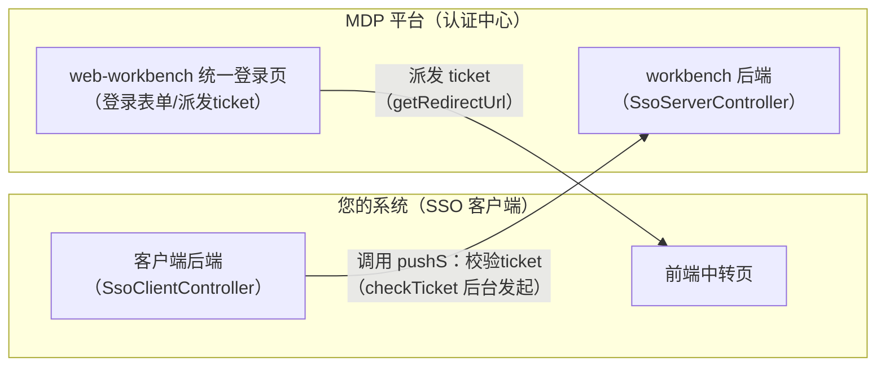
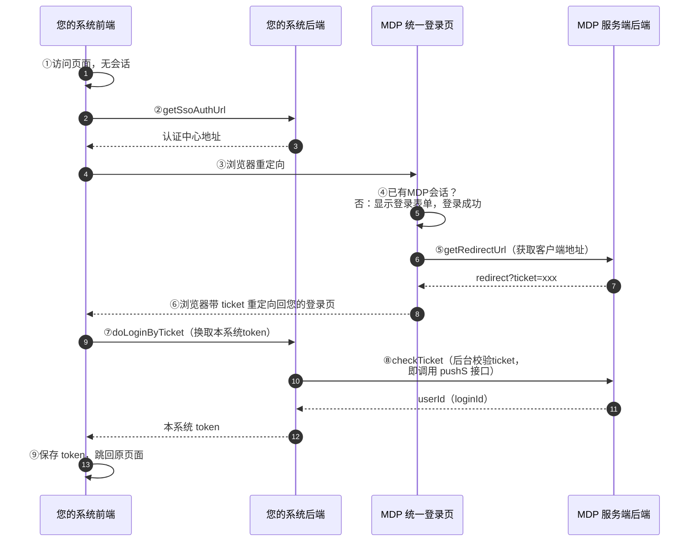
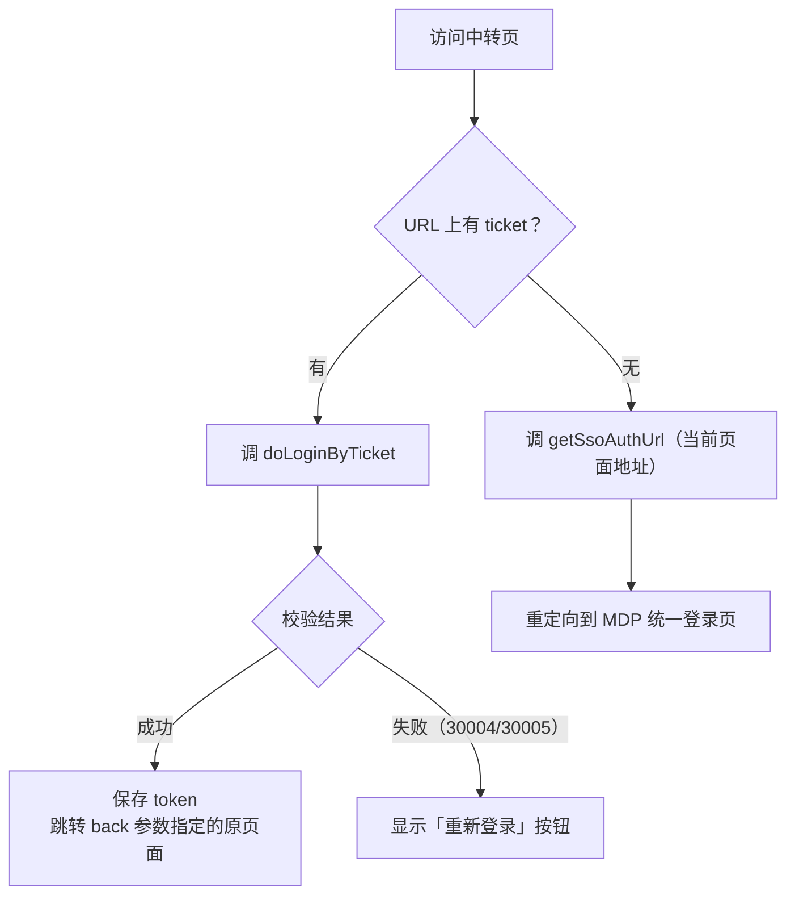
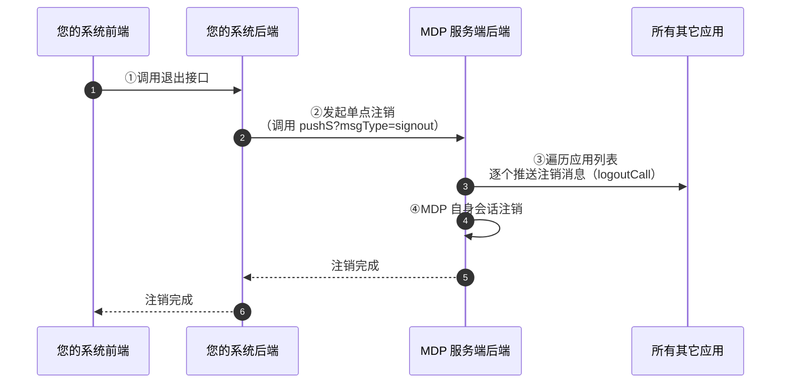

MDP 平台支持两种单点登录方式：

| 方式 | 核心机制 | 适用场景 |
| ---- | -------- | -------- |
| **ticket 模式（本文档）** | 登录成功后 MDP 派发一次性 `ticket`，客户端凭 `ticket` 换取用户 id，生成本系统会话 | 前后端分离的 Web 系统 |
| [OAuth2 模式](oauth2模式.md) | 标准授权码模式 | 需要 OAuth2 生态兼容的系统 |

## 1. 角色说明

MDP 单点登录基于 Sa-Token SSO 模块（模式二/模式三）实现：

- **SSO 服务端（认证中心）**：MDP 平台。统一登录页由 `web-workbench` 前端承担，后端接口在 workbench 服务（`SsoServerController`）。
- **SSO 客户端**：您的系统。需要实现 3 个后端接口 + 1 个前端中转页。



## 2. 登录流程总览（模式二/三）



步骤说明：

| 步骤 | 含义 |
| ---- | ---- |
| ⑦ doLoginByTicket | 您的系统后端接口：接收前端提交的 ticket，向 MDP 校验并换取用户身份，生成本系统会话 token |
| ⑧ checkTicket | sa-token 客户端内置方法：您的后端**后台**调用 MDP 服务端的 `pushS` 接口校验 ticket 有效性，成功返回 `userId`（即 loginId） |

关键点：

- **ticket 是一次性的**：默认 5 分钟有效（服务端配置 `sa-token.sso-server.ticket-timeout=300`），且使用一次后即销毁；同一账号重复登录时服务端会先删除旧 ticket 再派发新 ticket；
- **MDP 不会把用户密码告诉您**，您拿到的是 `userId`（MDP 用户 id），由您自行映射/创建本系统的账号；
- **登录方式**（账号密码 / 手机验证码 / 邮箱验证码）由认证中心的登录页决定，您的系统无需关心。

## 3. 接入前准备

在 MDP 平台创建应用（详见[准备工作](../准备工作.md)）后，确认以下配置：

| 参数 | 来源 | 说明 |
| ---- | ---- | ---- |
| `appKey`（应用ID） | 系统生成 | 客户端唯一标识，即下文配置中的 `client` |
| `appSecret`（应用秘钥） | 系统生成 | 客户端与 MDP 后端通信时接口调用秘钥 |
| `ssoAllowUrl` | 您配置 | **允许授权的重定向地址白名单**，多个用逗号分隔。`redirect` 参数必须在白名单内，否则拒绝重定向 |
| `ssoPushUrl` | 您配置 | 您系统接收 MDP 推送消息的后端地址（如 `http://your-domain/anyUser/client/pushC`），用于单点注销 |
| `ssoPush` | 您配置 | 是否接收消息推送。需要单点注销请开启 |
| `allowIp` | 您配置 | 你的应用的IP地址。调用 MDP 服务端接口的服务器 IP 地址。内置应用填内网 IP，第三方应用填您的服务器**外网 IP** |

## 4. 您的系统需要实现的内容

以下代码参考自若依的接入实现，完整可运行代码见[若依实战](若依实战-ticket模式.md)。

### 4.1 后端：3 个接口

#### 接口一：获取认证中心登录地址

```
GET /anyUser/client/getSsoAuthUrl?clientLoginUrl={当前页面地址}
```

检测到用户未登录（无本系统 token，URL 上也没有 ticket）时，前端先调用此接口，然后重定向到返回的地址。

```java
@GetMapping("/anyUser/client/getSsoAuthUrl")
public AjaxResult getSsoAuthUrl(String clientLoginUrl) {
    // 拼接：认证中心登录页 + client + redirect=clientLoginUrl
    String serverAuthUrl = SaSsoClientUtil.buildServerAuthUrl(clientLoginUrl, "");
    return AjaxResult.success("操作成功", serverAuthUrl);
}
```

#### 接口二：根据 ticket 登录

```
GET /anyUser/client/doLoginByTicket?ticket={ticket}
```

浏览器从认证中心带 ticket 重定向回来后，前端调用此接口换取本系统的 token：

```java
@GetMapping("/anyUser/client/doLoginByTicket")
public AjaxResult doLoginByTicket(String ticket) {
    // 校验 ticket（内部会通过 http 请求调用 MDP 服务端的 pushS 接口完成校验）
    // 校验失败会直接抛异常（错误码 30004：ticket 无效；30005：校验失败）
    SaCheckTicketResult ctr = SaSsoClientProcessor.instance.checkTicket(ticket);

    // 校验成功：ctr.loginId 即 MDP 的用户id，根据它查询/创建本系统用户，生成本系统会话
    String token = sysLoginService.login(Convert.toLong(ctr.loginId()));
    return AjaxResult.success("操作成功", token);
}
```

`SaCheckTicketResult` 主要字段：

| 字段 | 说明 |
| ---- | ---- |
| `loginId` | MDP 用户 id（即您换取到的用户标识） |
| `remainTokenTimeout` | MDP 会话剩余有效时间（秒），可用于同步设置您本系统会话时长 |
| `clientId` | 客户端标识（即 appKey） |

#### 接口三：接收服务端推送（单点注销必需）

```
GET /anyUser/client/pushC
```

MDP 服务端执行"全端退出"时，会向所有开启了 `ssoPush` 的应用推送注销消息，您的系统在此接口中销毁本系统会话：

```java
@GetMapping("/anyUser/client/pushC")
public Object push() {
    try {
        // 消息类型：logoutCall（单点注销回调），框架内部自动处理
        return SaSsoClientProcessor.instance.ssoPushC();
    } catch (Exception e) {
        return SaResult.error(e.getMessage());
    }
}
```

> 若您的系统集成了 Spring Security 等安全框架，注销回调还需同步调整登出处理器（若依即因集成了 Spring Security 而改造了 `LogoutSuccessHandlerImpl`，详见第 6 章）。

### 4.2 后端：sa-token sso-client 配置

在您的 `application.yml` 中：

```yaml
sa-token:
  sso-client:
    ### 以下信息为【应用管理】创建应用后系统生成的值 ###
    client: your-app-key           # 应用ID（即 appKey）
    secret-key: your-app-secret    # 应用秘钥（即 appSecret）

    ### 以下信息根据您的部署环境修改 ###
    # MDP 单体版：boot-server 访问地址
    server-url: http://localhost:23455
    # MDP 微服务版：inner-gateway-server 访问地址 + workbench 前缀
    # server-url: http://localhost:23450/api/workbench
    # MDP 统一登录页地址（web-workbench 前端）
    authUrl: 'http://localhost:7700/#/auth/login'

    ### 以下为 MDP 服务端固定路径，请勿修改 ###
    signoutUrl: '/anyUser/sso/signout'
    pushUrl: '/anyUser/sso/pushS'
    # 是否使用模式三
    is-http: true
```

说明：

- `is-http: true` 即**模式三**：客户端后端通过 http 请求向 MDP 服务端校验 ticket、注销会话（推荐，前后端分离架构适用）；
- `secret-key` 用于客户端 ↔ 服务端后台接口调用的签名校验（timestamp + sign），防止伪造；
- `server-url` 必须是您的后端服务**可以访问到**的地址（内网互通即可）。

### 4.3 前端：登录中转页

在前端项目新建一个中转页（如 `login_sso.vue`，访问地址： http://localhost:1024/login ），逻辑只有两步：**有 ticket 就登录，没 ticket 就跳认证中心**。



参考实现要点：

```javascript
created() {
  // 有 ticket 走登录，无 ticket 跳认证中心
  (this.ticket ? this.handleLoginByTicket(this.ticket) : this.goSsoAuthUrl());
},
methods: {
  handleLoginByTicket(ticket) {
    doLoginByTicket(ticket).then((res) => {
      // 保存 token 到本系统，然后跳回 back 指定的原页面
      this.$store.dispatch("Login2", res.data).then(() => {
        location.href = decodeURIComponent(this.back);
      });
    }).catch((error) => {
      // 30004：ticket 无效；30005：ticket 校验失败 —— 提示重新登录
      if ([30004, 30005].includes(error?.data?.code)) {
        this.ticketError = true;   // 页面显示"重新登录"按钮，点击后重新走 goSsoAuthUrl
      }
    });
  },
  goSsoAuthUrl() {
    // clientLoginUrl 传当前完整地址（含 back 参数），登录成功后认证中心会重定向回来
    getSsoAuthUrl(location.href).then((res) => {
      location.href = res.data;
    });
  },
}
```

配套调整：

- 将本系统所有"检测到未登录"的地方重定向到该中转页，并携带 `back` 参数（登录成功后要回到的地址）；
- 建议在路由守卫中：无 token 且无 ticket 时跳转中转页。

## 5. 从工作台跳转到您的系统（自动登录）

若您的系统配置了**自动登录地址**（免登录跳转地址），用户在 MDP 工作台"我的应用"点击您的应用时，MDP 会直接派发 ticket 并打开：

```shell
# 如 http://localhost:1024/login?ticket=xx
https://your-domain/your-login-path?ticket=xxx
```

您的中转页按 4.3 节流程处理该 ticket 即可，无需额外开发。

## 6. 单点注销

### 6.1 注销范围的三种类型

从注销范围上，注销分为三种，实现方式和影响面各不相同：

| 类型 | 影响范围 | 您的系统需要做什么 |
| ---- | -------- | ------------------ |
| **单端注销** | 仅当前应用下线，其它应用和认证中心不受影响 | 你项目本来就集成了sa-token，只需本地 `StpUtil.logout()`  <br/>没有集成sa-token，如若依使用的是spring-secrity，则需要自行删除本系统 token |
| **全端注销（单点注销）** | 一处注销，所有应用 + 认证中心全部下线 | 通知 MDP 服务端，由服务端统一推送注销 |
| **单浏览器注销** | 仅当前浏览器登录的应用下线，其它浏览器/设备不受影响 | 在全端注销请求上附加 `singleDeviceIdLogout=true` 参数 |

> 三者的关系：单端注销是"我退我的"；全端注销是"通知所有人退出"；单浏览器注销是全端注销的细化——只注销同一 deviceId（同一浏览器）的会话。前提是登录时按 deviceId 分组（MDP 认证中心登录时已自动设置 deviceId，见 6.4）。

### 6.2 单端注销

只注销当前应用的会话，不惊动认证中心和其它应用。在您的后端添加接口：

```java
// 当前应用独自注销（不退出其它应用）
@RequestMapping("/sso/logoutByAlone")
public Object logoutByAlone() {
    StpUtil.logout();
    return SaSsoClientProcessor.instance._ssoLogoutBack(SaHolder.getRequest(), SaHolder.getResponse());
}
```

前端跳转或 ajax 异步调用此接口即可。若是跳转方式，可指定 `back` 参数代表注销成功后跳转的地址，例如：

```
http://{您的系统地址}/sso/logoutByAlone?back=https://your-home-page
```

> 若您的系统未使用 sa-token（如若依使用 spring-security），单端注销只需删除本系统 token 即可，无需实现上述接口。

### 6.3 全端注销（单点注销）

一处注销、全端下线。客户端和服务端均可发起，整体流程：



以上逻辑 sa-token 已在内部封装完毕，您只需按步骤集成。

#### 6.3.1 客户端发起（推荐，用户在您的系统点退出）

前端调用您后端的退出接口 → 您的后端调用 MDP 服务端的 `pushS` 接口（`msgType=signout`）→ 服务端遍历所有开启 `ssoPush` 的应用逐个推送 `logoutCall` → 各应用（含 MDP 自身）销毁会话。

使用 sa-token 的系统，前端只需调用 sa-token 提供的注销端点即可（内部自动完成 ②~④ 全部动作）。前端调用后要同步清除本地的 token 缓存：

```javascript
// 退出成功后，前端清除本系统 token
logout(state.token).then(() => {
    commit('SET_TOKEN', '');
    commit('SET_ROLES', []);
    commit('SET_PERMISSIONS', []);
    removeToken();
});
```

未使用 sa-token 的系统（如若依集成了 spring-security），需要在退出处理器中自行调用 sa-token 客户端方法通知 MDP。以若依改造 `LogoutSuccessHandlerImpl` 为例：

```java
@Override
public void onLogoutSuccess(HttpServletRequest request, HttpServletResponse response, Authentication authentication) {
    LoginUser loginUser = tokenService.getLoginUser(request);
    if (loginUser != null && loginUser.getUser().getSsoId() != null) {
        // loginId 即登录时通过 ticket 换到的 MDP 用户id，用它通知认证中心注销
        SaResult result = (SaResult) _ssoLogoutByMode3(loginUser.getUser().getSsoId());
        if (result.getCode() == SaResult.CODE_SUCCESS) {
            // 删除本系统会话、记录退出日志
            tokenService.delLoginUser(loginUser.getToken());
        }
    }
}
```

`_ssoLogoutByMode3` 内部做的事（无需自己实现，理解即可）：构建注销消息 → 调用 MDP 服务端 `/anyUser/sso/pushS` → 服务端响应非 200 时抛 30006 异常 → 最后本地再注销一次兜底（防止服务端极端场景下未通知到本应用）。

#### 6.3.2 服务端发起（用户在 MDP 平台点退出）

用户在 MDP 任意入口点击"全端退出"时，MDP 服务端接口 `/anyUser/sso/signout` 会执行 `ssoSignout()`，同样走 ③④ 步骤——遍历所有开启 `ssoPush` 的应用，逐个向其 `ssoPushUrl` 推送 `logoutCall` 消息，您的 `pushC` 接口收到后销毁本系统会话即可（`pushC` 实现见 4.1 接口三）。

### 6.4 单浏览器注销

只注销**当前浏览器**登录的应用（同一账号在其它浏览器/设备上的会话不受影响）。

**前提**：登录时按 `deviceId` 设备 ID 为会话分组。MDP 认证中心已在登录方法中设置（前端未传则随机生成）：

```java
StpUtil.login(userId, new SaLoginParameter()
        .setDeviceType("PC")
        .setDeviceId(StrUtil.isEmpty(login.getDeviceId()) ? SaFoxUtil.getRandomString(32) : login.getDeviceId()));
```

**发起方式**：在全端注销的基础上附加 `singleDeviceIdLogout=true` 参数，代表按设备 ID 分组注销，非本设备 ID 的会话不参与注销：

```
http://{您的系统地址}/sso/logout?back=self&singleDeviceIdLogout=true
```

MDP 自身前端退出当前浏览器会话时也是这种用法（`signout` 接口携带 `singleDeviceIdLogout: true`）。

### 6.5 接入单点注销的检查清单

1. 应用配置中 `ssoPush` 已开启、`ssoPushUrl` 已正确指向您的 `pushC` 接口；
2. `pushC` 接口外网可访问（MDP 服务端主动发起 HTTP 调用），且未被本系统鉴权拦截器拦截（路径含 `anyUser` 即匿名可访问）；
3. 未使用 sa-token 的系统（spring-security 等），需在登出处理器中补充"通知 MDP 注销"的逻辑（见 6.3.1）；
4. 若需要单浏览器注销，确认登录链路中 `deviceId` 正确传递与保存。

## 7. 常见问题

**Q1：登录后提示 ticket 无效（30004/30005）？**

- ticket 一次性且默认 5 分钟有效，请确认没有重复使用（例如页面刷新导致同一 ticket 提交两次）；
- 确认 `secret-key` 与平台登记的 `appSecret` 一致——客户端调用服务端校验接口需要签名；
- 出现该错误时引导用户走"重新登录"，重新获取新 ticket。

**Q2：重定向被拒绝 / 提示 redirect 不合法？**

`redirect` 地址必须在应用配置的 `ssoAllowUrl` 白名单内（支持逗号分隔多个）。请检查域名、端口、路径是否完全匹配。

**Q3：调 MDP 服务端接口提示 IP 不在白名单？**

检查应用配置的 `allowIp`。第三方应用应配置您服务器的**外网出口 IP**；与 MDP 部署在同一内网的系统才填内网 IP。

**Q4：单点注销没有生效？**

- 确认 `ssoPush` 开启、`ssoPushUrl` 配置正确且 MDP 服务端可访问；
- 确认您的 `pushC` 接口没有被您系统的鉴权拦截器拦截（该接口必须匿名可访问，即路径含 `anyUser`）；
- 查看您系统是否因集成 Spring Security 等框架，需要在登出处理器中补充销毁逻辑。

**Q5：ticket 换登录成功后，再次访问又要求登录？**

您本系统的会话时长设置过短或未持久化 token。建议用 `SaCheckTicketResult.remainTokenTimeout`（MDP 会话剩余时间）来设置您本系统会话的有效期，保持两者同步过期。

**Q6：如何区分不同登录方式、记录登录日志？**

认证中心在登录和跳转时会记录登录日志（含 appKey、跳转地址等），您可以在 MDP 控制台查询。
