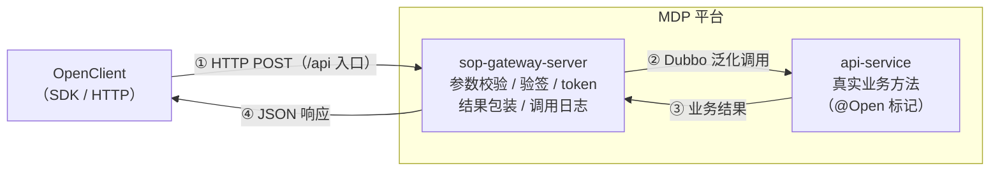

接口调用（拉数据）是指：您的应用**主动调用** MDP 平台开放的接口（如查询组织、用户，发送短信邮件），获取平台数据。

## 1. 链路概述



要点：

- 所有开放接口统一由网关 `sop-gateway-server` 的 `/api` 入口承接，**第三方应用不直接访问 api-service**；
- 网关完成权限检查、签名验证、IP 拦截、token 校验后，通过 Dubbo 泛化调用转发到真实的业务方法；
- 各接口的请求/响应字段以 `mdp-simple-sdk` 中对应的 `XxxApi` / `XxxDto` / `XxxResp` 类为准，也可在开发者中心查看接口文档。

## 2. 接入总览：您要做的事

无论选择哪条路线，接入的完整过程都是固定的 4 件事：

1. **准备凭证**：在平台创建应用，拿到 `appKey`、`appSecret`，配置出口 IP；
2. **换取 accessToken**：多数接口都需要访问令牌，先调 `accessToken.get` 获取；
3. **调用业务接口**：按接口文档组装业务参数（`bizContent`），提交到网关 `/api`；
4. **解析响应**：按 `code == "0"` 判定成功，取 `data` 中的数据。

其中第 2、3、4 步有两种实现路线，二选一即可：

| 路线 | 适合谁 | 您需要做的 | 跳转 |
| ---- | ------ | ---------- | ---- |
| **路线一：官方 SDK（Java，推荐）** | Java 技术栈 | 引入 2 个依赖，初始化一个客户端，直接用现成的 `XxxApi` 类调接口——签名、公共参数、token 携带、响应解析全部自动完成 | [第 4 节](#_4-路线一-使用官方-sdk-推荐) |
| **路线二：自行封装 HTTP** | 非 Java 技术栈，或不想引依赖 | 自己组装表单参数、自己算 RSA2 签名、自己管理 token 与响应解析 | [第 5 节](#_5-路线二-自行封装-http-请求) |

## 3. 第一步：接入前准备

详见[准备工作](准备工作.md)，本链路需要：

1. 已创建应用并获得 `appKey`、`appSecret`；

   

2. 已生成 RSA2 密钥对并**上传公钥**到平台——因为第一个要调的接口 `accessToken.get` 就强制要求签名（**不是可选项**，两条路线都需要）；

3. 应用配置的允许授权 IP 中已填写您服务器的外网出口 IP；

4. 目标接口已获得平台授权（默认接口无需申请，受限接口联系平台管理员开通）。

完成后您手上应有 4 个值：

| 值 | 来源 | 用途 |
| ---- | ---- | ---- |
| appKey | 平台分配（应用ID） | 每个请求必填 |
| appSecret | 平台分配（应用秘钥） | 仅用于换取 accessToken |
| 应用私钥 | 您自己生成的 RSA2 私钥（PKCS8 格式） | 请求签名，**只存在您这边，绝不上传** |
| 网关地址 | 平台分配，形如 `https://gateway.xxx.com/api` | 所有请求的提交地址 |

## 4. 路线一：使用官方 SDK（推荐）

SDK 分两个模块，职责清晰：

- `mdp-sdk-core`：核心工具类，提供 `OpenClient` 请求客户端、`SignUtil` 签名工具；
- `mdp-simple-sdk`：封装了所有开放接口，每个接口一个 `XxxApi` 类，含强类型的请求/响应对象。

使用 SDK 时，签名规则、公共参数、token 携带、响应解析**全部自动完成**，您只需要按以下 4 步走。

### 4.1 引入依赖

```xml
<dependency>
    <groupId>top.mddata.sdk</groupId>
    <artifactId>mdp-sdk-core</artifactId>
    <version>${mdp.version}</version>
</dependency>
<dependency>
    <groupId>top.mddata.sdk</groupId>
    <artifactId>mdp-simple-sdk</artifactId>
    <version>${mdp.version}</version>
</dependency>
```

> 版本号与 MDP 平台版本保持一致，建议通过 Maven 属性统一管理（如 `${mdp.version}`），升级时只需改一处。

### 4.2 初始化客户端

```java
// url：网关地址；appKey：平台分配；privateKeyIsv：您的应用私钥（RSA2 签名用）
OpenClient client = new OpenClient("https://gateway.xxx.com/api", "您的appKey", "您的应用私钥");
```

`OpenClient` 线程安全，**声明一个全局复用即可**，无需每次请求都创建。如需调整超时时间：

```java
OpenConfig config = new OpenConfig()
        .setConnectTimeoutSeconds(10)
        .setReadTimeoutSeconds(10);
OpenClient client = new OpenClient(url, appKey, privateKey, config);
```

### 4.3 获取 accessToken

`accessToken.get` 由 SDK 封装为 `AccessTokenGetApi`，且该类已内置「需要签名」标记——签名由 SDK 自动完成，您只管传入 appKey 与 appSecret：

```java
AccessTokenGetDto dto = new AccessTokenGetDto();
dto.setAppKey("您的appKey").setAppSecret("您的appSecret");

Result<AccessTokenGetResp> result = client.execute(new AccessTokenGetApi().setBizModel(dto));
if ("0".equals(result.getCode())) {
    String accessToken = result.getData().getAccessToken();
    // 建议立即设置为默认令牌，后续所有请求自动携带，无需逐个传递
    client.setDefaultAccessToken(accessToken);
}
```

令牌特性：

- token 默认 2 小时有效，过期请重新获取（建议在内存中缓存并记录获取时间，过期前刷新）；
- token 与 appKey 绑定，不能跨应用使用；
- `forceRefresh=true` 后旧 token 立即失效。

### 4.4 调用业务接口

每个开放接口对应一个 `XxxApi` 类，组装业务参数后 `execute` 即可，返回值是强类型对象：

```java
// 查询组织分页
OrgPageApi api = new OrgPageApi();
OrgQuery query = new OrgQuery();
// ... 组装查询条件
api.setBizModel(query);

Result<Page<OrgResp>> pageResult = client.execute(api);
if ("0".equals(pageResult.getCode())) {
    List<OrgResp> records = pageResult.getData().getRecords();
}
```

发送短信、查用户等其他接口同理，把 `OrgPageApi` / `OrgQuery` 换成对应的 `XxxApi` / `XxxDto` 即可，全部接口清单见第 7 节。

### 4.5 SDK 已封装、您无需自己实现的能力

以下环节 SDK 已全部处理，直接使用即可，**不要自己重复实现**：

| 能力 | 说明 |
| ---- | ---- |
| 公共参数填充 | `execute` 自动填充 `appKey`、`method`、`version`、`format`、`charset`、`timestamp` |
| 请求签名 | `AccessTokenGetApi` 等需要签名的接口已内置标记；其他接口默认不签，如需开启可全局 `OpenConfig.setSignEnabled(true)` 或单个请求 `api.setSignEnabled(true)`，传入私钥即自动签名 |
| accessToken 携带 | 设置 `client.setDefaultAccessToken()` 后自动携带；也可单个请求 `api.setAccessToken()` 覆盖 |
| 响应解析 | 自动反序列化为 `Result<Resp>` 强类型对象，下划线字段自动匹配驼峰属性 |
| 文件上传/下载 | 请求对象实现 `DownloadAware` 后，`execute` 自动改走下载流，`client.download(request)` 直接返回文件内容 |
| 签名工具 | 若您在 SDK 之外还有自己拼请求的场景，可直接使用 `SignUtil`（见 5.2 节），无需引入额外依赖 |

## 5. 路线二：自行封装 HTTP 请求

非 Java 技术栈或无法引入 SDK 时，直接 HTTP POST 表单到网关 `/api`。此路线下签名、token、参数组装都要自己实现，请严格按以下 5 步执行。

### 5.1 第 1 步：了解请求协议

所有接口通过 HTTP POST **表单**（`application/x-www-form-urlencoded`）提交到网关 `/api` 入口，公共参数如下：

| 参数 | 必填 | 说明 |
| ---- | ---- | ---- |
| appKey | 是 | 平台分配的应用ID |
| method | 是 | 接口名，如 `user.page` |
| version | 是 | 接口版本，如 `1.0` |
| format | 是 | 响应格式，固定 `json` |
| charset | 是 | 编码，固定 `utf-8` |
| timestamp | 是 | 请求时间，格式 `yyyy-MM-dd HH:mm:ss`，与平台时间差超过网关超时配置会被拒绝 |
| accessToken | 视接口 | 访问令牌，多数接口需要 |
| bizContent | 是 | 业务参数，JSON 字符串 |
| signType | 视接口 | 签名算法类型，`RSA2` |
| sign | 视接口 | 请求签名串 |

> `signType`、`sign`、`accessToken` 是否必填，取决于目标接口在平台侧的 `needSign`、`needToken` 配置。默认情况下：需要 token（大多数接口）、不需要签名。但 `accessToken.get` 本身**强制需要签名**，所以第 2 步的签名是必学项。

### 5.2 第 2 步：实现 RSA2 签名

这是本路线最关键也最容易出错的一步。签名规则：

1. 将所有请求参数（**不含 `sign` 本身**）按参数名 ASCII 码升序排序；
2. 组成 `key=value` 并用 `&` 连接，得到待签名内容（值不做 URL 编码，空值参数跳过）；
3. 使用您的**应用私钥**对待签名内容进行 SHA256WithRSA（即 RSA2）签名；
4. 签名结果 Base64 编码后放入 `sign` 参数。

**签名过程示例**。假设请求参数如下（尚未包含 sign）：

| 参数         | 值                         |
|------------|---------------------------|
| appKey     | 2014072300007148          |
| method     | user.page                 |
| version    | 1.0                       |
| charset    | utf-8                     |
| format     | json                      |
| signType   | RSA2                      |
| timestamp  | 2026-07-24 03:07:50       |
| bizContent | `{"current":1,"size":10}` |

第一步，按参数名 ASCII 升序排序后拼接为待签名内容（8 个参数的排序结果为：appKey → bizContent → charset → format → method → signType → timestamp → version）：

```
appKey=2014072300007148&bizContent={"current":1,"size":10}&charset=utf-8&format=json&method=user.page&signType=RSA2&timestamp=2026-07-24 03:07:50&version=1.0
```

> 注意：`signType` 参与签名，`sign` 本身不参与签名；`bizContent` 的值按原始 JSON 字符串参与拼接，不做 URL 编码。

第二步，用应用私钥对上述内容做 SHA256WithRSA 签名，结果 Base64 编码后即 `sign` 的值，随请求一起提交。

各语言伪代码：

```
待签名内容 signContent = 按参数名 ASCII 升序排序后以 & 拼接 key=value（不含 sign 本身，值不 URL 编码）
sign = Base64( SHA256WithRSA_Sign( privateKey, signContent ) )
```

平台收到请求后，使用您上传的公钥以相同规则验签。

### 5.3 第 3 步：获取 accessToken

调用 `accessToken.get` 换取令牌。该接口 `needToken=false`、**`needSign=true`**——也就是说这是您的第一个签名请求，appKey 与 appSecret 放在 `bizContent` 中：

```bash
curl -X POST 'https://gateway.xxx.com/api' \
  -d 'appKey=您的appKey' \
  -d 'method=accessToken.get' \
  -d 'version=1.0' \
  -d 'format=json' \
  -d 'charset=utf-8' \
  -d 'timestamp=2026-07-24 03:07:50' \
  -d 'signType=RSA2' \
  -d 'sign=按5.2节规则计算的签名' \
  -d 'bizContent={"appKey":"您的appKey","appSecret":"您的appSecret"}'
```

响应的 `data.accessToken` 即访问令牌。请缓存并记录获取时间：

- token 默认 2 小时有效，过期请重新获取；
- token 与 appKey 绑定，不能跨应用使用；
- `forceRefresh=true` 后旧 token 立即失效。

### 5.4 第 4 步：调用业务接口

将业务参数组装为 `bizContent`（JSON 字符串），连同公共参数与 accessToken 提交。以分页查询用户为例：

```bash
curl -X POST 'https://gateway.xxx.com/api' \
  -d 'appKey=您的appKey' \
  -d 'method=user.page' \
  -d 'version=1.0' \
  -d 'format=json' \
  -d 'charset=utf-8' \
  -d 'timestamp=2026-07-24 03:07:50' \
  -d 'accessToken=您的token' \
  -d 'bizContent={"current":1,"size":10}'
```

> `user.page` 等多数业务接口默认不需要签名，不带 `signType`、`sign` 即可；若目标接口要求签名（平台会返回 `ISV_MISSING_SIGNATURE`），按 5.2 节规则计算后追加这两个参数。

### 5.5 第 5 步：解析响应

按第 6 节的响应格式判定成功/失败并取数。建议封装统一的响应处理：`code != "0"` 时抛出带 `subCode` / `subMsg` 的异常，便于定位问题。

## 6. 响应格式与错误码

```json
{
    "code": "0",
    "msg": "",
    "subCode": "",
    "subMsg": "",
    "data": {
        "id": 1,
        "name": "Jim"
    }
}
```

- `code` 为 `"0"` 表示成功，其余为失败；
- 失败时 `subCode` / `subMsg` 携带具体错误信息；
- 个别接口若声明了 `hasCommonResponse=false`，则只返回 `data` 部分的内容。

| 错误码 | 说明 | 排查建议 |
| ------ | ---- | -------- |
| ISV_INVALID_METHOD | 接口不存在或未启用 | 检查 method/version 是否正确 |
| ISV_MISSING_APP_KEY / ISV_INVALID_APP_KEY | appKey 缺失或不合法 | 核对 appKey |
| ISV_MISSING_SIGNATURE / ISV_INVALID_SIGNATURE | 签名缺失或错误 | 核对私钥与平台公钥是否配对、签名内容是否包含多余参数 |
| ISV_INVALID_TIMESTAMP | 请求超时 | 检查服务器时间，timestamp 超过网关配置的超时秒数会被拒绝 |
| AOP_INVALID_AUTH_TOKEN | accessToken 缺失或无效 | 先调用 accessToken.get；检查 token 是否过期、是否与 appKey 匹配 |
| ISV_IP_FORBIDDEN | IP 被禁止访问 | 联系平台管理员检查 IP 黑白名单 |
| ISV_ROUTE_NO_PERMISSIONS | 无接口授权 | 联系平台管理员为应用授权该接口 |

## 7. 接口列表

当前平台开放的接口（method 名即开放接口的标识）：

| 分类 | method | 说明 |
| ---- | ------ | ---- |
| 令牌 | accessToken.get | 获取访问令牌（needToken=false，needSign=true） |
| 组织机构 | org.save / org.updateById / org.getById / org.page | 组织机构增删改查 |
| 用户 | user.batchSave / user.updateById / user.getById / user.page | 用户增删改查 |
| 消息 | msg.sendSms / msg.sendEmail / msg.sendNotice | 短信、邮件、站内信发送 |

## 8. 常见问题

**Q1：请求返回"请求超时"？**

timestamp 与平台服务器时间差超过网关配置的超时秒数（`mdp.gateway.timeout-seconds`）会被拒绝，请校准服务器时间。

**Q2：签名总是验签失败？**

- 确认签名内容不包含 `sign` 参数本身；
- 确认参数按 ASCII 升序排序，值不做 URL 编码；
- 确认您用的是应用私钥签名，且平台存储的是对应公钥。

**Q3：token 提示无效？**

- token 默认 2 小时有效，过期请重新获取；
- token 与 appKey 绑定，不能跨应用使用；
- `forceRefresh=true` 后旧 token 立即失效。

**Q4：提示无接口授权（ISV_ROUTE_NO_PERMISSIONS）？**

应用需先获得目标接口的授权，请联系平台管理员在控制台为您的应用开通接口权限。
