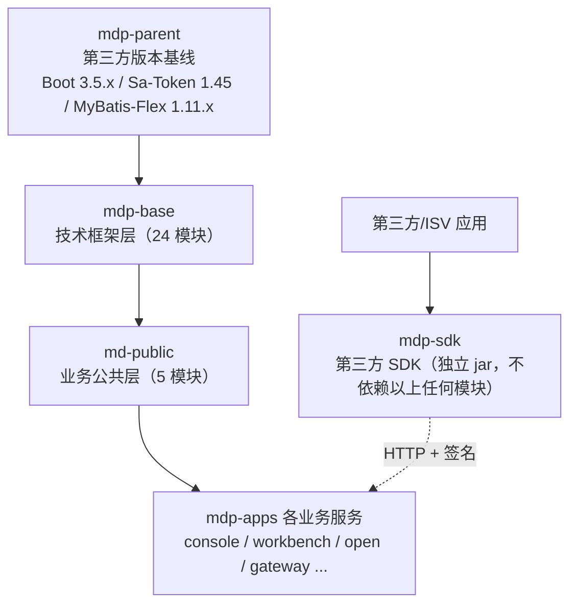

本章节面向**基于 MDP 进行二次开发的程序员（以及辅助开发的 AI）**，对后端四个基础工程做模块级源码解读，重点回答五个问题：

1. 每个模块是干什么的（源码解读）
2. 想改功能应该动哪里（扩展点、功能扩展建议）
3. 哪些行为不用改代码、改配置就行（可配置参数）
4. 有哪些坑（二次开发注意事项）

::: tip 与现有章节的分工
平台整体架构（单体/微服务双形态、facade 三件套）见 [架构介绍](../info/架构介绍.md)，业务服务的分层与端口清单见 [服务介绍](../start/服务介绍.md)，完整工程目录树见 [简介](../简介.md)。本章节不重复上述内容，只聚焦**单个模块内部**的结构与扩展方式。
:::

## 1. 四大工程定位

| 工程 | Maven 坐标 | 定位 | 文档 |
|---|---|---|---|
| mdp-parent | `top.mddata.base:mdp-parent` | 全平台第三方依赖版本基线（BOM）+ checkstyle/flatten 构建规范 | [mdp-parent](mdp-parent.md) |
| mdp-base | `top.mddata.base:*` | 技术框架层：24 个与业务无关的模块（核心模型、数据库、缓存、日志、SSO 定制等），可被任何项目复用 | [mdp-base/](mdp-base/README.md) |
| mdp-sdk | `top.mddata.sdk:*` | 交付给第三方/ISV 的独立 SDK，封装开放接口调用（签名、加解密、HTTP） | [mdp-sdk/](mdp-sdk/README.md) |
| md-public | `top.mddata.apps:md-*` | 业务公共层：平台自身的公共实体、Mapper、装配、缓存 key、枚举扫描，被各业务服务依赖 | [md-public/](md-public/README.md) |

## 2. 整体依赖关系

::: warning mdp-sdk 的独立性
mdp-sdk 严禁依赖 mdp-base / md-public 的任何模块，它有自己的一套 `Result`/`Page` 模型和硬编码的轻量依赖（okhttp + fastjson2）。阅读时不要把 SDK 的 `top.mddata.sdk.core.common.Result` 和服务端的 `top.mddata.base.model.R` 混为一谈。
:::

## 3. 三个必须知道的全局约定

- **配置前缀根是 `mdp.`**：定义于 `md-core` 的 `Constants.PROJECT_PREFIX`（`top/mddata/base/constant/Constants.java`），所有 starter 的配置项形如 `mdp.cache.*`、`mdp.log.*`，而不是 `md.*`。
- **版本号统一走 `${revision}`**：由 flatten-maven-plugin 处理，外部项目 import `md-bom` 后无需写版本号。
- **部分抽象配置类要求应用层继承才生效**：`BaseConfig`、`AbstractGlobalExceptionHandler`（md-boot）、`DbConfiguration`（md-db）、`MyMybatisFlexConfiguration`（md-db-mybatis-flex）所在的模块 `AutoConfiguration.imports` 为空是有意设计，md-public 的 `md-common-config` 就是它们的落地示例。

## 4. 阅读指引

| 你想做什么 | 建议阅读 |
|---|---|
| 搭建一个新业务服务 | [md-mvc-flex](mdp-base/md-mvc-flex.md)（三层基类）→ [md-public 总览](md-public/README.md) → [md-common-config](md-public/md-common-config.md)（装配层） |
| 新增/调整缓存 | [md-cache-starter](mdp-base/md-cache-starter.md) → [md-cache-key](md-public/md-cache-key.md) |
| 接入单点登录、改造认证流程 | [md-sa-token](mdp-base/md-sa-token.md)（定制副本，升级有坑） |
| 对接开放平台（第三方视角） | [mdp-sdk 总览](mdp-sdk/README.md) → [mdp-simple-sdk](mdp-sdk/mdp-simple-sdk.md) |
| 开放平台服务端扩展（@Open 接口） | [md-sop-support](mdp-base/md-sop-support.md) |
| 增加数据权限、审计字段 | [md-db-mybatis-flex](mdp-base/md-db-mybatis-flex.md) → [md-common-dao](md-public/md-common-dao.md) |
| 字典翻译、名称回显 | [md-echo-starter](mdp-base/md-echo-starter.md) |
| 操作日志落库 | [md-log-starter](mdp-base/md-log-starter.md)（DB 模式需自行监听事件） |
| 新增枚举下拉 | [md-enumeration-scanning](md-public/md-enumeration-scanning.md) |
| 生成前后端 CRUD 代码 | [md-codegen](mdp-base/md-codegen.md) |
| 升级 Spring Boot / 三方依赖 | [mdp-parent](mdp-parent.md)（版本都在这里仲裁） |

<Catalog />
