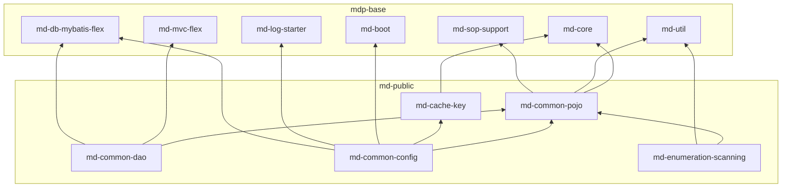

## 1. 工程定位

`md-public` 位于 `mdp-apps/` 下，是**平台所有业务服务共同依赖的公共层**：boot-server、console-server、workbench-server、open-server 等服务都建立在这五个模块之上。它承载了三类内容：

- **公共数据模型**：用户/组织等核心实体、通用 DTO、枚举、常量（md-common-pojo）
- **公共持久层**：核心实体的 Mapper（md-common-dao）与缓存 key 规范（md-cache-key）
- **公共装配层**：Web MVC、上下文拦截、全局异常、消息、文件存储等 Spring 配置（md-common-config）

与 `mdp-base`（纯技术框架、不含业务语义）的分工：mdp-base 提供 `SuperEntity`、`SuperMapper`、`BaseConfig` 等**抽象基座**，md-public 在其上落地**平台自己的业务公共实现**。

## 2. 模块清单

| 模块 | pom description | 职责 |
| --- | --- | --- |
| [md-common-pojo](md-common-pojo.md) | 公共pojo模块 | 实体（双层 Base+DO）、DTO、VO、枚举、常量、三大配置属性类 |
| [md-common-dao](md-common-dao.md) | 公共dao模块 | 公共实体的 MyBatis-Flex Mapper 接口 + XML |
| [md-common-config](md-common-config.md) | 公共配置模块 | Web/安全/消息/文件存储/MyBatis-Flex 装配，上下文拦截器 |
| [md-cache-key](md-cache-key.md) | 缓存key模块 | 全平台缓存 key 表名常量与 Builder |
| [md-enumeration-scanning](md-enumeration-scanning.md) | 枚举自动扫描模块 | 启动时扫描 BaseEnum 枚举，转下拉选项供前端使用 |

## 3. 与 mdp-base 的依赖关系



核心基类均来自 mdp-base，二开前建议先读：

- [md-core](../mdp-base/md-core.md)：`SuperEntity`/`TreeEntity`/`BaseEnum`/`CacheKeyBuilder`/`ContextUtil`
- [md-mvc-flex](../mdp-base/md-mvc-flex.md)：`SuperMapper`/`SuperController`/`SuperService`
- [md-boot](../mdp-base/md-boot.md)：`BaseConfig`/`AbstractGlobalExceptionHandler`（抽象类，由 md-common-config 继承落地）

## 4. 二开关键脉络速查

**实体链**（详见 [md-common-pojo](md-common-pojo.md)）：

```
BaseEntity<T>（md-core）
  └─ SuperEntity<T>（+审计字段） / TreeEntity（+树形字段）
       └─ XxxBase（代码生成层，entity/base/，含 TABLE_NAME 常量）
            └─ Xxx（手写 DO 层，entity/，@Table + 关联注解，重新生成代码时不覆盖）
```

**DAO 链**（详见 [md-common-dao](md-common-dao.md)）：

```
com.mybatisflex.core.BaseMapper<T>
  └─ SuperMapper<T>（md-mvc-flex，空接口做标记）
       └─ XxxMapper（@Repository，被 @MapperScan(annotationClass=Repository.class) 扫描）
```

**配置前缀**：全平台配置根为 `mdp.`（`Constants.PROJECT_PREFIX`），md-public 定义的三大属性类：

| 属性类 | prefix | 用途 |
| --- | --- | --- |
| `SystemProperties` | `mdp.system` | 运行模式(mode)、登录校验开关、日志开关、枚举扫描包、演示环境写保护 |
| `MsgProperties` | `mdp.msg` | 短信/邮件验证码类型、长度、过期时间 |
| `IgnoreProperties` | `mdp.ignore` | 免登录/免鉴权 URI 白名单 |

**架构切换**：`mdp.system.mode=cloud`与 `boot`决定装配哪套上下文拦截器，二者互斥，详见 [md-common-config](md-common-config.md)。

**缓存机制**：`CacheKeyBuilder`→ `md-cache-key` 各 Builder→ `CacheKey`/`CacheHashKey`，详见 [md-cache-key](md-cache-key.md)。

**枚举机制**：实现 `BaseEnum` + 类上 `@Schema` + 放在 `mdp.system.enumPackage` 配置的包下 → `EnumService` 启动自动收集为下拉选项，详见 [md-enumeration-scanning](md-enumeration-scanning.md)。

## 5. 阅读建议

::: tip 与其他文档的分工
平台整体架构、单体/微服务双形态、facade 三件套机制见[架构介绍](../../info/架构介绍.md)；各服务端口与启动方式见[服务介绍](../../start/服务介绍.md)。本目录只讲 md-public 五个模块的内部实现与扩展方式，不复述上述内容。
:::

首次阅读推荐顺序：md-common-pojo（数据模型）→ md-common-dao（持久层）→ md-common-config（装配层）→ md-cache-key / md-enumeration-scanning（专项机制）。
