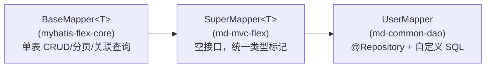

## 1. 模块定位

公共实体的持久层模块（pom description："公共dao模块"）：存放 md-common-pojo 中核心实体（User、Org 等）的 MyBatis-Flex Mapper 接口与 XML。凡是需要直接访问用户/组织表的服务都依赖本模块，避免各服务重复编写基础查询。

Maven 依赖：`md-common-pojo`、`md-db-mybatis-flex`、`md-mvc-flex`（均来自 md-public / mdp-base）。

包根：`top.mddata.common.mapper`，仅 6 个接口，无实现类——MyBatis-Flex 在运行期生成代理。

## 2. 源码解读

### 2.1 SuperMapper 体系

继承链非常薄，`SuperMapper` 本身是个**空标记接口**（`mdp-base/md-mvc-flex/.../mapper/SuperMapper.java`）：



`BaseMapper<T>` 已提供 `insert/update/deleteById/selectOneById/selectListByQuery/paginate` 及 `Relation` 关联查询能力，因此平台 Mapper 大多**零方法**，只在需要手写 SQL 时补方法。

### 2.2 Mapper 清单

| Mapper | 实体 | 自定义方法（注解 SQL） |
| --- | --- | --- |
| `UserMapper` | User | `resetPwErrorNum`/`incrPwErrorNumById`（@Update 登录错误次数）；`countByDayRange`/`countByState`/`countByType`/`countNewUsersInMonth`（@Select 统计） |
| `OrgMapper` | Org | `selectOrgByUserId`（用户拥有的机构）；`rankByUserCount`（部门用户排行） |
| `OrgNatureMapper` | OrgNature | — |
| `PositionMapper` | Position | — |
| `UserOrgRelMapper` | UserOrgRel | — |
| `UserRoleRelMapper` | UserRoleRel | — |

自定义 SQL 的写法约定（以 `UserMapper.java:29-39` 为例）：

- **表名用常量拼接**：`@Update` 的 SQL 文本块中拼 `UserBase.TABLE_NAME`，表名变更只改实体一处；
- **Java 文本块（`"""`）**：JDK 17 语法，保持 SQL 原始缩进可读；
- **`@Param` + `jdbcType`**：显式标注参数类型，规避 null 参数类型推断问题。

### 2.3 逻辑删除的手写 SQL 约定

平台启用 MyBatis-Flex 逻辑删除（`deleted_at` 字段）。**QueryWrapper 方式查询会自动追加删除过滤，但注解/XML 手写 SQL 不会**，因此所有手写 `@Select` 都显式带上 `WHERE deleted_at = 0`（`UserMapper.java:61` 的 javadoc 专门注明"手写 SQL，已手动过滤 deleted_at = 0"）。

### 2.4 XML 预留位

`resources/mapper/` 下有 4 个 XML（SysUserMapper/SysOrgMapper/SysOrgUserRel/SysPositionMapper.xml），当前均为**空壳**，且 namespace 指向 `top.mddata.console.organization.mapper.*`（console 服务的包名）。它们是复杂 SQL 的预留位置：简单 SQL 走注解，多表大 SQL 建议迁移到 XML。

### 2.5 扫描机制

Mapper 接口本身不带 `@Mapper` 注解，而是靠 `@Repository` + md-common-config 中 `MybatisFlexConfiguration` 的扫描配置生效（`MybatisFlexConfiguration.java:24`）：

```java
@MapperScan(basePackages = UTIL_PACKAGE, annotationClass = Repository.class)
```

即：只扫描 `top.mddata` 包下**标注了 `@Repository`** 的接口。

## 3. 可配置参数

本模块无自有配置。相关配置在上游模块：

| 配置 | 定义处 | 影响 |
| --- | --- | --- |
| `mdp.database.*` | md-db `DatabaseProperties` | id 生成策略、逻辑删除、数据权限开关 |
| `mybatis-flex.*` | mybatis-flex-spring-boot-starter | mapper-locations、逻辑删除列等 |

## 4. 扩展点

- **新增 Mapper**：`@Repository interface XxxMapper extends SuperMapper<Xxx>`，放入 `top.mddata` 包下即被扫描，无需其他注册。
- **替换 SQL 实现**：注解 SQL 可平移进 XML（namespace 对齐接口全限定名），接口方法签名不变。
- **数据权限**：查询走 QueryWrapper 时可被 `DataPermissionFilter`（md-db-mybatis-flex）自动拼接权限条件；手写 SQL 不参与。

## 5. 功能扩展建议

- **优先 QueryWrapper，其次注解 SQL，最后 XML**：单表条件查询用 `QueryWrapper` + TableDef（编译期列名检查、自动逻辑删除过滤）；两三行的固定 SQL 用注解文本块；超过一屏的多表 SQL 放 XML。
- **统计类接口**：参考 `countByDayRange` 的返回约定 `List<Map<String,Object>>`（key 为 date/code、value 为数值），与前端图表组件直接对接。
- **跨服务复用查询**：公共实体的通用查询下沉到本模块；仅单服务使用的业务查询留在该服务的 mapper 包，不要放进 md-common-dao。

## 6. 二次开发注意事项

::: warning @Repository 注解不能省
扫描条件是 `annotationClass = Repository.class`，新 Mapper 忘加 `@Repository` 时不会报编译错误，而是运行期注入失败（NoSuchBeanDefinitionException），排查成本高。
:::

::: warning 手写 SQL 必须自行处理逻辑删除与数据权限
注解/XML SQL 绕过了 MyBatis-Flex 的逻辑删除处理器和数据权限方言，`deleted_at = 0` 需要手写；若涉及敏感表还需自行评估权限过滤，否则会出现"已删数据被统计进来"的隐性 bug。
:::

::: tip XML namespace 是历史遗留
现有 4 个 XML 的 namespace 指向 console 服务的包名而非本模块接口，直接往这些 XML 里加语句不会绑定到 `top.mddata.common.mapper.*` 的接口上。新增 XML 时务必让 namespace 与接口全限定名一致。
:::
