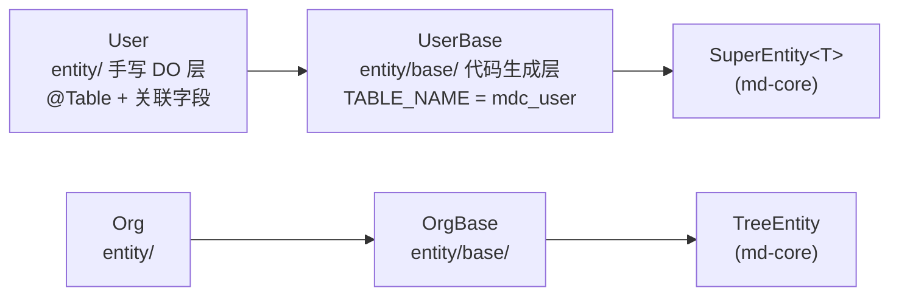

## 1. 模块定位

平台公共的数据模块，存放各业务服务共用的**实体、DTO、VO、枚举、常量、配置属性类**。二开时，频繁被各服务使用的公用表实体类也可以加进来。

它是 md-public 中被依赖最多的模块：md-common-dao、md-common-config、md-enumeration-scanning 以及各业务服务都直接或间接依赖它。

Maven 依赖：`md-core`、`md-util`、`mybatis-flex-core`、`spring-cloud-context`、`sop-service-support`。

包根：`top.mddata.common`，下分 `entity/`、`entity/base/`、`dto/`、`vo/`、`enumeration/`、`constant/`、`properties/` 七个包。

## 2. 源码解读

### 2.1 实体双层结构（entity/base + entity）

核心实体采用**生成层 + 手写层**的两层设计：



- **生成层** `entity/base/*Base.java`：由 md-codegen 根据数据库表生成，只含表字段与 `TABLE_NAME` 常量。**重新生成代码时会被覆盖**，不要在此添加业务字段。
- **DO 层** `entity/*.java`：手写层，可以在关联查询时再次添加字段，重新生成代码时忽略此文件。`@Table(UserBase.TABLE_NAME)` 绑定表名，关联查询字段加 `@Column(ignore = true)` 避免参与 SQL。

以 `User.java` 为例（`entity/User.java`）：

```java
@Table(UserBase.TABLE_NAME)
public class User extends UserBase {
    /** 用户拥有的部门 */
    @RelationOneToMany(
            selfField = "id",
            targetField = "userId",
            targetTable = UserOrgRelBase.TABLE_NAME,
            valueField = "orgId")
    @Column(ignore = true)
    private List<Long> orgIdList;
}
```

实体清单：

| 实体 | 表 | 基类 | 说明 |
| --- | --- | --- | --- |
| `User` / `UserBase` | mdc_user | `SuperEntity<Long>` | 用户（username/password/sex/phone/email/state…） |
| `Org` / `OrgBase` | mdc_org | `TreeEntity` | 组织（树形结构） |
| `OrgNature` / `OrgNatureBase` | — | — | 组织性质 |
| `Position` / `PositionBase` | — | — | 岗位 |
| `UserOrgRel` / `UserOrgRelBase` | — | — | 用户-组织关系 |
| `UserRoleRel` / `UserRoleRelBase` | — | — | 用户-角色关系 |

::: tip TableDef 自动生成
父 POM 的 annotationProcessorPaths 挂载了 `mybatis-flex-processor`，编译期会在 `target/generated-sources/` 下生成 `*TableDef` 类，条件构造器（`QueryWrapper`）直接使用，无需手写列名字符串。
:::

### 2.2 通用 DTO（dto/）

| 类 | 说明 |
| --- | --- |
| `IdDto` | `@NotNull` 的单 id 入参（"请填写主键"） |
| `IdsDto` | `@NotEmpty` 的 id 集合入参 |
| `StatusUpdateDto` extends `IdDto` | 单条状态变更 |
| `StatusUpdateBatchDto` extends `IdsDto` | 批量状态变更 |
| `AudioDto` | 语音相关入参 |

### 2.3 通用 VO（vo/）

- **`Option`**（`vo/Option.java`）：下拉选项统一模型（value/label/remark），`@EqualsAndHashCode(of = "value")` 按值去重；静态方法 `mapOptions(BaseEnum[])` 把任意 `BaseEnum` 枚举数组转成选项列表——枚举下拉全部经由它。
- **`BaseEventVO`**（`vo/BaseEventVO.java`）：事件 VO 基类，`copy()` 在**异步调用前**把 `ContextUtil` 线程变量快照到内部 map，`write()` 在异步线程开始时恢复。解决 ThreadLocal 跨线程丢失问题（详见第 6 节）。

### 2.4 枚举（enumeration/）

统一规范：**实现 `BaseEnum<T>`（md-core）+ 类上 `@Schema(title, description)` + 提供 `match`/`of` 静态工厂**。以 `StateEnum` 为例（`enumeration/StateEnum.java`）：

```java
@Schema(title = "StateEnum", description = "状态-枚举")
public enum StateEnum implements BaseEnum<Boolean> {
    ENABLE(true, 1, "1", "启用"),
    DISABLE(false, 0, "0", "禁用");
}
```

同一枚举同时持有 bool/integer/string 三种 code 形态，方便与前端、数据库不同字段类型互转。

| 包 | 枚举 |
| --- | --- |
| `enumeration/` | `BooleanEnum`、`HttpMethod`、`AuditStatusEnum`、`StateEnum`、`StoryMessageEnum`、`Sex` |
| `enumeration/organization/` | `UserSourceEnum`、`OrgTypeEnum`、`UserTypeEnum`、`OrgNatureEnum` |
| `enumeration/permission/` | `RoleTypeEnum`、`RoleCategoryEnum`、`MenuTypeEnum` |
| `enumeration/system/` | `DataTypeEnum`（枚举值数据类型，供 EnumService 解析泛型用） |

### 2.5 常量（constant/）

| 类 | 内容 |
| --- | --- |
| `AppConstants` | 7 个服务名常量：console/workbench/open/gateway/sop-gateway/generator/openapi-server |
| `EchoApi` / `EchoDictType` / `EchoRef` | `@Echo` 回显注解的 api/字典类型/引用常量（含 `@md.generator auto insert` 锚点，代码生成器自动追加） |
| `EventTypeCode` | org/user 的增删改事件码（事件回调机制用） |
| `MsgTemplateKey` | 站内信/短信/邮件模板 key |
| `RoleCode` | 内置角色：`SUPER_ADMIN`、`DEFAULT_DEVELOPER`、`DEFAULT_USER` |
| `FileObjectType`、`ConfigKey`、`DefValConstants`、`SwaggerConstants` | 文件业务类型、系统参数 key、默认值、文档常量 |
| `console/AdminConstant` | 前端菜单布局（IFRAME/LAYOUT/OPEN_LAYOUT）及 meta 字段名 |

### 2.6 配置属性类（properties/）

三个属性类的 prefix 都基于 `Constants.PROJECT_PREFIX`（值为 `mdp`）拼接，**`SystemProperties` 与 `MsgProperties` 带 `@RefreshScope`，Nacos 修改后即时生效**。

**`SystemProperties`** → `mdp.system`（`properties/SystemProperties.java`）：

| 配置项 | 默认值 | 说明 |
| --- | --- | --- |
| `application-name` / `application-description` / `version` | — | 应用展示信息 |
| `forget-password-url` | — | 忘记密码邮件中的前端重置地址 |
| `mode` | — | `cloud`（微服务）/ `boot`（单体），决定上下文拦截器装配，见 [md-common-config](md-common-config.md) |
| `verify-password` | `true` | 登录是否校验密码（开发环境可关） |
| `verify-captcha` | `true` | 登录是否校验验证码（开发环境可关） |
| `def-pwd` | 弱口令占位 | 新建用户/重置密码的默认密码，**生产环境必须改为强口令** |
| `record-log` | `false` | 方法日志切面总开关（MethodLogAspect） |
| `record-args` | `true` | 是否记录方法入参 |
| `record-result` | `true` | 是否记录方法返回值 |
| `enum-package` | — | 枚举扫描包路径，见 [md-enumeration-scanning](md-enumeration-scanning.md) |
| `not-allow-write` | `false` | 演示环境禁止写入总开关 |
| `not-allow-write-list` | `{}` | `Map<HTTP方法, URI列表>` 精细控制哪些写接口被拦截 |

**`MsgProperties`** → `mdp.msg`：

| 配置项 | 默认值 | 说明 |
| --- | --- | --- |
| `param` | `{}` | 消息模板通用参数 |
| `sms.type` | `number` | 短信验证码类型（number/string） |
| `sms.length` | `6` | 验证码长度 |
| `sms.expiration-in-minutes` | — | 过期分钟数 |
| `email.type` | `string` | 邮件验证码类型 |
| `email.length` / `email.expiration-in-minutes` | `6` / — | 同上 |

**`IgnoreProperties`** → `mdp.ignore`（免鉴权白名单，AntPathMatcher 匹配）：

| 配置项 | 默认值 | 说明 |
| --- | --- | --- |
| `auth-enabled` | `true` | 是否启用 uri 权限与前端按钮权限校验，`false` 则完全不校验 |
| `case-sensitive` | `false` | 前端按钮权限是否区分大小写 |
| `base-uri` | 内置集合 | 永久放行：静态资源(css/js/html/图片)、`/**/anno/**`、`/**/druid/**`、`/actuator/**`、api-docs/swagger、`/**/form/validator/**`、`/error` 等 |
| `anyone` | `{}` | **需登录、不鉴权**：携带 token 但不校验 uri 权限，可取到 userId（如文件上传、字典查询） |
| `any-user` | `{}` | **免登录、免鉴权**：不携带 token 也可访问，取不到 userId（如登录页、门户接口） |

三个集合的合并逻辑：`buildAnyone()` = baseUri + anyUser + anyone；`buildAnyUser()` = baseUri + anyUser；对应判定方法 `isIgnoreUriAuth(method, path)` 与 `isIgnoreUser(method, path)`。

## 3. 可配置参数

本模块**定义**了 `mdp.system`、`mdp.msg`、`mdp.ignore` 三组配置（完整表格见 2.6），属性的注册（`@EnableConfigurationProperties`）发生在 md-common-config 的 `SystemAutoConfiguration` 与 `WebConfiguration` 中。

## 4. 扩展点

| 扩展点 | 方式 |
| --- | --- |
| 新实体 | 继承 `SuperEntity<Long>`（普通表）或 `TreeEntity`（树表），按 Base+DO 双层拆分 |
| 新枚举 | 实现 `BaseEnum<T>` + 类上 `@Schema`，放入 `enum-package` 配置的包即被自动收集 |
| 通用入参 | 继承 `IdDto`/`IdsDto` 复用校验规则 |
| 异步事件 VO | 继承 `BaseEventVO`，用 `copy()/write()` 搬运线程上下文 |
| 配置属性 | 新增 `@ConfigurationProperties(prefix = Constants.PROJECT_PREFIX + ".xxx")` 类，建议放在本模块 properties 包保持集中 |

## 5. 功能扩展建议

- **给核心表加字段**：改数据库 → 重新生成 `*Base`→ DO 层加关联/扩展字段。切勿直接改 `entity/base/` 下的生成类。
- **新增免登录接口**：优先在 URI 设计上使用 `/anno/` 前缀（base-uri 已放行）；确实无法调整路径时再往 `mdp.ignore.any-user` 加配置，避免改动内置 baseUri。
- **调整验证码策略**：改 `mdp.msg.sms/email.*` 即可（type/length/过期时间），支持 Nacos 热刷新，无需改代码。

## 6. 二次开发注意事项

::: warning entity/base 会被代码生成器覆盖
`UserBase.java` 等生成层文件的修改会在下次执行代码生成时丢失。业务字段、关联注解一律写在 DO 层（`entity/User.java`）。
:::

::: warning def-pwd 生产环境必须修改
`SystemProperties.defPwd` 存在弱口令默认值（仅方便开发演示），生产环境部署前必须通过配置覆盖为强口令，且不要写入版本库。
:::

::: warning 异步线程上下文必须显式搬运
`ContextUtil` 基于 ThreadLocal，异步线程（@Async、线程池、事件监听）中直接取 userId 会拿到 null。规范做法：事件 VO 继承 `BaseEventVO`，发送前 `copy()`，消费线程开头 `write()`。
:::

::: tip mode 与拦截器互斥
`mdp.system.mode` 未配置时按 `cloud` 处理（matchIfMissing=true）。单体部署忘记配 `boot` 会导致上下文拦截器装配错误（依赖网关注入的请求头而拿不到用户信息），这是最常见的启动配置问题。
:::
