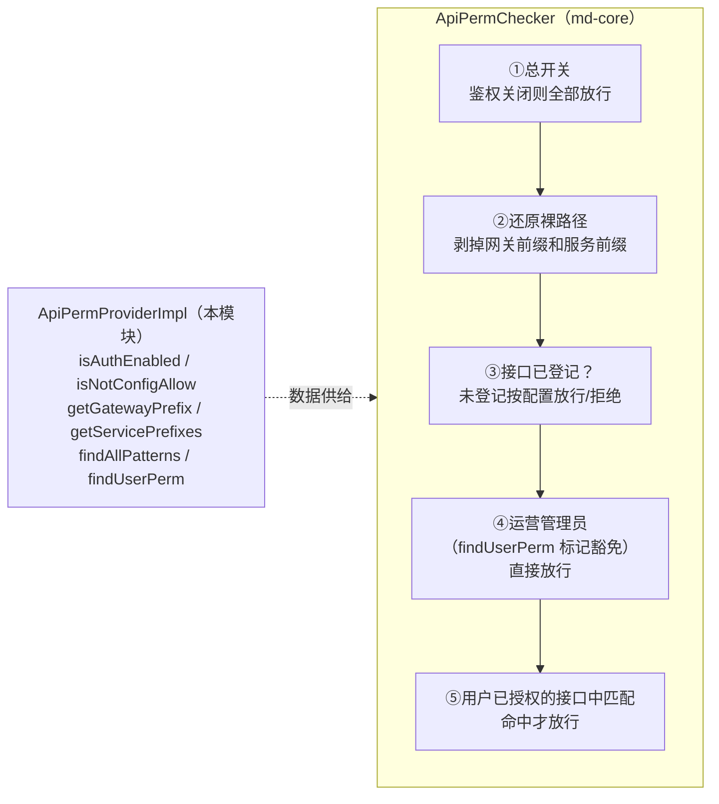

## 1. 模块定位

接口/字段权限共享 Provider 模块，坐标 `top.mddata.apps:md-resource-api`。实现 md-core 定义的两个 SPI——`top.mddata.base.apiperm.spi.ApiPermProvider`（为 **uri 级接口鉴权**提供数据：已纳管接口全集 + 用户放行集）与 `top.mddata.base.fieldperm.spi.FieldPermProvider`（为**字段权限**提供数据：URI→字段规则菜单映射 + 用户字段受限集，见 2.4），同一份实现同时服务两种部署形态：

- **单体版（boot）**：md-common-config 的 `ApiPermSupport` → `TokenContextFilter` 的 sa-token auth 阶段调用；
- **网关版（cloud）**：inner-gateway-server 的 `GatewayApiPermSupport` 调用。

判定引擎 `ApiPermChecker` 在 md-core（纯逻辑、无 web 依赖），本模块只负责"数据从哪来"。刻意排除了 spring-web/webmvc/servlet-api 依赖，使模块可同时用于 WebFlux 网关与 Servlet 单体。

调用方前置（`ApiPermSupport` / `GatewayApiPermSupport`）：**未登录、命中 `mdp.ignore` 白名单（anyone/any-user/base-uri）的请求直接放行，不进入判定引擎**；之后才由引擎执行下述 5 步。

整体判定链（引擎与数据的分工）：

## 2. 源码解读

两个 Provider 主类，均为 `@Component`（靠 `top.mddata` 包组件扫描注册，无 AutoConfiguration.imports）：

- `top.mddata.common.apiperm.ApiPermProviderImpl`：接口权限数据（2.1~2.3）；
- `top.mddata.common.fieldperm.FieldPermProviderImpl`：字段权限数据（2.4）。

### 2.1 配置桥接

四个配置方法全部桥接自 md-common-pojo 的 `IgnoreProperties`（即 `mdp.ignore.*`）：

| SPI 方法 | 配置项 | 默认值 |
| --- | --- | --- |
| `isAuthEnabled()` | `mdp.ignore.auth-enabled` | `true` |
| `isNotConfigAllow()` | `mdp.ignore.not-config-uri-allow` | `true`（未纳管接口放行；白名单严格模式配 false） |
| `getGatewayPrefix()` | `mdp.ignore.gateway-prefix` | `api` |
| `getServicePrefixes()` | `mdp.ignore.service-prefixes` | `{console, workbench, open}` |

### 2.2 findAllPatterns() —— 已纳管接口全集

直查 `mdc_resource_api` 表的 `DISTINCT uri, request_method`，结果走 `ResourceApiAllCacheKeyBuilder`（表名 `resource_api_all`，TTL 24h）缓存。判定引擎用它判断"该接口是否被平台纳管"。

### 2.3 findUserPerm(userId) —— 用户放行集

加载逻辑（`loadUserPerm`）：

1. 查 `mdc_user_role_rel JOIN mdc_role`（`state=1`、`deleted_at=0`）得用户角色 id + 编码；
2. 交给包级静态纯函数 `assemble(roles, apiLoader)` 组装：
   - **含 `OPERATIONS_ADMIN`（运营管理员）角色 → 直接豁免**（`UserApiPerm.operationsAdmin=true`，不再查接口表）；
   - 无角色 → 空放行集；
   - 否则查 `mdc_role_resource_rel` 得授权 resource_id 集，再反查 `mdc_resource_api` 得 uri + 请求方式放行集（多角色并集去重）。
3. 结果走 `UserResourceApiCacheKeyBuilder`（表名 `user_resource_api`，TTL 24h）缓存。

### 2.4 FieldPermProviderImpl —— 字段权限数据

`top.mddata.common.fieldperm.FieldPermProviderImpl`（@since 2026-10-02）实现 md-core 的 `FieldPermProvider` SPI，为 md-mvc-flex 的 `FieldPermAdvice` 供数（机制全貌见[字段权限](../../advanced/字段权限.md)）：

| SPI 方法 | 实现 |
| --- | --- |
| `isAuthEnabled()` | 桥接 `mdp.ignore.field-auth-enabled`（默认 true） |
| `findMenuId(uri, method)` | 查**缓存A**（`resource_field_uri_menu:id`，TTL 24h）：全量预解析 `mdc_resource_api` + `mdc_resource_menu` + 启用字段规则菜单，map key 形如 `"GET /system/user/page"`；接口绑定的资源**沿菜单上级链找最近一个配置了启用字段规则的菜单**（纯函数 `resolveUriMenu`/`resolveMenu`，防 parent 成环） |
| `findUserPerm(userId)` | 查**缓存B**（`user_field_perm:id:{userId}`，TTL 24h）：`assemble` 纯函数组装——含 `OPERATIONS_ADMIN` 角色**直接豁免**（不再查字段表）；否则按 `menuId → property → FieldRule` 聚合（多角色同名字段后写覆盖先写） |

与 apiperm 部分同风格：`assemble`/`resolveUriMenu` 均为可脱库单测的静态纯函数，模块自带 `FieldPermLoadLogicTest`（运营者豁免、聚合覆盖、上级链解析等用例）。

### 2.5 设计要点（源码 javadoc 约定）

- **跨模块直查**：用 MyBatis-Flex `Row Db` 直查 `mdc_` 表，与 `DataScopeProviderImpl` 同一模式，避免依赖 console 域实体；
- **缓存失效由 console 侧写操作负责**：本模块只读缓存，角色/资源变更时由 console 服务淘汰共享 Redis key；
- **忽略 `resource_type` 列**：授权表 `mdc_role_resource_rel.resource_type` 从未写入（全为空串），运行期一律按 `resource_id` 匹配（按钮是 `menu_type='50'` 的菜单行，非独立表）；`mdc_resource_api.resource_type` 仅作配置回显的展示元数据；
- **可测试性**：`assemble` 是静态纯函数 + `record RoleRow(Long roleId, String code)`，权限组装逻辑可脱离数据库单测（模块自带 `ApiPermLoadLogicTest`：运营者短路、多角色并集去重、无角色空集等用例）。

## 3. 可配置参数

无自有配置类，全部消费 `mdp.ignore.*`（见 2.1 表格，属性类定义在 [md-common-pojo](md-common-pojo.md) 的 `IgnoreProperties`）。

## 4. 扩展点

| 扩展点 | 方式 |
| --- | --- |
| 更换权限数据源 | 实现自己的 `ApiPermProvider`/`FieldPermProvider` 注册为 Bean 覆盖本实现（SPI javadoc 明示：实现方自行负责缓存）。注意原实现是普通 `@Component`（无 `@ConditionalOnMissingBean`），直接再加一个同类型 Bean 会报 `NoUniqueBeanDefinitionException`，需加 `@Primary` 或排除原 Bean |
| 调整放行语义 | 修改 `mdp.ignore.not-config-uri-allow`（未纳管接口放行/拒绝）、`service-prefixes`（新增服务前缀）等配置，无需改代码 |
| 单元测试权限组装 | 复用 `ApiPermProviderImpl.assemble(roles, apiLoader)` 静态纯函数 |

## 5. 功能扩展建议

| 想做什么 | 推荐做法 |
| --- | --- |
| 新服务接入 uri 鉴权 | 把服务前缀加入 `mdp.ignore.service-prefixes`，接口录入 `mdc_resource_api` 并授权给角色 |
| 联调期临时放开 | `mdp.ignore.not-config-uri-allow=true`（未纳管接口放行），上线前改回 false 白名单模式 |
| 给用户开全量权限 | 授予 `OPERATIONS_ADMIN` 角色（短路豁免，不查接口表），注意这是最高权限 |

## 6. 二次开发注意事项

::: warning 缓存失效不在本模块
本模块只读缓存，角色/资源/接口的写操作在 console 服务——**修改授权后缓存由 console 侧淘汰**。若自行写库（如 SQL 直改授权表），需手动清理 `resource_api_all`、`user_resource_api`（接口权限）与 `resource_field_uri_menu`、`user_field_perm`（字段权限）缓存，否则权限变更不生效。
:::

::: warning 双形态共用同一份实现
本模块同时被 Servlet 单体与 WebFlux 网关依赖，**严禁引入 spring-web/webmvc/servlet-api 依赖**（pom 中已刻意排除），新增代码只能用 spring-context + MyBatis-Flex Row API。
:::

::: warning OPERATIONS_ADMIN 是硬编码豁免
运营管理员角色编码写死在 `assemble` 中（`RoleCode.OPERATIONS_ADMIN`），拥有该角色的用户绕过全部 uri 鉴权。授予该角色需走审批，勿用于普通业务账号。
:::
