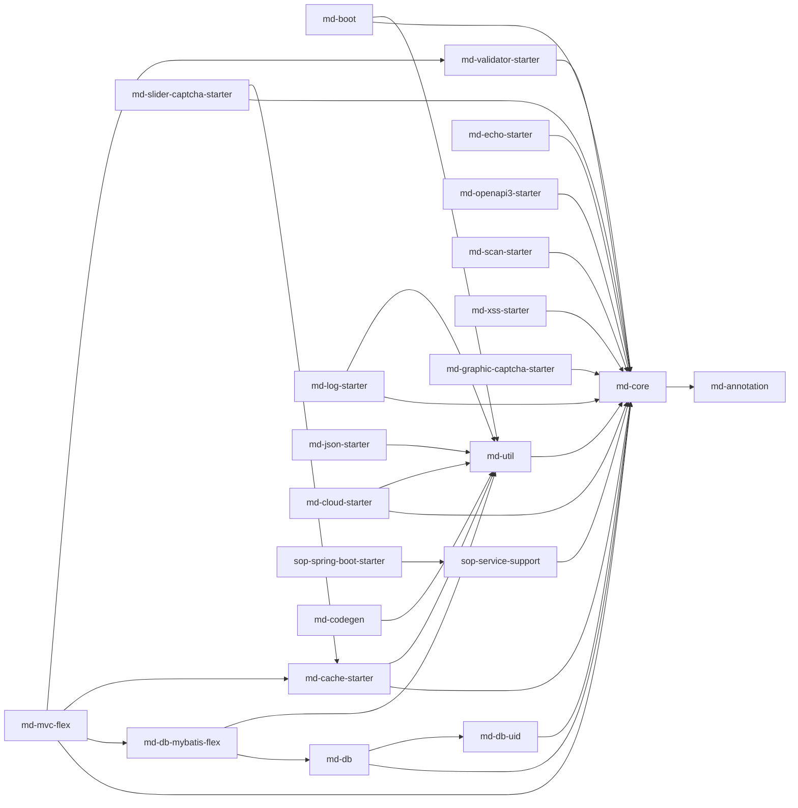

mdp-base 是 MDP 的**技术框架层**：24 个与具体业务无关的 Maven 模块（groupId `top.mddata.base`），可被任何 Spring Boot 3 / JDK 17 项目复用。本页给出模块清单、依赖关系、扩展点总览与配置开关速查，各模块细节见对应页面。

::: info 全局事实
- 版本号统一为 `${revision}`（当前 `1.5.0-SNAPSHOT`），由 flatten-maven-plugin 处理
- 所有配置前缀根是 **`mdp.`**（`md-core` 的 `Constants.PROJECT_PREFIX`）
- 根 pom 为全部子模块统一引入 lombok、slf4j-api、hutool-all、fastjson2、guava，并强制 checkstyle 检查（本地快速构建可加 `-Dcheckstyle.skip=true`）
:::

## 1. 模块清单

### 1.1 依赖管理（无代码）

| 模块 | 职责 | 文档 |
|---|---|---|
| md-bom | BOM，统一声明全部内部构件版本，外部二开项目 import 它即可 | [md-bom](md-bom.md) |
| md-all（md-all-boot / md-all-cloud） | 聚合依赖：单体应用只依赖 md-all-boot（15 个模块），微服务应用依赖 md-all-cloud（+md-cloud-starter） | [md-bom](md-bom.md) |

### 1.2 基础层

| 模块 | 职责 | 文档 |
|---|---|---|
| md-annotation | 纯注解定义：`@Echo`/`@EchoResult`/`@RequestLog`/`@LoginUser` 等 | [md-annotation](md-annotation.md) |
| md-core | 核心模型与契约：`R`、实体基类、异常体系、`ContextUtil`、`CacheKey`、回显 SPI | [md-core](md-core.md) |
| md-util | 通用工具：BeanPlusUtil、ArgumentAssert、树构建、参数转换器 | [md-util](md-util.md) |
| md-boot | Boot 单体公共配置：`BaseConfig`、全局异常处理、`@LoginUser` 参数解析、异步线程池 | [md-boot](md-boot.md) |
| md-db | 数据库公共配置：`DbConfiguration`、主键生成策略、like 处理器 | [md-db](md-db.md) |
| md-db-uid | 百度 UidGenerator 移植 + HuTool 雪花 ID | [md-db-uid](md-db-uid.md) |
| md-db-mybatis-flex | MyBatis-Flex 深度整合：数据权限、审计填充、主键生成器 | [md-db-mybatis-flex](md-db-mybatis-flex.md) |
| md-mvc-flex | Web 三层基类：`SuperController`/`SuperService`/`SuperMapper`、分页 | [md-mvc-flex](md-mvc-flex.md) |

### 1.3 Starter

| 模块 | 职责 | 配置前缀 | 文档 |
|---|---|---|---|
| md-cache-starter | Redis 缓存封装（RedisOps、CacheOps 抽象） | `mdp.cache` | [md-cache-starter](md-cache-starter.md) |
| md-echo-starter | 数据回显（字典/关联名称翻译） | `mdp.echo` | [md-echo-starter](md-echo-starter.md) |
| md-log-starter | 操作日志（切面 + 事件） | `mdp.log` | [md-log-starter](md-log-starter.md) |
| md-json-starter | Jackson 增强（大数精度、时间格式） | `spring.jackson` | [md-json-starter](md-json-starter.md) |
| md-openapi3-starter | springdoc/knife4j 文档定制 | `mdp.swagger` | [md-openapi3-starter](md-openapi3-starter.md) |
| md-scan-starter | 系统 API 扫描上报 | `mdp.scan` | [md-scan-starter](md-scan-starter.md) |
| md-validator-starter | 表单校验规则导出（供前端动态校验） | 无（`@EnableFormValidator` 显式启用） | [md-validator-starter](md-validator-starter.md) |
| md-xss-starter | XSS 防护过滤器 | `mdp.xss` | [md-xss-starter](md-xss-starter.md) |
| md-captcha-starter | 图形验证码 + 滑块验证码（2 个子 starter） | `mdp.captcha.graphic` / `mdp.captcha.slider` | [md-captcha-starter](md-captcha-starter.md) |
| md-cloud-starter | 微服务公共配置：Feign 定制、灰度发布 | `mdp.grayscale` | [md-cloud-starter](md-cloud-starter.md) |
| md-powerjob-worker-spring-boot-starter | PowerJob worker 定制 starter | `powerjob.worker` | [md-powerjob-worker-spring-boot-starter](md-powerjob-worker-spring-boot-starter.md) |

### 1.4 定制模块

| 模块 | 职责 | 文档 |
|---|---|---|
| md-sa-token | **Sa-Token 1.45.0 官方源码定制副本**（7 个子模块）：SSO server/client、OAuth2 client，核心改造是 sso-client 支持多 clientId | [md-sa-token](md-sa-token.md) |
| md-sop-support | SOP 开放平台网关支持：`@Open` 注解、接口注册、签名/AES 加解密、Dubbo 过滤器 | [md-sop-support](md-sop-support.md) |
| md-codegen | 代码生成器：后端全套 + 前端 Vue/Tsx 页面 | [md-codegen](md-codegen.md) |

## 2. 模块依赖关系

箭头方向为「A → B = A 依赖 B」：

::: tip 二开项目怎么引依赖
新业务服务不要逐个挑模块：单体架构依赖 `md-all-boot`，微服务架构依赖 `md-all-cloud`，版本号 import `md-bom` 后省略。`md-codegen`、`md-sa-token`、`md-sop-support` 按需单独引入。
:::

## 3. 扩展点总览（按机制分类）

| 机制 | 说明 | 典型代表 |
|---|---|---|
| 自动配置 | `META-INF/spring/...AutoConfiguration.imports` 注册，引 jar 即生效 | cache/echo/log/json/xss/scan/openapi3/cloud/captcha/sa-token/sop |
| 抽象类需应用继承 | 应用层子类加 `@Configuration`/`@RestControllerAdvice` 才生效 | `BaseConfig`、`AbstractGlobalExceptionHandler`（md-boot）、`DbConfiguration`（md-db）、`MyMybatisFlexConfiguration`（md-db-mybatis-flex） |
| 显式启用注解 | 需应用主动加注解 | `@EnableFormValidator`（md-validator-starter） |
| 接口/策略 SPI | 实现接口并按约定注册（beanName / META-INF services / 事件监听） | `LoadService`（回显）、`CacheOps`/`CachePlusOps`（缓存）、`SysLogEvent` 监听（日志落库）、`DataPermissionCurrentUser`（数据权限）、SaSso 各 `*Strategy`/`*Function`、`IDocBuildTemplate`（sop）、`IGenerator`/`IDialect`/`ITemplate`（codegen） |
| `@ConditionalOnMissingBean` 可覆盖 Bean | 应用定义同类型 Bean 即替换默认实现 | `UidGenerator`、`RedisSerializer`、`cacheManager`、`keyGenerator`、`SysLogAspect`、`EchoService` |

## 4. 配置开关速查表

| 配置项 | 默认值 | 作用 |
|---|---|---|
| `mdp.async.enabled` | true | 异步线程池（md-boot） |
| `mdp.database.id-type` | HU_TOOL | 主键生成策略：CACHE/BAIDU/HU_TOOL/DEFAULT |
| `mdp.database.flex.data-scope` | false | 数据权限装配开关（matchIfMissing=false） |
| `mdp.database.flex.audit` | — | SQL 审计开关 |
| `mdp.cache.serializer-type` | ProtoStuff | 缓存序列化方式（ProtoStuff/JDK） |
| `mdp.cache.cache-null-val` | true | 是否缓存 null 值（防穿透） |
| `mdp.echo.enabled` / `mdp.echo.aop-enabled` | true / true | 回显总开关 / AOP 开关 |
| `mdp.log.enabled` / `mdp.log.type` | true / LOGGER | 操作日志开关 / 输出方式（LOGGER 打日志、DB 发事件） |
| `spring.jackson.big-number-serialize-mode` | FLEXIBLE | 大数转字符串策略（防 JS 精度丢失） |
| `mdp.xss.enabled` / `mdp.xss.request-body-enabled` | true / false | XSS 过滤 / JSON body 反序列化清洗 |
| `mdp.scan.enabled` | true | API 扫描接口 |
| `mdp.swagger.title` 等 | 在线文档 | knife4j 文档信息 |
| `mdp.captcha.graphic.enabled` / `mdp.captcha.slider.enabled` | — | 图形/滑块验证码开关 |
| `mdp.captcha.slider.cache-type` | default | 滑块缓存：default/redis/custom |
| `mdp.grayscale.enabled` | true | Feign 灰度发布（按版本元数据路由） |
| `powerjob.worker.enabled` | true | PowerJob worker |
| `knife4j.enable` | — | 在线文档总开关 |
| `dubbo.enabled` | true | sop-support 装配条件 |
| `feign.sentinel.enabled` | — | Feign+Sentinel 融合 |

各配置项的完整字段、默认值与说明以对应模块页面的「可配置参数」表为准。

