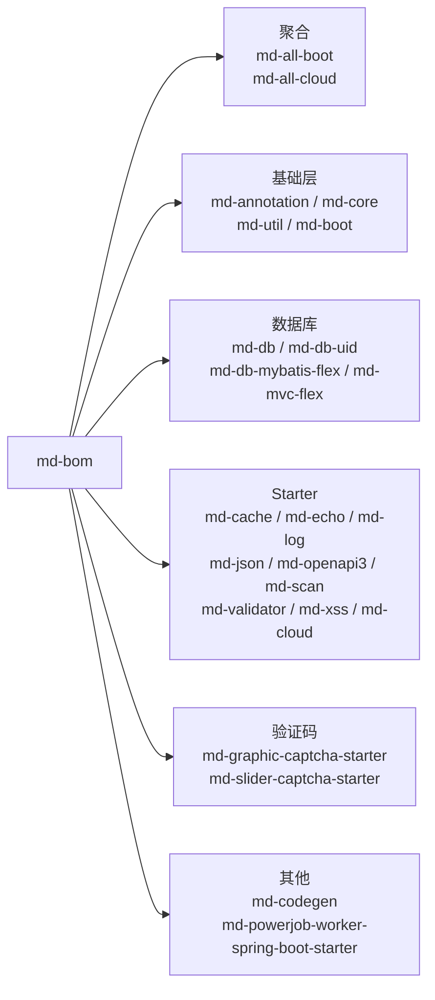

## 1. 模块定位

`md-bom` 与 `md-all` 都是**无 Java 代码的依赖管理模块**（md-all 下两个子模块各有一个仅用于占位的工具类），解决两个问题：

| 模块 | Maven 坐标 | 职责 |
| --- | --- | --- |
| `md-bom` | `top.mddata.base:md-bom` | BOM（Bill of Materials）：`dependencyManagement` 统一声明全部内部构件版本，下游 import 后引依赖不写版本号 |
| `md-all` | `top.mddata.base:md-all` | 聚合 POM，含两个「一键依赖」子模块 |
| `md-all/md-all-boot` | `top.mddata.base:md-all-boot` | **单体架构-依赖管理**：一个依赖引入 15 个常用模块 |
| `md-all/md-all-cloud` | `top.mddata.base:md-all-cloud` | **微服务架构-依赖管理**：= md-all-boot + md-cloud-starter |

三者均继承 [mdp-parent](../mdp-parent.md)，版本随 `${revision}` 统一发布。

## 2. 源码解读

### 2.1 md-bom 管理的构件清单

`md-bom/pom.xml` 的 `dependencyManagement` 声明了 24 个内部构件，按用途分组：



::: info Sa-Token 与 SOP 系列不在 md-bom 内
`md-sa-token`（7 个子构件）与 `md-sop-support`（2 个子构件）的版本同样由 md-bom 管理（pom 中后段声明），它们是**定制源码副本**，详见 [md-sa-token](md-sa-token.md) 与 [md-sop-support](md-sop-support.md)。
:::

### 2.2 md-all-boot：单体应用的「一键依赖」

`md-all-boot/pom.xml` 聚合以下 15 个模块（dependency 列表实测）：

```
md-annotation、md-core、md-json-starter、md-util、md-cache-starter、
md-db-uid、md-db-mybatis-flex、md-boot、md-echo-starter、md-log-starter、
md-mvc-flex、md-openapi3-starter、md-scan-starter、md-validator-starter、md-xss-starter
```

注意：聚合中**不包含** `md-db`（它已被 `md-db-mybatis-flex` 传递引入）、验证码、代码生成器、PowerJob、sa-token、sop —— 这些按需单独引入。

### 2.3 md-all-cloud：微服务应用的一键依赖

`md-all-cloud/pom.xml` 只有两个依赖：

```xml
<dependency>
    <groupId>top.mddata.base</groupId>
    <artifactId>md-all-boot</artifactId>
</dependency>
<dependency>
    <groupId>top.mddata.base</groupId>
    <artifactId>md-cloud-starter</artifactId>
</dependency>
```

即微服务应用 = 单体全家桶 + Feign/负载均衡/灰度/Sentinel 支持（见 [md-cloud-starter](md-cloud-starter.md)）。

### 2.4 占位工具类

`md-all-boot` 与 `md-all-cloud` 各含一个类 `top.mddata.base.all.UaBootUtil` / `UaCloudUtil`，仅为让 Maven 打出 jar（而非纯 pom）的占位，无业务逻辑。

## 3. 可配置参数

无。依赖管理模块不含任何运行期配置。

## 4. 扩展点

- **二开工程标准接入方式**：

```xml
<!-- 1. import BOM 获得版本仲裁 -->
<dependencyManagement>
    <dependencies>
        <dependency>
            <groupId>top.mddata.base</groupId>
            <artifactId>md-bom</artifactId>
            <version>${mdp.version}</version>
            <type>pom</type>
            <scope>import</scope>
        </dependency>
    </dependencies>
</dependencyManagement>

<!-- 2. 按架构形态引入一键依赖 -->
<dependency>
    <groupId>top.mddata.base</groupId>
    <artifactId>md-all-boot</artifactId>   <!-- 或 md-all-cloud -->
</dependency>
```

- 不想全家桶时，跳过 md-all，直接从 md-bom 管理的清单中按需挑选单个 starter。

## 5. 功能扩展建议

| 想做什么 | 推荐做法 |
| --- | --- |
| 新增内部公共模块 | 在 `mdp-base` 下建模块 → 在 `md-bom` 的 dependencyManagement 登记 → 视情况加入 `md-all-boot` |
| 排除全家桶中不需要的模块 | 对 `md-all-boot` 加 `<exclusions>`；更干净的做法是不用 md-all，逐个显式引入所需模块 |
| 二开工程统一版本 | 只 import `md-bom`，禁止在业务工程里为 md 构件写死版本号，防止升级时版本漂移 |

## 6. 二次开发注意事项

::: warning 高频坑点
1. **md-bom 只管理版本，不引入依赖**：import md-bom 后仍必须显式声明需要的构件，常见误区是「import 了 BOM 类就能用」。
2. **md-all-boot 是传递依赖大户**：引入后 `mvn dependency:tree` 会膨胀，排查类冲突时先确认是否由全家桶传递引入。
3. **升级平台版本只改一处**：业务工程中用属性（如 `${mdp.version}`）统一引用 md-bom 版本，避免多个 md 构件版本不一致导致 NoSuchMethodError。
4. **`.flattened-pom.xml` 是构建产物**：md-bom 目录下也有该文件，不要手工修改或提交变更。
:::
