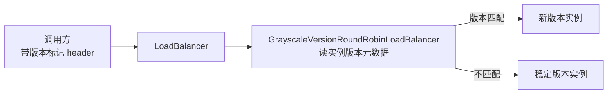

## 1. 模块定位

微服务公共配置模块，坐标 `top.mddata.base:md-cloud-starter`。覆盖三块：OpenFeign 定制（header 透传、Sentinel 融合、专属日志）、RestTemplate 增强、**灰度发布**（按版本元数据路由）。单体应用不引入（`md-all-cloud` = `md-all-boot` + 本模块）。

## 2. 源码解读

```
top.mddata.base.cloud
├── config/
│   ├── OpenFeignAutoConfiguration.java          # Feign 定制装配（imports 注册）
│   ├── RestTemplateConfiguration.java           # RestTemplate + header 拦截器（imports 注册）
│   ├── GrayscaleConfig.java                     # 灰度：@LoadBalancerClients(GrayscaleLbConfig)（imports 注册）
│   ├── GrayscaleLbConfig.java
│   └── SentinelAutoConfiguration.java
├── feign/
│   ├── DateFormatRegister.java                  # Feign 侧日期编解码
│   ├── MySentinelInvocationHandler.java         # Sentinel 熔断调用处理器
│   └── SentinelFeignBuilder.java
├── http/
│   ├── InfoFeignLoggerFactory.java / InfoSlf4jFeignLogger.java   # Feign 专属日志
│   └── RestTemplateHeaderInterceptor.java
├── interceptor/FeignAddHeaderRequestInterceptor.java  # header 透传（网关上下文）
└── rule/GrayscaleVersionRoundRobinLoadBalancer.java   # 灰度负载均衡器
org.springframework.cloud.openfeign.MyFeignClientsRegistrar  # ⚠️ 覆写官方类的包名侵入式定制
```

### 2.1 header 透传链

微服务形态下，网关解析 token 后把用户上下文写进请求头，`FeignAddHeaderRequestInterceptor`/`RestTemplateHeaderInterceptor` 保证**服务间调用时这些 header 继续透传**，下游用 `HeaderThreadLocalInterceptor`（md-common-config）还原到 `ContextUtil`。

### 2.2 灰度发布

`GrayscaleConfig`（默认开启，`GrayscaleConfig.java:22`）→ `@LoadBalancerClients(defaultConfiguration = GrayscaleLbConfig.class)` → `GrayscaleVersionRoundRobinLoadBalancer`：按服务实例的版本元数据（注册中心 metadata）做版本路由，实现"指定流量打到指定版本实例"。



### 2.3 MyFeignClientsRegistrar

放在 `org.springframework.cloud.openfeign` 包下**覆写官方类**（与 Spring Boot 的同名类加载顺序博弈），用于增强 `@EnableFeignClients` 的注册逻辑——这是侵入性最强的定制点。

## 3. 可配置参数

| 配置项 | 默认值 | 说明 |
|---|---|---|
| `mdp.grayscale.enabled` | true（matchIfMissing=true） | 灰度发布开关 |
| `feign.sentinel.enabled` | — | Feign+Sentinel 融合分支开关 |
| Feign 日期格式、连接超时等 | — | 经 Spring Cloud OpenFeign 官方配置 |

## 4. 扩展点

- **`GrayscaleLbConfig`**：用 `@LoadBalancerClient(name="xxx", configuration=...)` 为特定服务覆盖负载均衡策略。
- **`InfoFeignLoggerFactory`**：Feign 日志实现可替换（默认 slf4j，输出请求/响应摘要）。
- **拦截器链**：`FeignAddHeaderRequestInterceptor` 可加业务 header（如租户标识）。

## 5. 功能扩展建议

| 想做什么 | 推荐做法 |
|---|---|
| 服务间调用丢用户上下文 | 检查是否走了定制 Feign/RestTemplate；自建 HTTP 客户端要自己透传 header |
| 灰度验证新版本 | 实例注册时带版本元数据，调用方带标记；不需要灰度直接 `mdp.grayscale.enabled=false` |
| 调 Feign 调用链路 | 开 Feign 日志（`InfoSlf4jFeignLogger`），配合 sleuth/日志追踪 |
| 熔断降级 | `feign.sentinel.enabled=true` + sentinel 规则中心 |

## 6. 二次开发注意事项

::: danger 包名侵入式定制
`MyFeignClientsRegistrar` 放在 `org.springframework.cloud.openfeign` 包下覆写官方类，**升级 Spring Cloud 版本时官方类内部变化会让它静默失效**（无编译错误）。升级后必须验证：Feign 接口注册、header 透传、Sentinel 融合是否仍正常。
:::

::: warning 灰度默认开启
`mdp.grayscale.enabled` 默认 true——实例没配版本元数据时表现为普通轮询，不影响功能；但配错版本元数据会造成流量路由异常，排查"部分请求打到老实例"时优先查灰度。
:::
