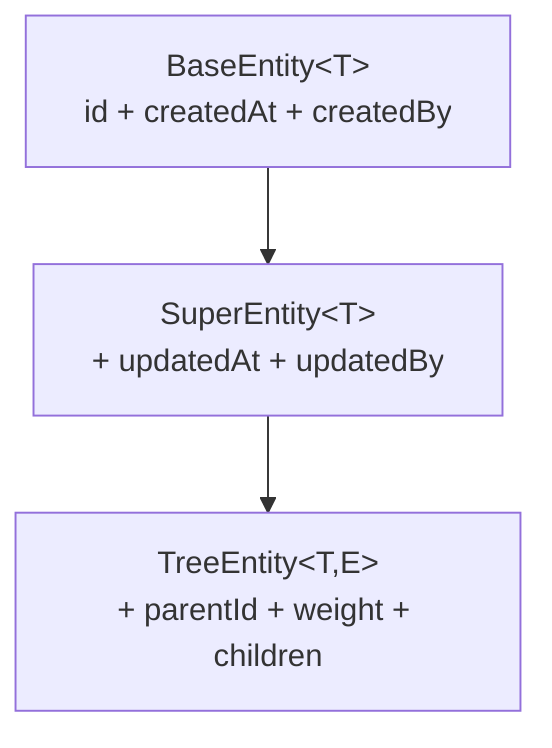

## 1. 模块定位

`md-core` 是 mdp-base 的**核心模块**：定义统一响应体、基础实体、异常体系、线程上下文、缓存 key 契约与回显 SPI。它只依赖 `md-annotation` 与 `spring-context`，被平台几乎所有模块依赖 —— **改这里等于改全平台契约**，二开时应只增不改。

- Maven 坐标：`top.mddata.base:md-core`（description：核心模块）
- 依赖：md-annotation、spring-context
- 被依赖：md-util、md-boot、md-db、全部 starter

## 2. 源码解读

包结构（`top.mddata.base`）：

```
base/          # R 响应体、BaseEntity/SuperEntity/TreeEntity、ExtraParams
constant/      # Constants（PROJECT_PREFIX="mdp"）、ContextConstants（上下文 key）
exception/     # 异常体系 + code/ExceptionCode
interfaces/    # BaseEnum、echo/{EchoService,LoadService,EchoVO}、validator/IValidatable
model/         # Kv、cache/{CacheKey,CacheHashKey,CacheKeyBuilder}、log/OptLogDTO
util/          # ContextUtil（线程上下文）、StrPool、LogSuppressUtil
```

### 2.1 统一响应体 R

`base/R.java` 是全平台 API 的统一返回包装：

| 字段 | 说明 |
| --- | --- |
| `code` | 0/200 成功；负数系统级错误；正数业务错误（见 ExceptionCode） |
| `data` | 业务数据（泛型 T） |
| `msg` | 提示信息，成功为 `"ok"` |
| `path` | 请求路径（异常时由全局处理器回填） |
| `extra` | 附加数据 Map（`put(key,val)` 链式添加） |
| `timestamp` | 服务器响应时间戳 |
| `errorMsg` | 原始异常消息，**仅开发/测试环境返回**，生产为空防泄露 |
| `defExec` | `@JsonIgnore`，是否执行前端默认成功/失败处理 |

内置状态码常量：`SUCCESS_CODE=0`、`FAIL_CODE=-1`、`TIMEOUT_CODE=-2`、`VALID_EX_CODE=-9`、`OPERATION_EX_CODE=-10`。静态工厂：`success()/success(data)/fail(...)/timeout()/result(...)`；`getIsSuccess()` 判定 `code==0 || code==200`。

### 2.2 基础实体三件套



- `base/entity/BaseEntity.java`：
  - 主键 `@Id(keyType = KeyType.Generator, value = "uid")` —— 走 md-db-mybatis-flex 注册的 `UidKeyGenerator`
  - 内置校验组接口 `Save` / `Update`（Update 组下 id `@NotNull`）
  - 全部公共字段名都定义了常量（`CREATED_AT="createdAt"`、`CREATED_AT_FIELD="created_at"`、`DELETED_BY_FIELD="deleted_by"` 等），写 QueryWrapper 时引用常量而非硬编码字符串
- `SuperEntity.java`：追加 `updatedAt`/`updatedBy`，普通业务表实体继承它
- `TreeEntity.java`：追加 `parentId`、`weight`（排序号）、`children`（`@Column(ignore=true)` 不落库）、`parent`；实现 `Comparable` 按 weight 排序，提供 `setParent`/`addChildren` 维护父子引用

### 2.3 异常体系

```
BaseExceptionCode（接口：getCode/getMsg）
 └─ ExceptionCode（枚举：平台内置异常码）
BaseException / BaseCheckedException / BaseUncheckedException
 ├─ BizException          业务异常（可指定 ExceptionCode 或自定义 code+msg）
 ├─ ArgumentException     参数异常
 ├─ CaptchaException      验证码异常
 ├─ ForbiddenException    403 禁止访问
 └─ UnauthorizedException 401 未认证
```

`ExceptionCode` 编码规则（类 Javadoc）：系统级用负数（-1 系统繁忙、-3 参数解析、-4 SQL、-5 NPE、-9 参数校验、-13 JSON 解析）；HTTP 语义用标准码（401/403/404/405/429/500）；业务级用 9 位分段码 `[系统]_[模块]_[功能]`（如 `100_000_001` 账号被禁用）；JWT 相关用 40000~40009。支持 `build(msg, params)` / `param(params)` 格式化消息。

### 2.4 线程上下文 ContextUtil

`util/ContextUtil.java` 基于 `ThreadLocal<Map<String,String>>` 存取当前请求的用户/组织/链路信息，key 定义在 `constant/ContextConstants.java`：`Token`、`Authorization`、`AppId`、`UserId`、`CurrentCompanyId`、`CurrentCompanyNature`、`CurrentTopCompanyId`、`CurrentDeptId`、`Path`、`Accept-Language`、traceId、灰度版本等。

写入方：微服务模式由网关注入请求头 → `HeaderThreadLocalInterceptor`；单体模式由 `TokenContextFilter` 从 Sa-Token 会话解析（两者见 md-public 的 md-common-config）。读取方遍布全平台（审计字段填充、数据权限、日志）。

### 2.5 缓存 key 契约

`model/cache/CacheKeyBuilder.java`（`@FunctionalInterface`）定义 key 构建规范：

- 命名规范（Javadoc）：`[前缀:][租户ID:]表名[:字段名][:唯一键值]`，冒号分隔
- 抽象方法仅 `getTable()`；默认 `getField()` 返回 `id`、`getExpire()` 返回 null（永不过期）、`getPattern()` 返回 `*:{table}:*`
- `key(uniques...)` → `CacheKey`（KV 模式，redis/caffeine 通用）；`hashKey()`/`hashFieldKey(field,...)` → `CacheHashKey`（redis hash）
- 全局前缀由静态 `CacheKeyBuilder.Key.setPrefix(...)` 设置，用于区分项目/环境

平台全部缓存 key 实现集中在 md-public 的 `md-cache-key` 模块（见 [md-cache-key](../md-public/md-cache-key.md)）。

### 2.6 回显 SPI 与枚举契约

- `interfaces/echo/LoadService.java`：单方法 `Map<Serializable, Object> findByIds(Set<Serializable> ids)`。应用实现它并注册为 Spring Bean，`@Echo(api="beanName")` 即可路由过来
- `interfaces/echo/EchoService.java`：回显引擎契约，`action(obj, isUseCache, ignoreFields...)`，三步：parse（反射解析 @Echo 字段）→ load（按 api 分组查询）→ write（写回字段或 echoMap）。实现在 md-echo-starter
- `interfaces/echo/EchoVO.java`：为 VO 提供 `getEchoMap()` 存放回显结果
- `interfaces/BaseEnum.java`：所有业务枚举的基接口 —— `getCode()`（唯一标识，泛型 Serializable）+ `getDesc()`（中文名）+ `eq()` 默认比较。实现它并加 `@Schema` 注解的枚举会被 md-enumeration-scanning 自动收集为前端下拉选项
- `interfaces/validator/IValidatable.java`：自校验对象契约

### 2.7 其他

- `constant/Constants.java`：`PROJECT_PREFIX = "mdp"`（**全平台配置前缀之源**）、`UTIL_PACKAGE = "top.mddata"`（组件/Mapper 扫描根包）
- `model/Kv.java`：链式 Map 构建；`model/log/OptLogDTO.java`：操作日志传输对象（md-log-starter 组装后随事件发布）
- `util/LogSuppressUtil.java`：打标当前线程「抑制 SQL 审计输出」（日志落库链路自身不再产生审计噪音）
- `util/StrPool.java`：常用字符串常量池；`base/ExtraParams.java`：额外参数容器

## 3. 可配置参数

无 `@ConfigurationProperties`。本模块是纯契约层，唯一的全局「配置」是代码常量：

| 常量 | 值 | 影响 |
| --- | --- | --- |
| `Constants.PROJECT_PREFIX` | `mdp` | 所有 starter 的配置前缀 |
| `Constants.UTIL_PACKAGE` | `top.mddata` | 默认扫描根包 |
| `CacheKeyBuilder.Key.prefix` | null（静态可设） | 缓存 key 全局前缀 |

## 4. 扩展点

| 扩展点 | 方式 |
| --- | --- |
| `LoadService` | 实现接口注册 Bean，成为 @Echo 数据源（策略模式，按 beanName 收集） |
| `BaseExceptionCode` | 业务工程自定义异常码枚举实现该接口，配合 `BizException.wrap()` 使用 |
| `BaseEnum` | 业务枚举实现它，自动获得 eq 比较、枚举扫描、Option 转换能力 |
| `CacheKeyBuilder` | 实现它定义新缓存 key（getTable/getExpire） |
| `IValidatable` | 实体自校验逻辑入口 |

## 5. 功能扩展建议

| 想做什么 | 推荐做法 |
| --- | --- |
| 新业务表实体 | 继承 `SuperEntity<Long>`（树表继承 `TreeEntity`），字段名引用父类常量 |
| 新业务异常码 | 在业务工程实现 `BaseExceptionCode` 枚举，按 9 位分段规则规划号段，**不要往 `ExceptionCode` 里加**（升级冲突） |
| 修改统一响应结构 | 不建议改 `R`；前端已按 code/data/msg/extra 对接，如需扩展字段用 `extra` |
| 自定义上下文数据 | 通过 `ContextUtil.set(key, val)` 加自定义 key，key 常量放业务工程的 Constants，用完在拦截器 afterCompletion 清理 |

## 6. 二次开发注意事项

::: warning 高频坑点
1. **ContextUtil 必须清理**：ThreadLocal 用完不调 `remove()` 会内存泄漏 + 线程池串数据；平台拦截器已统一清理，自行开线程时需手动搬运（参考 `BaseEventVO.copy()/write()` 的做法）。
2. **R 的成功码是 0 或 200 双判定**：客户端判断成功请用 `getIsSuccess()`，不要只比较某一个值。
3. **errorMsg 只在 dev/test 返回**：全局异常处理器根据 `spring.profiles.active` 决定是否回填，生产排查问题靠服务端日志而非响应体。
4. **TreeEntity 的 children/parent 不落库**（`@Column(ignore=true)`），需要持久化父子关系时用 `parentId` 字段；`weight` 排序值别与业务「权重」概念混淆。
5. **本模块被全平台依赖**：任何对既有类签名/常量值的修改都是破坏性变更，升级平台版本时优先 diff 此模块。
:::
