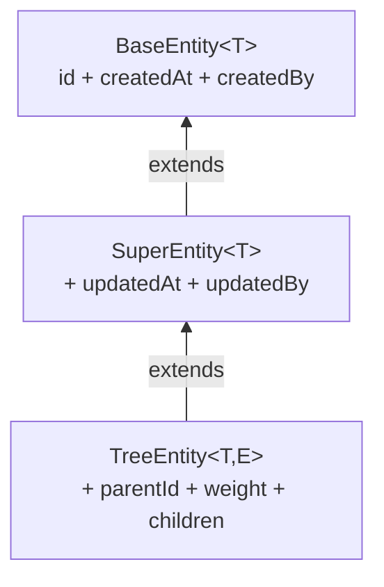

## 1. 模块定位

`md-core` 是 mdp-base 的**核心模块**：定义统一响应体、基础实体、异常体系、线程上下文、缓存 key 契约、接口权限契约与回显 SPI。核心依赖 `md-annotation` 与 `spring-context`（另含 hutool-all、jackson、transmittable-thread-local 等基础工具依赖），被平台几乎所有模块依赖 —— **改这里等于改全平台契约**，二开时应只增不改。

- Maven 坐标：`top.mddata.base:md-core`
- 依赖：md-annotation、spring-context、hutool-all、jackson、TTL
- 被依赖：md-util、md-boot、md-db、全部 starter

## 2. 源码解读

包结构（`top.mddata.base`）：

```
base/          # R 响应体、BaseEntity/SuperEntity/TreeEntity、ExtraParams
constant/      # Constants（PROJECT_PREFIX="mdp"）、ContextConstants（上下文 key）
exception/     # 异常体系 + code/ExceptionCode
interfaces/    # BaseEnum、echo/{EchoService,LoadService,EchoVO}、validator/IValidatable
model/         # Kv、cache/{CacheKey,CacheHashKey,CacheKeyBuilder}、log/OptLogDTO
apiperm/       # 接口权限契约：engine/ApiPermChecker、spi/ApiPermProvider、model/{ApiPattern,UserApiPerm}
fieldperm/     # 字段权限契约：engine/{FieldPermEngine,Masker,BuiltinMasker}、spi/FieldPermProvider、model/{FieldRule,UserFieldPerm}
util/          # ContextUtil（线程上下文）、StrPool、LogSuppressUtil
```

### 2.1 统一响应体 R

`base/R.java` 是全平台 API 的统一返回包装：

| 字段 | 说明 |
| --- | --- |
| `code` | 0成功；负数系统级错误；正数业务错误（见 ExceptionCode） |
| `data` | 业务数据（泛型 T） |
| `msg` | 提示信息，成功为 `"ok"` |
| `path` | 请求路径（异常时由全局处理器回填） |
| `extra` | 附加数据 Map（`put(key,val)` 链式添加） |
| `timestamp` | 服务器响应时间戳 |
| `errorMsg` | 原始异常消息，**仅开发/测试环境返回**，生产为空防泄露 |
| `defExec` | `@JsonIgnore`，是否执行前端默认成功/失败处理 |

内置状态码常量：`SUCCESS_CODE=0`、`FAIL_CODE=-1`、`TIMEOUT_CODE=-2`、`VALID_EX_CODE=-9`、`OPERATION_EX_CODE=-10`；提示语常量 `DEF_ERROR_MESSAGE` / `HYSTRIX_ERROR_MESSAGE`。静态工厂：`success()/success(data)/fail(...)/timeout()/result(...)`；`getIsSuccess()` 仅判定 `code == 0`（R.java:363，**不含 200**）。`put(key,val)` 链式添加单个附加数据，`putAll(Map)` 批量添加。

### 2.2 基础实体三件套


```mermaid
flowchart BT
    T["TreeEntity&lt;T,E&gt;<br/>+ parentId + weight + children"] -->|extends| S["SuperEntity&lt;T&gt;<br/>+ updatedAt + updatedBy"]
    S -->|extends| B["BaseEntity&lt;T&gt;<br/>id + createdAt + createdBy"]
```

- `base/entity/BaseEntity.java`：
  - 主键 `@Id(keyType = KeyType.Generator, value = "uid")` —— 走 md-db-mybatis-flex 注册的 `UidKeyGenerator`
  - 内置校验组接口 `Save` / `Update`（Update 组下 id `@NotNull`）
  - 全部公共字段名都定义了常量（`CREATED_AT="createdAt"`、`CREATED_AT_FIELD="created_at"`、`DELETED_BY_FIELD="deleted_by"` 等），写 QueryWrapper 时引用常量而非硬编码字符串
- `SuperEntity.java`：追加 `updatedAt`/`updatedBy`，普通业务表实体继承它
- `TreeEntity.java`：追加 `parentId`、`weight`（排序号）、`children`（`@Column(ignore=true)` 不落库）、`parent`；树表字段常量（`PARENT_ID`/`WEIGHT`/`PARENT_ID_FIELD`/`WEIGHT_FIELD`）也定义在本类；实现 `Comparable` 按 weight 排序，提供 `setParent`/`addChildren` 维护父子引用

### 2.3 异常体系

```
BaseExceptionCode（接口：getCode/getMsg）
 └─ ExceptionCode（枚举：平台内置异常码）
BaseException（接口，含常量 BASE_VALID_PARAM=-9）
 ├─ BaseCheckedException（extends Exception，受检异常）
 └─ BaseUncheckedException（extends RuntimeException，运行时异常）
     ├─ BizException          业务异常（可指定 ExceptionCode 或自定义 code+msg）
     ├─ ArgumentException     参数异常
     ├─ CaptchaException      验证码异常
     ├─ ForbiddenException    403 禁止访问
     └─ UnauthorizedException 401 未认证
```

`BizException` 静态工厂：`wrap()`（包装任意异常/异常码）、`validFail()`（固定 -9 参数校验失败）。

`ExceptionCode` 编码规则（类 Javadoc）：系统级用负数（-1 系统繁忙、-3 参数解析、-4 SQL、-5 NPE、-9 参数校验、-13 JSON 解析）；HTTP 语义用标准码（200/400/401/403/404/405/429/500/502/504）；业务级用 9 位分段码 `[系统]_[模块]_[功能]`（如 `100_000_001` 账号被禁用）；JWT 相关用 40000~40009。支持 `build(msg, params)` / `param(params)` 格式化消息。

### 2.4 线程上下文 ContextUtil

`util/ContextUtil.java` 基于**普通 ThreadLocal**（`ContextUtil.java:60`，非 InheritableThreadLocal、非 TTL）存取当前请求的用户/组织/链路信息，key 定义在 `constant/ContextConstants.java`：`Token`、`Authorization`、`AppId`、`UserId`、`CurrentCompanyId`、`CurrentCompanyNature`、`CurrentTopCompanyId`、`CurrentTopCompanyNature`、`CurrentDeptId`、`Path`、`Accept-Language`、`trace`（链路标识，经 `getLogTraceId()` 读取）、`proceed`（拦截器放行标志，`isProceed()`）、`x-feign`（内部调用标识）、灰度版本等。

常用方法补充：`getCurrentDeptOrCompanyId()`（"本部门"语义统一取值——部门为空回落公司，数据权限场景常用）、`getLocale()/setLocale()`、`isEmptyUserId()/isEmptyAppId()`、`getLocalMap()/setLocalMap()`（上下文全量快照/还原，异步搬运用）。

写入方：微服务模式由网关注入请求头 → `HeaderThreadLocalInterceptor`；单体模式由 `TokenContextFilter` 从 Sa-Token 会话解析（两者见 md-public 的 md-common-config）。读取方遍布全平台（审计字段填充、数据权限、日志）。

#### 参数丢失/取不到的高危场景

::: warning ThreadLocal 不跨线程 —— 换线程 = 上下文为空
以下场景中 `ContextUtil.getUserId()` 等**必然取不到值**（返回 null），进而引发审计字段没填充、数据权限过滤失效、日志缺操作人等隐性 bug：

| # | 场景 | 原因 | 正确做法 |
|---|---|---|---|
| 1 | **`@Async` 异步方法** | 方法在线程池（md-boot 的 md-async-executor-）执行，请求线程早已 return，ThreadLocal 不随线程池传递 | 参数在**调用方**先取出来显式传参；或参考 `BaseEventVO.copy()/write()` 在异步前后搬运（md-log-starter 的 SysLogListener 就是：切面在请求线程组装完 `OptLogDTO` 才发事件） |
| 2 | **手动 `new Thread()` / 自建线程池** | 同上，全新线程的 ThreadLocal 是空的 | 同上；用完记得在新线程内 `remove()` |
| 3 | **CompletableFuture / 并行流（parallelStream）** | 任务跑到 ForkJoinPool.commonPool() 的其他线程 | 计算所需的上下文先在主线程提取为局部变量再进入 lambda |
| 4 | **定时任务（PowerJob/@Scheduled）** | 定时线程不经过 Web 拦截器，从头就没有上下文 | 用「系统操作人」语义兜底（显式 set 系统账号），不要依赖登录态 |
| 5 | **消息监听（MQ consumer）** | 消费线程与生产请求线程无关 | 生产端把 userId 写进消息体，消费端显式 `set` 后再处理（用完 remove） |
| 6 | **微服务跨服务调用后，被调方取不到** | ThreadLocal 不跨进程：A 服务 set 的值到 B 服务就是没有 | 上下文经请求头透传（`FeignAddHeaderRequestInterceptor`，见 md-cloud-starter），B 服务靠 `HeaderThreadLocalInterceptor` 重建 —— **自建 HTTP 客户端调服务时必须自己透传这些 header** |
| 7 | **单元测试 / main 方法直接调用** | 没有拦截器写入 | 测试里手动 `ContextUtil.setUserId(...)`，结束后 remove |

```java
// ❌ 错误：异步方法里直接取上下文 —— getUserId() 返回 null
@Async
public void auditAsync(String bizId) {
    Long userId = ContextUtil.getUserId();   // null！
    saveLog(bizId, userId);                  // 审计字段丢失
}

// ✅ 正确：调用方先取，显式传参
public void doBiz(String bizId) {
    Long userId = ContextUtil.getUserId();   // 请求线程内，取得到
    auditAsync(bizId, userId);
}
@Async
public void auditAsync(String bizId, Long userId) {
    saveLog(bizId, userId);
}
```

平台提供的标准搬运模式（`BaseEventVO`，md-common-pojo）：

```java
// 生产端（请求线程）：快照上下文进事件
event.setContextMap(BaseEventVO.copy());     // 内部 ContextUtil.getLocalMap() 全量复制
// 消费端（新线程）：还原
event.getContextMap().write();               // 内部 ContextUtil.setLocalMap(map)
```
:::

### 2.5 缓存 key 契约

`model/cache/CacheKeyBuilder.java`（`@FunctionalInterface`）定义 key 构建规范。

**命名风格**（类 Javadoc）：

- 【推荐】key 需具可读性、可管理性，不使用含义不清或特别长的 key 名；
- 【强制】以英文字母开头，只允许**小写字母、数字、英文点号(.)和英文半角冒号(\:)**；
- 【强制】不包含特殊字符——下划线、空格、换行、单双引号及其他转义字符均禁止。

**命名规范**：`[前缀:]业务类型[:业务字段][:业务值]`，各段用冒号拼接：

| 段 | 必填 | 说明 |
| --- | --- | --- |
| 前缀 | 可选 | 区分不同项目、不同环境（经 `Key.setPrefix()` 静态全局设置） |
| 业务类型 | **必填** | 区分业务类型的数据缓存，通常为**表名**；同一 key 有多个业务类型时用英文点号(.)分割表示完整语义，如 `user.role` 存储用户拥有的角色 |
| 业务字段 | 可选 | 区分业务值属于哪个字段，通常为字段名；多个业务类型时业务字段对应多个 |
| 业务值 | 可选 | 区分同一业务类型下不同行的数据缓存 |

**接口结构**（与代码逐项对应）：

- 抽象方法仅 `getTable()`（业务类型，必填）；
- `getField()` 默认返回 `SuperEntity.ID_FIELD`（继承自 `BaseEntity.java:60`，即 `"id"`），复写可换字段名，返回空串则跳过该段；
- `getExpire()` 默认 null（**永不过期**），`@Nullable`；
- `getPrefix()` 读静态 `Key.prefix`（区分项目/环境）；
- `getPattern()` 返回 `*:{table}:*` 通配，用于批量清理；
- `key(uniques...)` → `CacheKey`（通用 KV 模式，**redis/caffeine 双兼容**），`uniques` 即「业务值」段（多个值依次拼接，空值自动跳过）；
- `hashKey()` / `hashFieldKey(field, ...)` → `CacheHashKey`（redis hash 模式，后者带 field）；`CacheHashKey.tran()` 可把 hash key 转成普通 KV key（`key:field` 拼接）。

key 拼接逻辑见私有方法 `getKey()`（`CacheKeyBuilder.java:142-166`）：前缀(有则加) → 业务类型(必填,空则断言失败) → 业务字段(非空才加) → 业务值(逐个非空才加)，冒号连接。`key()`/`hashKey()` 均对结果做 `Assert.notEmpty` 校验。

平台全部缓存 key 实现集中在 md-public 的 `md-cache-key` 模块（见 [md-cache-key](../md-public/md-cache-key.md)）。

### 2.6 回显 SPI 与枚举契约

- `interfaces/echo/LoadService.java`：单方法 `Map<Serializable, Object> findByIds(Set<Serializable> ids)`。应用实现它并注册为 Spring Bean，`@Echo(api="beanName")` 即可路由过来
- `interfaces/echo/EchoService.java`：回显引擎契约，`action(obj, isUseCache, ignoreFields...)`（另有默认方法 `action(obj, ignoreFields...)`），三步：parse（反射解析 @Echo 字段）→ load（按 api 分组查询）→ write（写回字段或 echoMap）。实现在 md-echo-starter
- `interfaces/echo/EchoVO.java`：为 VO 提供 `getEchoMap()` 存放回显结果
- `interfaces/BaseEnum.java`：所有业务枚举的基接口 —— `getCode()`（唯一标识，泛型 Serializable）+ `getDesc()`（中文名）+ `eq()` 默认比较（两个重载：`eq(T)` / `eq(BaseEnum)`）。实现它并加 `@Schema` 注解的枚举会被 md-enumeration-scanning 自动收集为前端下拉选项
- `interfaces/validator/IValidatable.java`：自校验对象契约

### 2.7 接口权限契约（apiperm/）

`apiperm` 包定义 **uri 级接口鉴权**的平台契约，单体版与网关版共用同一套判定逻辑（实现方见 [md-resource-api](../md-public/md-resource-api.md)）：

| 类 | 说明 |
| --- | --- |
| `engine/ApiPermChecker.java` | 判定引擎（纯逻辑、无 web 依赖，单体/网关共用）。一次请求依次过 5 道关卡，任何一道拒绝即拦截：①鉴权总开关（`auth-enabled=false` 则全部放行）→ ②把请求路径还原成裸路径（剥掉网关前缀 `/api` 和服务前缀如 `/console`，即 `normalizePath()`）→ ③查这个接口有没有在平台登记过（没登记的新接口按 `not-config-uri-allow` 配置统一放行或拒绝）→ ④运营管理员直接放行 → ⑤在用户角色已授权的接口清单里逐个匹配，命中才放行 |
| `spi/ApiPermProvider.java` | 权限数据提供方 SPI：`isAuthEnabled` / `isNotConfigAllow` / `getGatewayPrefix` / `getServicePrefixes` / `findAllPatterns`（已纳管接口全集）/ `findUserPerm`（用户放行集） |
| `model/ApiPattern.java` | record：URI Ant 模式 + 请求方式匹配（`ALL` 通配） |
| `model/UserApiPerm.java` | 用户接口放行集（`operationsAdmin` 运营者豁免标记 + `patterns`，Redis 缓存模型） |

### 2.8 字段权限契约（fieldperm/）

`fieldperm` 包定义**列级字段权限**（响应层隐藏/脱敏）的平台契约，与 apiperm 同为"纯逻辑引擎 + SPI 数据提供"结构（数据实现见 [md-resource-api](../md-public/md-resource-api.md) §2.4，Web 入口 `FieldPermAdvice` 在 [md-mvc-flex](md-mvc-flex.md)，使用指南见[字段权限](../../advanced/字段权限.md)）：

| 类 | 说明 |
| --- | --- |
| `engine/FieldPermEngine.java` | 执行引擎（纯函数，无 web/DB 依赖）。遍历响应对象树（`R.data`、mybatis-flex `Page`、集合/Map/嵌套 VO），对命中规则的属性隐藏置 null / 脱敏变形；防护阈值 `DEFAULT_MAX_DEPTH=5`、`DEFAULT_MAX_OBJECTS=5000`（超限告警截断）、`IdentityHashMap` 防循环引用；按类名识别 Page、按包名跳过 JDK/框架类（`SKIP_PACKAGES`），不引依赖 |
| `engine/Masker.java` | `@FunctionalInterface` 脱敏函数 SPI |
| `engine/BuiltinMasker.java` | 内置 9 条脱敏规则（规则名与 mybatis-flex `Masks` 生态对齐）：mobile / fixed_phone / id_card_number / chinese_name / address / email / password / car_license / bank_card_number；`register(name, rule)` 支持自定义/同名覆盖 |
| `model/FieldRule.java` | 单字段规则（`RULE_TYPE_HIDE=10` 隐藏 / `RULE_TYPE_MASK=20` 脱敏 + maskRule，Redis 缓存模型） |
| `model/UserFieldPerm.java` | 用户字段受限集（**拒绝模型**：`operationsAdmin` 豁免标记 + `menuRules: Map<menuId, Map<property, FieldRule>>`） |
| `spi/FieldPermProvider.java` | 数据提供方 SPI：`isAuthEnabled()` / `findMenuId(uri, method)`（URI → 沿菜单上级链找最近字段规则菜单）/ `findUserPerm(userId)` |

### 2.9 其他

- `constant/Constants.java`：`PROJECT_PREFIX = "mdp"`（**全平台配置前缀之源**）、`UTIL_PACKAGE = "top.mddata"`（组件/Mapper 扫描根包）、`ENABLED = "enabled"`
- `model/Kv.java`：键值对通用对象（`key`/`value` 两字段，链式 setter + Builder，equals/hashCode 只按 key）；`model/log/OptLogDTO.java`：操作日志传输对象（md-log-starter 组装后随事件发布）
- `util/LogSuppressUtil.java`：`suppress()`/`release()`/`isSuppressed()` 三方法打标当前线程「抑制 SQL 审计输出」（日志落库链路自身不再产生审计噪音）；**线程池复用线程，调用方必须在 finally 中 `release()`**，否则标记泄漏给同线程的下一个任务
- `util/StrPool.java`：常用字符串常量池；`base/ExtraParams.java`：额外参数容器

## 3. 可配置参数

无 `@ConfigurationProperties`。本模块是纯契约层，唯一的全局「配置」是代码常量：

| 常量 | 值 | 影响 |
| --- | --- | --- |
| `Constants.PROJECT_PREFIX` | `mdp` | 所有 starter 的配置前缀 |
| `Constants.UTIL_PACKAGE` | `top.mddata` | 默认扫描根包 |
| `Constants.ENABLED` | `enabled` | 通用开关配置后缀 |
| `CacheKeyBuilder.Key.prefix` | null（静态可设） | 缓存 key 全局前缀 |

## 4. 扩展点

| 扩展点 | 方式 |
| --- | --- |
| `LoadService` | 实现接口注册 Bean，成为 @Echo 数据源（策略模式，按 beanName 收集） |
| `BaseExceptionCode` | 业务工程自定义异常码枚举实现该接口，配合 `BizException.wrap()` 使用 |
| `BaseEnum` | 业务枚举实现它，自动获得 eq 比较、枚举扫描、Option 转换能力 |
| `CacheKeyBuilder` | 实现它定义新缓存 key（getTable/getExpire） |
| `IValidatable` | 实体自校验逻辑入口 |
| `Masker` | `BuiltinMasker.register(name, rule)` 注册自定义脱敏规则（可同名覆盖内置） |
| `FieldPermProvider` | 实现 SPI 更换字段权限数据源（参考 md-resource-api 的 `FieldPermProviderImpl`） |

## 5. 功能扩展建议

| 想做什么 | 推荐做法 |
| --- | --- |
| 新业务表实体 | 继承 `SuperEntity<Long>`（树表继承 `TreeEntity`），字段名引用父类常量 |
| 新业务异常码 | 在业务工程实现 `BaseExceptionCode` 枚举，按 9 位分段规则规划号段，**不要往 `ExceptionCode` 里加**（升级冲突） |
| 修改统一响应结构 | 不建议改 `R`；前端已按 code/data/msg/extra 对接，如需扩展字段用 `extra` |
| 自定义上下文数据 | 通过 `ContextUtil.set(key, val)` 加自定义 key，key 常量放业务工程的 Constants，用完在拦截器 afterCompletion 清理 |

## 6. 二次开发注意事项

::: warning 高频坑点
1. **ContextUtil 必须清理**：ThreadLocal 用完不调 `remove()` 会内存泄漏 + 线程池串数据；平台拦截器已统一清理，自行开线程时需手动搬运（参考 `BaseEventVO.copy()/write()` 的做法）。
2. **LogSuppressUtil 必须 finally 中 release()**：线程池复用线程，只 `suppress()` 不 `release()` 会把「抑制审计」标记泄漏给同线程的后续任务。
3. **errorMsg 只在 dev/test 返回**：全局异常处理器根据 `spring.profiles.active` 决定是否回填，生产排查问题靠服务端日志而非响应体。
4. **TreeEntity 的 children/parent 不落库也不出参**（`@Column(ignore=true)`，`parent` 另有 `@JsonIgnore`），需要持久化父子关系时用 `parentId` 字段；`weight` 排序值别与业务「权重」概念混淆。
5. **本模块被全平台依赖**：任何对既有类签名/常量值的修改都是破坏性变更，升级平台版本时优先 diff 此模块。
:::
