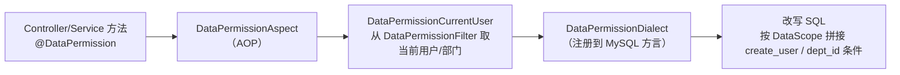

## 1. 模块定位

MyBatis-Flex 深度整合模块，坐标 `top.mddata.base:md-db-mybatis-flex`。负责 ORM 层的全局定制：数据权限、SQL 审计、逻辑删除、主键生成器对接、审计字段自动填充。依赖 md-db、md-util、mybatis-flex。是 mdp-base 中**唯一注册了自动配置类**的持久层模块。

## 2. 源码解读

```
top.mddata.base.mybatisflex
├── config/
│   ├── MyMybatisFlexConfiguration.java      # 抽象配置：extends DbConfiguration implements MyBatisFlexCustomizer
│   └── DataPermissionAutoConfiguration.java # 自动配置（imports 唯一注册项）
├── datapermission/                          # 数据权限套件
│   ├── DataPermission.java                  # 方法注解
│   ├── DataPermissionAspect.java            # AOP 切面
│   ├── DataPermissionFilter.java            # 接口：应用需提供实现
│   ├── DataPermissionCurrentUser.java       # 数据载体（用户/部门）
│   ├── DataPermissionDialect.java           # MySQL 方言扩展：改写 SQL 拼权限条件
│   └── DataScope.java                       # 权限范围枚举
├── keygen/UidKeyGenerator.java              # 主键生成器：调用 UidGenerator
├── listener/                                # 全局监听器
│   ├── DefaultInsertListener.java           # 插入自动填充（创建人/时间）
│   ├── DefaultUpdateListener.java           # 更新自动填充（修改人/时间）
│   └── FieldPermissionsOnSetListener.java   # （预留，当前未启用）
├── logicdelete/TimeStampDelByLogicDeleteProcessor.java  # 默认逻辑删除处理器
├── dialect/AuthDialectImpl.java             # （预留）
└── utils/BeanPageUtil.java
```

### 2.1 MyMybatisFlexConfiguration（抽象，需继承）

实现 `MyBatisFlexCustomizer.customize(FlexGlobalConfig)`，启动时依次装配（`MyMybatisFlexConfiguration.java:80-93`）：

1. `audit()`：按 `flex.audit` 开启审计，按 `flex.audit-collector` 选择收集器（默认打 INFO 日志，并抑制操作日志落库链路自身的 SQL，避免级联刷屏）；
2. `uid()`：把 `UidKeyGenerator` 注册进 KeyGeneratorFactory（主键生成对接 md-db 的 UidGenerator）；
3. `logicDelete()`：按 `flex.logic-delete-processor` 设置 6 种处理器之一（默认 TIME_STAMP_DEL_BY）；
4. 全局监听器：`DefaultInsertListener` / `DefaultUpdateListener` 注册给 `BaseEntity` 的所有子类——**创建/更新时间与操作人的自动填充就在这里**；
5. `DatabaseIdProvider`：Oracle/MySQL/SQLServer 的 databaseId 映射（多数据库 SQL 切换用）。

MDP 中由 md-public 的 `MybatisFlexConfiguration` 继承落地（同时做 `@MapperScan`）。

### 2.2 数据权限套件



- `@DataPermission`（方法级）：`tableAlias`/`id`(id)/`deptId`(dept_id)/`userId`(create_user) 可调字段名；
- `DataPermissionFilter` 是**应用必须实现的接口**——MDP 在 md-public 的 `DataPermissionFilterImpl` 中从 `ContextUtil` 提供当前用户。

## 3. 可配置参数

本模块配置全部在 md-db 的 `DatabaseProperties`（前缀 `mdp.database`），与持久层相关的关键项：

| 配置项 | 默认值 | 说明 |
|---|---|---|
| `mdp.database.flex.data-scope` | false | **数据权限总开关**（`DataPermissionAutoConfiguration` 的 `@ConditionalOnProperty`，matchIfMissing=false） |
| `mdp.database.flex.audit` | false | SQL 审计开关 |
| `mdp.database.flex.audit-collector` | DEFAULTS | 收集器：DEFAULTS/CONSOLE/COUNTABLE/SCHEDULED |
| `mdp.database.flex.logic-delete-processor` | TIME_STAMP_DEL_BY_LOGIC_DELETE_PROCESSOR | 逻辑删除处理器（6 种） |
| `mdp.database.flex.deleted-by-column` | deleted_by | 逻辑删除人字段名 |
| `mdp.database.id-type` 及 `default-id/cache-id/hutool-id.*` | — | 主键生成参数（经 UidKeyGenerator 生效） |

## 4. 扩展点

| 扩展点 | 类型 | 说明 |
|---|---|---|
| `DataPermissionFilter` | 接口（应用必须实现） | 提供当前用户/部门给数据权限；可自定义数据源 |
| `MyMybatisFlexConfiguration` | 抽象类 | 应用继承可覆盖 `customize()` 追加全局配置（不建议大改，影响全库行为） |
| `DataPermissionDialect` | 类 | 注册到 `DialectFactory`，新数据库种需自行注册对应方言 |
| 审计字段填充 | 监听器 | `DefaultInsert/UpdateListener` 针对 `BaseEntity`；新填充字段可加监听器 |
| `TimeStampDelByLogicDeleteProcessor` | 类 | 换逻辑删除语义走配置枚举，无需写代码 |

## 5. 功能扩展建议

| 想做什么 | 推荐做法 |
|---|---|
| 按部门隔离数据 | `flex.data-scope=true` + Service 方法加 `@DataPermission` + 确认应用实现了 `DataPermissionFilter` |
| 新增表跳过数据权限 | 不要乱加 ignore-table（那是租户的）；数据权限是注解式按方法生效的，不加注解即不拦截 |
| 多租户 | `ignore-table`/`ignore-table-prefix` 控制租户插件拼接范围 |
| 看 SQL 性能 | `flex.audit=true` + `audit-collector=COUNTABLE` 做量级统计 |
| 自定义审计输出 | 实现自己的 `MessageCollector`（参考 `MyMybatisFlexConfiguration#audit` 的装配方式） |

## 6. 二次开发注意事项

::: warning 开数据权限的三个前提
1. `mdp.database.flex.data-scope=true`（默认关）；2. Spring 容器里有 `DataPermissionFilter` Bean（MDP 各服务用 md-common-config 的 `DataPermissionFilterImpl`）；3. `@DataPermission` 注解的默认字段名（id/dept_id/create_user）与你的表结构一致，不一致必须在注解上显式指定。
:::

::: warning 字段填充依赖 BaseEntity
`DefaultInsertListener/UpdateListener` 只对 `BaseEntity` 子类生效；自定义实体没继承 `BaseEntity` 就不会有创建人/时间的自动填充。
:::

::: warning DataPermissionDialect 只注册了 MYSQL
`DataPermissionAutoConfiguration#postConstruct` 将方言注册到 `DialectFactory`（MySQL）。使用其他数据库（Oracle/PG/达梦）时数据权限 SQL 改写需要自行注册对应方言，否则条件拼接可能不生效。
:::
