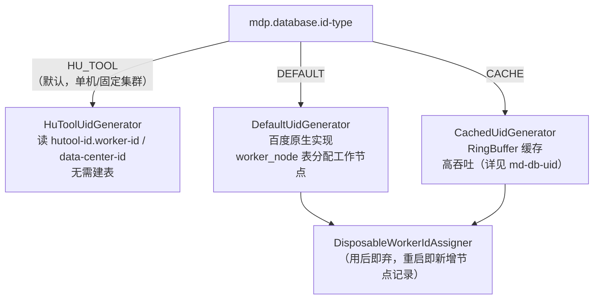

## 1. 模块定位

数据库公共配置模块，坐标 `top.mddata.base:md-db`。两个职责：① 主键生成策略装配（`DbConfiguration`）；② 模糊查询 TypeHandler。依赖 md-core、md-db-uid。

## 2. 源码解读

```
top.mddata.base.db
├── config/DbConfiguration.java        # 抽象配置：按 idType 注册 UidGenerator + 3 个 like 处理器
├── properties/
│   ├── DatabaseProperties.java        # mdp.database.* 全量配置
│   ├── IdType.java                    # 主键策略枚举（3 种）
│   └── flex/{AuditCollector, LogicDeleteProcessor}.java  # 审计收集器/逻辑删除处理器枚举
└── typehandler/                       # Base/Full/Left/RightLikeTypeHandler、SqlLike、SqlUtils
```

### 2.1 DbConfiguration（抽象，需继承）

构造注入 `DatabaseProperties`，核心是 `getHuToolUidGenerator()`（`DbConfiguration.java:36-68`，`@ConditionalOnMissingBean`）——按 `mdp.database.id-type` 三分支装配：



同时注册 3 个 MyBatis TypeHandler Bean，XML 中配合使用：`and name like #{name,typeHandler=leftLike}`（右模糊 rightLike、全模糊 fullLike 同理）——避免手拼 `%`。

### 2.2 装配生效方式

本模块 imports 为空，`DbConfiguration` 由 md-db-mybatis-flex 的 `MyMybatisFlexConfiguration` 继承后生效；应用工程一般不直接继承它。

## 3. 可配置参数

`DatabaseProperties`（前缀 `mdp.database`，已核对源码）：

| 配置项 | 默认值 | 说明 |
|---|---|---|
| `mdp.database.id-type` | HU_TOOL | 主键策略：HU_TOOL / DEFAULT / CACHE |
| `mdp.database.is-not-write` | false | 全局禁止写入（配合 write-white-list 白名单放行） |
| `mdp.database.write-white-list` | — | 禁止写入白名单（URL 列表） |
| `mdp.database.is-data-scope` | true | 是否启用数据权限（注意：真正装配在 flex.data-scope） |
| `mdp.database.ignore-table` | [] | 租户插件不拼接租户 ID 的表名 |
| `mdp.database.ignore-table-prefix` | [] | 同上，按前缀 |
| `mdp.database.flex.audit` | false | 启用 SQL 审计 |
| `mdp.database.flex.audit-collector` | DEFAULTS | 审计收集器：DEFAULTS / CONSOLE / COUNTABLE / SCHEDULED |
| `mdp.database.flex.data-scope` | false | **数据权限装配开关**（matchIfMissing=false，决定 DataPermissionAutoConfiguration 是否生效） |
| `mdp.database.flex.logic-delete-processor` | TIME_STAMP_DEL_BY_LOGIC_DELETE_PROCESSOR | 逻辑删除处理器（另 5 种见下） |
| `mdp.database.flex.deleted-by-column` | deleted_by | 逻辑删除人字段名 |
| `mdp.database.hutool-id.worker-id` | 0 | 终端 ID（0-31） |
| `mdp.database.hutool-id.data-center-id` | 0 | 数据中心 ID（0-31） |
| `mdp.database.default-id.*` | timeBits=31 等 | 百度 DefaultUidGenerator 参数（timeBits/workerBits/seqBits/epochStr/randomSequenceLimit） |
| `mdp.database.cache-id.*` | boostPower=3 等 | CachedUidGenerator 参数（boostPower/paddingFactor/scheduleInterval/rejected*BufferHandlerClass） |

逻辑删除处理器可选值（`LogicDeleteProcessor` 枚举）：INTEGER / BOOLEAN / DATE_TIME / TIME_STAMP / PRIMARY_KEY / **TIME_STAMP_DEL_BY**（默认，删除时写时间戳+删除人）。

## 4. 扩展点

- **`UidGenerator` Bean**（`@ConditionalOnMissingBean`）：应用定义同类型 Bean 即可整体替换主键生成（如自研号段模式）。
- **3 个 Like TypeHandler**：无 Bean 覆盖语义，XML 引用即生效。
- **`RejectedPut/TakeBufferHandler`**：CACHE 策略的环满/环空拒绝策略可配置实现类（`cache-id.rejected-*-buffer-handler-class`）。

## 5. 功能扩展建议

| 想做什么 | 推荐做法 |
|---|---|
| 切换主键策略 | 改 `mdp.database.id-type` 即可；切 DEFAULT/CACHE 前先确认应用库已建 `worker_node` 表 |
| 新的模糊查询方向 | 已有左/右/全三种，不够时参考 `BaseLikeTypeHandler` 写子类并在 DbConfiguration 子类注册 |
| 调整雪花位数 | DEFAULT 策略用 `default-id.timeBits/workerBits/seqBits`，按部署规模参考源码 javadoc 的容量公式 |
| 多数据库 | `DatabaseIdProvider` 在 md-db-mybatis-flex 注册（Oracle/MySQL/SQLServer），新库种在那里加 |

## 6. 二次开发注意事项

::: warning is-data-scope 与 flex.data-scope 是两个开关
`mdp.database.is-data-scope`（默认 true）只是属性标记；真正让数据权限切面装配的是 `mdp.database.flex.data-scope`（默认 **false**）。开数据权限时配后者，别只配前者白等半天。
:::

::: warning HU_TOOL 策略集群会撞 ID
`worker-id`/`data-center-id` 默认都是 0，集群部署时**每个实例必须配置不同值**，否则雪花 ID 重复。动态扩容频繁的集群用 DEFAULT 或 CACHE（依赖 worker_node 表）。
:::

::: warning worker_node 表
使用 DEFAULT/CACHE 策略的应用库需建 `WORKER_NODE` 表（DDL 见 md-db-uid 的 WorkerNodeDao 注释/百度 uid-generator 文档），忘记建表启动即报错。
:::
