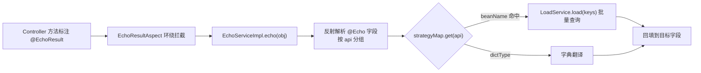

# md-echo-starter

## 1. 模块定位

数据回显模块：把 VO/DTO 上 `@Echo` 标注的字段（如 `orgId` 对应的 `orgName`、字典 code 对应的名称）自动翻译填充，免去每个查询接口手写关联翻译。核心思路是「**注解声明 + beanName 路由 + AOP 统一处理**」。

Maven 坐标：`top.mddata.base:md-echo-starter`。自动配置入口：`EchoAutoConfiguration`。`@Echo` / `@EchoResult` 注解本身定义在 `md-annotation` 模块，`EchoService` / `LoadService` 契约定义在 `md-core` 模块。

## 2. 源码解读

```
top.mddata.base.echo
├── EchoAutoConfiguration     # 注册 EchoService 与 EchoResultAspect 两个 Bean
├── core
│   ├── EchoServiceImpl       # 核心实现：反射解析 @Echo 字段 → 分组 → 调 LoadService 批量查询 → 回填
│   └── DefCacheLoader        # guava LoadingCache 本地缓存（mdp.echo.guava-cache.enabled=true 时启用）
├── aspect
│   └── EchoResultAspect      # @EchoResult 切面：方法返回值递归回显（maxDepth 控制深度）
├── manager
│   ├── ClassManager          # 类元数据缓存（避免每次反射）
│   ├── CacheLoadKeys / LoadKey / FieldParam  # 批量加载的 key 组织
└── properties
    └── EchoProperties        # mdp.echo.* 配置
```

回显调用链：



关键机制：

- `EchoAutoConfiguration#getEchoService` 构造注入 `Map<String, LoadService> strategyMap` —— Spring 会把容器内**所有** `LoadService` 实现按 beanName 收集进 Map。`@Echo(api = "orgNameApi")` 中的 api 值即 beanName，运行时按名路由。
- `EchoServiceImpl` 实现 `InitializingBean`，启动时若配置了 `mdp.echo.base-packages`，会预扫描包下所有含 `@Echo` 的实体类并缓存元数据（`ClassManager`），提升运行期性能。
- 支持对象、`List`、`Set`、`IPage` 等嵌套结构递归回显，深度由 `mdp.echo.max-depth` 限制。

## 3. 可配置参数

配置类：`EchoProperties`（prefix `mdp.echo`）。

| 配置项 | 默认值 | 说明 |
| --- | --- | --- |
| `mdp.echo.enabled` | `true` | 总开关，false 时不注册 `EchoService` Bean |
| `mdp.echo.aop-enabled` | `true` | 是否启用 `@EchoResult` 切面，false 时只能手动调 `EchoService#action` |
| `mdp.echo.base-packages` | 无 | 启动时预扫描 `@Echo` 实体的包路径列表，未配置则运行期首次反射 |
| `mdp.echo.dict-separator` | `###` | 字典类型与 code 的分隔符（`@Echo(dictType = "xxx###code")` 场景） |
| `mdp.echo.dict-item-separator` | `,` | 多个字典 code 之间的分隔符 |
| `mdp.echo.max-depth` | `3` | 递归回显最大深度 |
| `mdp.echo.guava-cache.enabled` | `false` | 本地缓存开关，**生产慎用**（见注意事项） |
| `mdp.echo.guava-cache.maximum-size` | `1000` | 本地缓存最大条数 |
| `mdp.echo.guava-cache.refresh-write-time` | `2` | 写后刷新时间（分钟） |
| `mdp.echo.guava-cache.refresh-thread-pool-size` | `10` | 自动刷新线程数 |

## 4. 扩展点

| 扩展点 | 机制 | 说明 |
| --- | --- | --- |
| `LoadService` 接口（md-core） | Spring 策略模式按 beanName 收集 | **最主要的扩展点**：实现 `LoadService` 并注册为 Bean（beanName 即 `@Echo.api` 的值），即可支持任意数据源的回显 |
| `EchoService` Bean | `@ConditionalOnMissingBean` | 可整体替换回显实现 |
| `EchoResultAspect` Bean | `@ConditionalOnMissingBean` | 可替换切面逻辑（如改变切点范围） |

## 5. 功能扩展建议

新增一类回显（如"根据 id 翻译项目名"）的标准三步：

1. 写实现类并注册，beanName 用业务化命名：

```java
@Service("projectNameApi")
public class ProjectNameLoadService implements LoadService {
    @Override
    public Map<Object, Object> findByKeys(Set<Object> keys) {
        // 一次批量查询，禁止循环单查
        return projectService.listByIds(keys).stream()
            .collect(toMap(Project::getId, Project::getName));
    }
}
```

2. VO 字段上标注：`@Echo(api = "projectNameApi", ref = "projectName")`（源字段存 projectId，回显写入 projectName）。
3. 查询接口方法上加 `@EchoResult`，或手动调用 `echoService.action(obj)`。

MDP 平台侧的 `LoadService` 实现集中在各业务服务的 `*ApiImpl`（配合 `EchoApi` 常量类使用，见 `md-common-pojo` 的常量定义）。

## 6. 二次开发注意事项

::: warning guava-cache 开启后存在短暂数据不一致
源码注释明确提示：本地缓存开启后，字典/名称变更在 `refresh-write-time` 分钟内不回显最新值。对数据正确性有要求的场景保持 `enabled=false`（默认），改为在 `LoadService` 实现内部自行加 Redis 缓存。
:::

- `@Echo.api` 的值必须与 `LoadService` 实现类的 **beanName** 完全一致；找不到 bean 时该字段回显被静默跳过，不会抛异常，排查时优先检查命名。
- `findByKeys` 是批量语义，实现时务必一次 in 查询，不要循环单查（否则回显 N 条记录产生 N 次 SQL）。
- `@EchoResult` 基于 AOP，同类内部方法自调用不生效；返回值嵌套层级超过 `max-depth` 的部分不回显。
- 预扫描 `base-packages` 配置过大（如根包）会拖慢启动，建议只配 VO/DTO 所在包。
