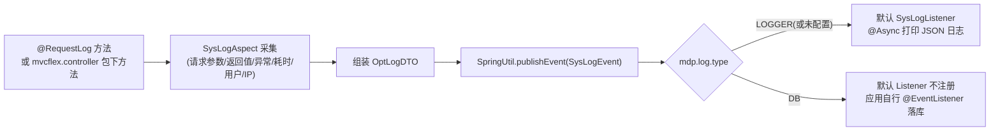

# md-log-starter

## 1. 模块定位

操作日志模块：通过 `@RequestLog` 注解 + AOP 切面采集 Controller 请求日志，组装 `OptLogDTO`（md-core 定义）后以 **Spring 事件**（`SysLogEvent`）发布；框架本身**不负责落库**，存储由监听方决定。附带 ip2region 的 IP 归属地解析能力。

Maven 坐标：`top.mddata.base:md-log-starter`。自动配置入口：`LogAutoConfiguration`、`Ip2RegionAutoConfiguration`。

## 2. 源码解读

```
top.mddata.base.log
├── LogAutoConfiguration          # @EnableAsync + @ConditionalOnWebApplication，注册 SysLogAspect、SysLogListener
├── Ip2RegionAutoConfiguration    # ip2region 查询器装配（ipv4/ipv6 双栈）
├── aspect/SysLogAspect           # 核心切面：@Before/@AfterReturning/@AfterThrowing 组装 OptLogDTO 并发布事件
├── event
│   ├── SysLogEvent               # ApplicationEvent 包装 OptLogDTO
│   └── SysLogListener            # 默认监听器：@Async + @EventListener，把日志 JSON 打到 logger
├── monitor/PointUtil             # 监控埋点输出工具
├── util/LogUtil、ThreadLocalParam # 日志上下文工具
└── properties
    ├── OptLogProperties          # mdp.log.* 配置
    ├── OptLogType                # LOGGER / DB
    └── Mode                      # BOOT / CLOUD
```

日志流转：



关键机制（`SysLogAspect.java`）：

- 切点两部分：`execution(public * top.mddata.base.mvcflex.controller.*.*(..))`（SuperController 体系全部方法）**或** `@annotation(top.mddata.base.annotation.log.RequestLog)`，见 `SysLogAspect.java:93`。
- `@RequestLog` 的 `request()` 属性支持 **SpEL 表达式**（内置 `SpelExpressionParser`），可动态描述业务单据号等信息。
- 参数/结果超长会截断（`MAX_LENGTH = 65535`），`multipart/form-data` 请求不记录请求体。
- 发布事件是**无条件的**；`type` 只决定默认监听器是否注册（见下）。

## 3. 可配置参数

配置类：`OptLogProperties`（prefix `mdp.log`）。

| 配置项 | 默认值 | 说明 |
| --- | --- | --- |
| `mdp.log.enabled` | `true` | 总开关，false 时整个 `LogAutoConfiguration` 不装配 |
| `mdp.log.type` | `DB` | 日志类型 `LOGGER` / `DB`。**影响默认监听器**：`type=LOGGER` 或未配置该 key 时注册默认 `SysLogListener`（打日志）；显式配置 `DB` 后默认监听器不注册，需应用自行监听落库 |
| `mdp.log.ipv4.enabled` | `true` | 是否启用 IPv4 归属地解析 |
| `mdp.log.ipv4.cache-policy` | `1` | ip2region 缓存策略：0=NoCache、1=VIndexCache、2=BufferCache |
| `mdp.log.ipv4.searchers` | `20` | 初始化查询器数量（并发查询用） |
| `mdp.log.ipv4.xdb-path` | 无 | xdb 数据文件路径，支持 `classpath:` 与 `file:`（绝对/相对）两种前缀 |
| `mdp.log.ipv4.cache-slice-bytes` | `50` | BufferCache 分片大小（MiB） |
| `mdp.log.ipv4.fair-lock` | 无 | ReentrantLock 是否公平锁 |
| `mdp.log.ipv6.*` | 同上 | IPv6 一套相同配置 |

## 4. 扩展点

| 扩展点 | 机制 | 说明 |
| --- | --- | --- |
| `SysLogEvent` 事件监听 | `@EventListener` | **DB 模式的唯一落库通道**：应用写监听器把 `OptLogDTO` 持久化（MDP 平台在 console 服务中就是这么做的） |
| `SysLogAspect` Bean | `@ConditionalOnMissingBean` | 替换采集逻辑（如追加自定义字段） |
| `SysLogListener` Bean | `@ConditionalOnMissingBean` | 替换默认打印行为 |
| `@RequestLog.request()` SpEL | 注解属性 | 不改代码扩展日志描述 |

## 5. 功能扩展建议

DB 模式落库监听器参考实现：

```java
@Component
@RequiredArgsConstructor
public class OptLogDbListener {
    private final OptLogService optLogService;

    @Async
    @EventListener(SysLogEvent.class)
    public void onSave(SysLogEvent event) {
        OptLogDTO dto = (OptLogDTO) event.getSource();
        optLogService.save(convert(dto)); // 转换为业务表实体后落库
    }
}
```

- 想采集**更多维度**（如租户号）：优先用 `ContextUtil` 在切面执行前放入线程上下文，`OptLogDTO` 组装时会自动携带常用上下文字段；仍不够再替换 `SysLogAspect`。
- 想把日志外发到 MQ/Kafka：同样监听 `SysLogEvent`，`@Async` 保证不阻塞请求线程。

## 6. 二次开发注意事项

::: warning type=DB 时框架不落库
`md-log-starter` 只提供事件发布，**没有任何数据库写入代码**。显式配置 `mdp.log.type=DB` 且应用未监听 `SysLogEvent` 时，日志会被静默丢弃——这是二开最常见的"操作日志没记录"原因。
:::

- `@Async` 监听依赖 `LogAutoConfiguration` 上的 `@EnableAsync`；若应用自定义了异步线程池，注意日志监听会使用该线程池，落库慢可能拖垮业务异步任务，建议为日志单独指定 executor。
- `SysLogListener` 落库链路中调用了 `LogSuppressUtil.suppress()` 抑制自身 SQL/切面日志，避免"记日志的日志"死循环，自定义监听器如需查库建议保留同样的抑制处理。
- `xdb-path` 未配置时 IP 归属地为空但不报错；生产环境建议把 `ip2region_v4.xdb` 放服务器固定路径用 `file:` 引用，避免打进 jar 包增大体积。
- 切面覆盖 `top.mddata.base.mvcflex.controller` 包（即 `SuperController` 全方法），即使不加 `@RequestLog` 也会采集；不需要时通过 `mdp.log.enabled=false` 或替换 `SysLogAspect` 收窄切点。
