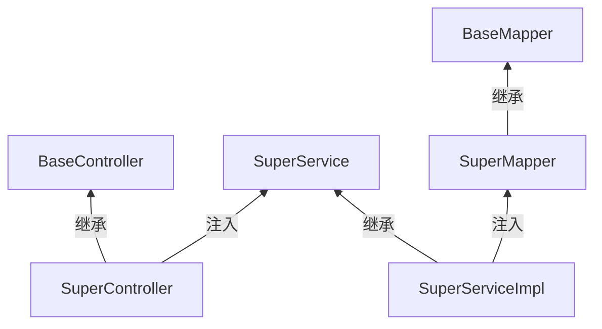

## 1. 模块定位

Web 三层架构基类模块，坐标 `top.mddata.base:md-mvc-flex`。定义 Controller/Service/Mapper 的通用基类，让一个业务模块只需继承即可获得标准 CRUD+分页能力。依赖 md-core、md-db-mybatis-flex。配合 md-codegen 生成的代码使用。

## 2. 源码解读

```
top.mddata.base.mvcflex
├── controller/
│   ├── BaseController.java          # 接口：通用响应辅助
│   └── SuperController.java        # 抽象 Controller 基类
├── service/
│   ├── SuperService.java           # 接口：extends mybatis-flex IService
│   └── impl/SuperServiceImpl.java  # 实现：extends ServiceImpl 持有 SuperMapper
├── mapper/SuperMapper.java         # extends mybatis-flex BaseMapper
├── request/
│   ├── PageParams.java              # 分页入参（current/size/sort/order）
│   ├── PageFlexUtil.java           # PageParams → mybatis-flex Page 转换
│   └── DownloadVo.java             # 文件下载响应载体
└── utils/WrapperUtil.java          # QueryWrapper 构造工具
```

### 2.1 三层基类继承链



业务侧写法（md-codegen 生成的也是这个形态）：

```java
@RestController
public class FooController extends SuperController<FooService, Foo, ...> { }

public interface FooService extends SuperService<Foo> { }

@Service
public class FooServiceImpl extends SuperServiceImpl<FooMapper, Foo> implements FooService { }

@Repository
public interface FooMapper extends SuperMapper<Foo> { }
```

### 2.2 分页约定

`PageParams` 携带 `current/size/sort/order`（部分字段在 md-public 的 DTO 中扩展），`PageFlexUtil` 把它转成 mybatis-flex 的 `Page` 对象；返回结构是 `R<Page<T>>` 形态（Page 来自 md-core）。

## 3. 可配置参数

无。本模块只定义基类与工具，不读取任何配置。

## 4. 扩展点

- **`SuperController`**：业务 Controller 继承即得标准增删改查接口（REST 风格）；不需要某些通用接口时继承后 override 或不用基类。
- **`SuperServiceImpl`**：业务 Service 实现继承，自动拥有 `IService` 的单表 CRUD/分页/批量能力；自定义查询写在 Service 或 Mapper。
- **`SuperMapper`**：必须加 `@Repository` 才会被 md-common-config 的 `@MapperScan(annotationClass = Repository.class)` 扫到（详见 [md-common-dao](../md-public/md-common-dao.md)）。
- **`WrapperUtil`**：构造 QueryWrapper 时复用条件拼接，避免每个业务手写重复逻辑。

## 5. 功能扩展建议

| 想做什么 | 推荐做法 |
|---|---|
| 新业务模块 | 用 [md-codegen](md-codegen.md) 生成全套三层 + 前端页面，生成的代码就是本模块的标准用法 |
| 通用 Controller 加接口 | 改 `SuperController` 影响全平台——优先在业务 Controller 里写，确属通用的再沉下来 |
| 分页参数统一 | 前端固定传 `PageParams` 结构，别自造分页字段 |
| 文件下载 | 返回 `DownloadVo`，配合 x-file-storage 体系 |

## 6. 二次开发注意事项

::: warning 泛型参数别写错
`SuperController<S, Entity, ...>` 的 S 必须是 `SuperService` 子接口——写成了实现类会导致注入失败。md-codegen 生成的骨架最稳妥，手写时对照同工程已有模块。
:::

::: warning SuperController 默认接口会暴露
继承基类意味着通用 CRUD 端点直接生效（含批量删除等写操作）。对外暴露的服务（如 openapi 相关）要评估是否需要这些端点，必要时 override 限制或用更薄的 `BaseController`。
:::

::: warning 与 facade 体系的关系
单体/微服务双形态的 facade 调用链（`{域}-api`/`-boot-impl`/`-cloud-impl`）建立在 Service 层之上，见 [架构介绍](../../info/架构介绍.md)。本模块只管"单服务内"的三层，不要把跨服务调用逻辑写进 `SuperServiceImpl`。
:::
