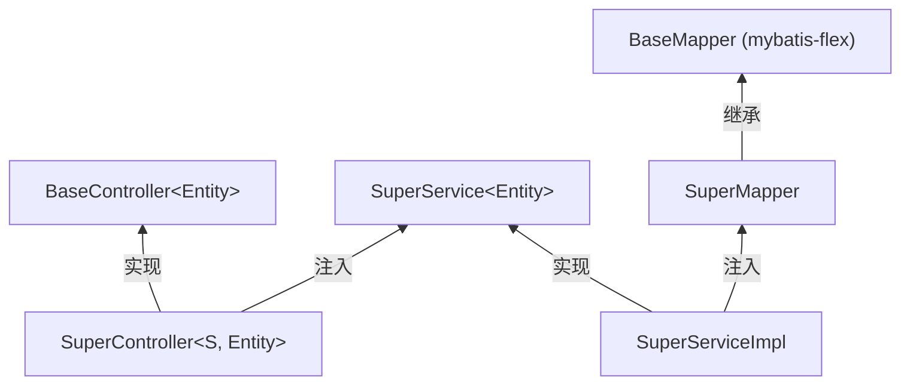

## 1. 模块定位

Web 三层架构基类模块，坐标 `top.mddata.base:md-mvc-flex`。定义 Controller/Service/Mapper 的通用基类，业务模块继承后获得统一的 DTO 入口、缓存感知 CRUD 与分页查询约定。依赖 md-core、md-db-mybatis-flex、md-cache-starter（`CacheOps` 缓存体系）、md-validator-starter、fastexcel。配合 md-codegen 生成的代码使用。

## 2. 源码解读

```
top.mddata.base.mvcflex
├── controller/
│   ├── BaseController.java          # 接口：取当前用户、文件下载响应写出
│   └── SuperController.java        # 抽象 Controller 基类（不含任何端点）
├── service/
│   ├── SuperService.java           # 接口：extends mybatis-flex IService + DTO/缓存方法
│   └── impl/SuperServiceImpl.java  # 实现：缓存感知的 CRUD 重写
├── mapper/SuperMapper.java         # extends mybatis-flex BaseMapper（空标记接口）
├── request/
│   ├── PageParams.java              # 分页入参（current/size/sort/order + model/extra）
│   ├── PageFlexUtil.java           # 分页记录类型转换（Entity→Vo）
│   └── DownloadVo.java             # 文件下载响应载体
├── advice/UpdateFieldAdvice.java   # 更新端点请求体字段采集（@ControllerAdvice）
├── context/UpdateFieldContext.java # 本次请求提交字段集合的上下文
└── utils/WrapperUtil.java          # QueryWrapper 动态条件构造工具
```

### 2.1 三层基类继承链


```mermaid
flowchart BT
    SC["SuperController&lt;S, Entity&gt;"] -->|"实现"| BC["BaseController&lt;Entity&gt;"]
    SSI["SuperServiceImpl"] -->|"实现"| SS["SuperService&lt;Entity&gt;"]
    SM["SuperMapper"] -->|"继承"| FXM["BaseMapper (mybatis-flex)"]
    SC -->|"注入"| SS
    SSI -->|"注入"| SM
```

业务侧写法（md-codegen 生成的也是这个形态）：

```java
@RestController
public class FooController extends SuperController<FooService, Foo> { }

public interface FooService extends SuperService<Foo> { }

@Service
public class FooServiceImpl extends SuperServiceImpl<FooMapper, Foo> implements FooService { }

@Repository
public interface FooMapper extends SuperMapper<Foo> { }
```

::: warning SuperController 不含任何端点
`SuperController` 只有两个泛型参数（`S extends SuperService<Entity>`、`Entity extends BaseEntity<?>`），类内只提供 `superService` 注入、`getEntityClass()`、`getSuperService()`——**继承它不会得到任何 REST 端点**，`/save`、`/update`、`/page`、`/delete` 等接口全部由业务 Controller 手写（md-codegen 生成的也是手写形态）。它存在的意义是统一注入与类型约束，不是"开箱即用的 CRUD"。
:::

`BaseController` 接口提供两个 default 能力：`getUserId()`（从 `ContextUtil` 取当前用户）、`write(byte[], fileName, response)`（文件/zip 下载响应写出，与 `DownloadVo` 配套）。

### 2.2 SuperService 的 DTO 入口与缓存体系

`SuperService` 在 mybatis-flex `IService` 之上定义了两组方法：

**DTO 入口**（Service 层直接接收 DTO，内部转实体）：

| 方法 | 说明 |
| --- | --- |
| `saveDto(Object dto)` | 保存：转实体 → `saveBefore` → `save` → `saveAfter` |
| `updateDtoById(Object dto)` | 更新：转实体 → `updateBefore`（选择性更新，见 2.3）→ `updateById` → `updateAfter` |
| `getByIdCache(Serializable id)` | 先查缓存，miss 再查库 |

**缓存方法**（供业务按需调用）：

| 方法 | 说明 |
| --- | --- |
| `getByKey(CacheKey, loader)` | 缓存中存 id，miss 时 loader 加载并写入，再按 id 查实体 |
| `findByIds(ids, loader)` | 批量查缓存，miss 部分走 loader 回源并写缓存（带空值缓存防击穿，分批上限 `MAX_BATCH_KEY_SIZE = 500`） |
| `findCollectByIds(keyIdList, cacheBuilder, loader)` | 按自定义 key 批量查缓存并汇总 |
| `refreshCache / clearCache / delCache / setCache` | 缓存刷新与淘汰 |

`SuperServiceImpl` 通过钩子方法 `cacheKeyBuilder()` 实现**缓存感知的 CRUD 重写**：返回 null（默认）时等价于纯 DB 操作；子类返回具体的 `CacheKeyBuilder` 后，`remove`/`update` 系列方法会先查后删并淘汰缓存、`saveBatch` 批量写缓存。`saveBefore`/`saveAfter`/`updateBefore`/`updateAfter` 四个钩子留给业务在 DTO 转换前后插入自定义逻辑（如审计、缓存联动）。

### 2.3 选择性更新机制（UpdateFieldAdvice + UpdateEntity）

表单更新场景的经典问题：DTO 里有 20 个字段，但前端表单只渲染了 10 个——全量拷贝更新会把未渲染的字段误置 null。本模块的解决链路：

```
@Validated(BaseEntity.Update.class) 标注的更新端点
  → UpdateFieldAdvice（@ControllerAdvice + RequestBodyAdvice）
      在反序列化前解析请求体顶层字段集合，存入 UpdateFieldContext（request attribute）
  → SuperServiceImpl.updateBefore()
      有字段集合时：先按「忽略 null」拷贝，再对「提交过但值为 null」的字段显式调 setter(null)
      → UpdateEntity 追踪到该列，更新为 NULL
      无字段集合时（内部调用、测试）：维持全量拷贝旧语义
```

最终语义：**只更新提交的字段；提交为 null 的字段显式置空；未提交的字段不动**。

### 2.4 分页与动态查询约定

`PageParams<T>` 字段：

| 字段 | 说明 |
| --- | --- |
| `current` / `size` | 页码（默认 1）/ 每页条数（默认 10） |
| `sort` / `order` | 排序字段 / 排序方向（均支持逗号分隔多字段） |
| `model`（泛型 T） | **必传**（`@NotNull`）的查询参数对象 |
| `extra`（Map） | 扩展参数，`WrapperUtil` 动态条件拼接的数据来源 |

分页对象 `Page` 是 `com.mybatisflex.core.paginate.Page`（只有 `R` 来自 md-core）；业务 Controller 手写 `new Page<>(current, size)` 分页查询，`PageFlexUtil.toBeanPage(page, voClass)` 负责把分页记录从 Entity 转成 Vo。

`WrapperUtil` 提供三个公开能力：

- **`buildWrapperByExtra`**：按 `extra` 参数的 `字段_操作符` 后缀约定动态拼条件，支持 `st/ed/start/end/ge/gt/lt/le/eq/ne/like/likeLeft/likeRight/in`（如 `createdAt_st` / `name_like`）；
- **`buildWrapperByOrder`**：多字段排序（sort/order 逗号分隔）；
- **`buildOperators`**：实体的 String 字段自动用 LIKE；`getColumnByProperty` 做字段名 → 列名校验，非法字段抛 `BizException`（防注入）。

## 3. 可配置参数

无。本模块只定义基类与工具，不读取任何配置。

## 4. 扩展点

- **`SuperController`**：继承获得 `superService` 注入与 `getEntityClass()`；端点全部手写，不需要的端点不写即可。
- **`SuperServiceImpl`**：继承自动拥有 `IService` 单表 CRUD/分页/批量能力；覆写 `cacheKeyBuilder()` 启用缓存感知 CRUD；覆写 `saveBefore/saveAfter/updateBefore/updateAfter` 插入业务钩子。
- **`SuperMapper`**：必须加 `@Repository` 才会被 md-common-config 的 `@MapperScan(annotationClass = Repository.class)` 扫到（详见 [md-common-config](../md-public/md-common-config.md)）。
- **`WrapperUtil`**：动态条件复用 `字段_操作符` 约定，避免每个业务手写重复逻辑。

## 5. 功能扩展建议

| 想做什么 | 推荐做法 |
|---|---|
| 新业务模块 | 用 [md-codegen](md-codegen.md) 生成全套三层 + 前端页面，生成的代码就是本模块的标准用法 |
| 实体接入缓存 | 覆写 `cacheKeyBuilder()` 返回对应 Builder（见 [md-cache-key](../md-public/md-cache-key.md)），不要绕过 SuperServiceImpl 手写缓存逻辑 |
| 分页参数统一 | 前端固定传 `PageParams` 结构（含 model/extra），别自造分页字段；动态查询条件走 extra 的 `字段_操作符` 约定 |
| 文件下载 | Controller 调 `BaseController.write(...)` 或返回 `DownloadVo`，配合 x-file-storage 体系 |

## 6. 二次开发注意事项

::: warning 泛型参数别写错
`SuperController<S, Entity>` 的 S 必须是 `SuperService` 子接口——写成了实现类会导致注入失败。md-codegen 生成的骨架最稳妥，手写时对照同工程已有模块。
:::

::: warning 端点需自行声明并鉴权
基类不提供端点，业务 Controller 手写的每个端点都要自行评估：是否需要纳入接口权限（uri 鉴权，见 [md-resource-api](../md-public/md-resource-api.md)）、是否有数据权限要求。
:::

::: warning 缓存一致性的边界
`cacheKeyBuilder()` 启用后，**经过 SuperServiceImpl 的增删改**会自动淘汰缓存；但绕过 Service 直接走 Mapper/XML 的写操作不会触发淘汰，会产生脏缓存——此类场景需手动调 `delCache`/`clearCache`。
:::

::: warning 与 facade 体系的关系
单体/微服务双形态的 facade 调用链（`{域}-api`/`-boot-impl`/`-cloud-impl`）建立在 Service 层之上，见 [架构介绍](../../info/架构介绍.md)。本模块只管"单服务内"的三层，不要把跨服务调用逻辑写进 `SuperServiceImpl`。
:::
