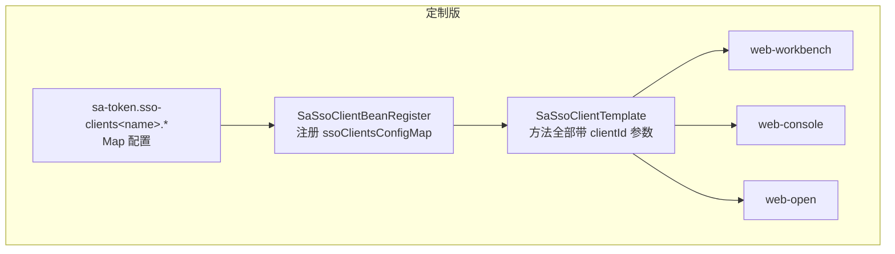
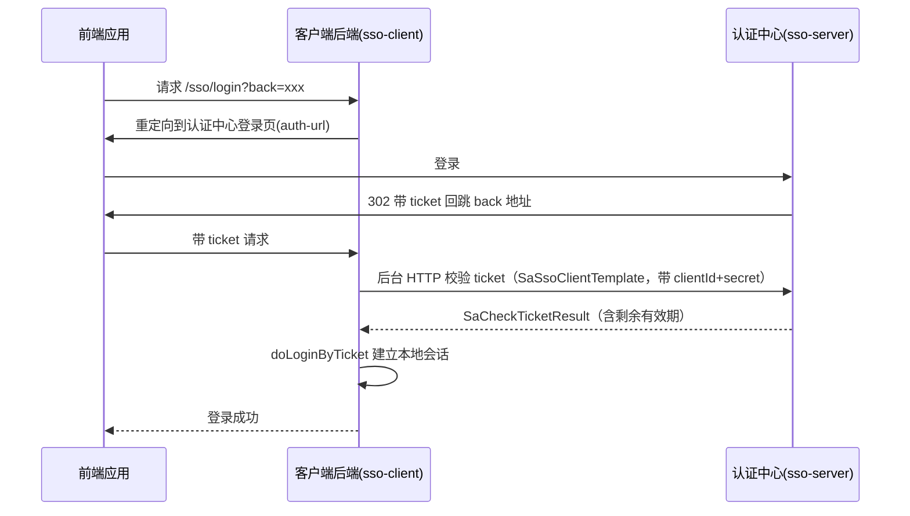

## 1. 模块定位

**Sa-Token v1.45.0 官方源码的定制副本**（坐标 `top.mddata.base:*`，模块内含 7 个子模块）。官方 sa-token 无法满足"一个后端服务多个 SSO 前端客户端"的需求，因此以源码 fork 方式改造。承担 MDP 的全部认证职责：SSO 服务端（认证中心）、SSO 客户端、OAuth2 客户端。

> ⚠️ **本模块不是 Maven 依赖，而是源码副本**：升级 sa-token 版本需手动 diff 合并，且定制过的方法签名与官方不一致，不能直接覆盖。模块根目录 `README.md` 有完整的升级注意事项，升级前必读。

## 2. 源码解读

### 2.1 子模块结构

| 子模块 | 角色 | 关键内容 |
|---|---|---|
| sa-token-sso-core | SSO 公共内核（无 Spring 依赖） | `SaSsoTemplate`（消息分发）、`SaSsoMessage`/`SaSsoMessageHolder`（checkTicket/signout/logoutCall 等消息路由）、`TicketModel`、`SaSsoErrorCode`（30001~30008） |
| sa-token-sso-server | SSO 服务端核心 | `SaSsoServerTemplate`/`SaSsoServerProcessor`/`SaSsoServerManager` |
| sa-token-sso-server-starter | 服务端自动装配 | 绑定 `sa-token.sso-server` 配置 |
| sa-token-sso-client | SSO 客户端核心（**定制重点**） | `SaSsoClientTemplate`/`SaSsoClientProcessor`：所有方法加 `clientId` 参数 |
| sa-token-sso-client-starter | 客户端自动装配（含多客户端增强） | `SaSsoClientBeanRegister` 注册 `ssoClientsConfigMap` |
| sa-token-oauth2-client | OAuth2 客户端（仅依赖 sa-token-core） | `SaOauth2ClientTemplate#buildServerAuthorizeUrl`、`Oauth2ClientConfig` 拼 6 个端点 |
| sa-token-oauth2-client-starter | OAuth2 客户端自动装配 | 绑定 `sa-token.oauth2-client` |

依赖关系：`sso-core` → 官方 `sa-token-core`、`sa-token-sign`；`sso-server`/`sso-client` → `sso-core`；starter 各自装配。**OAuth2 服务端不在本模块**（workbench-web 直接用官方 `cn.dev33:sa-token-oauth2` + 应用层 `OAuth2DataLoaderImpl` 从数据库加载 client）。

### 2.2 核心改造：多 clientId

原生 sa-token 一个后端只有一份 sso-client 配置。本定制版：

业务背景：MDP 三个前端应用（workbench/console/open）共用同一个后端，需按 clientId 区分请求来源。服务端侧配套改造是可重写 `SaSsoServerTemplate#getClient`——MDP 应用层 `CustomSaSsoServerTemplate` 从数据库 `mdo_app` 表动态加载客户端注册信息（增删客户端不用改配置重启）。

### 2.3 SSO ticket 校验时序（模式三：is-http=true）

## 3. 可配置参数

| 前缀 | 角色 | 关键配置项 |
|---|---|---|
| `sa-token.sso-server.*` | 服务端 | `ticket-timeout`（ticket 有效期，如 300）、`is-http`、`allow-anon-client`、`secret-key`（全局秘钥，占位符勿提交真实值） |
| `sa-token.sso-client.*` | 客户端（单客户端/兜底） | `client`（标识）、`secret-key`、`server-url`（认证中心后端地址）、`auth-url`（认证中心前端登录页）、`is-http`（模式三开关） |
| `sa-token.sso-clients.<name>.*` | **定制多客户端 Map** | 每个 `<name>` 一份完整 sso-client 配置 |
| `sa-token.oauth2-client.*` | OAuth2 客户端 | clientId、clientSecret、serverUrl 及 authorize/token/refresh/revoke/userinfo/client_token 六端点 |

## 4. 扩展点

| 扩展点 | 类型 | 说明 |
|---|---|---|
| `SaSsoServerTemplate#getClient` | 可重写方法 | MDP 重写为从 `mdo_app` 表动态加载客户端（参考应用层 `CustomSaSsoServerTemplate`） |
| `DoLoginHandleFunction` | 函数式接口 | 服务端登录逻辑（校验账密→`StpUtil.login`） |
| `CheckTicketAppendDataFunction` | 函数式接口 | 校验 ticket 时附加返回数据 |
| `NotLoginViewFunction` | 函数式接口 | 未登录视图（前后端分离场景返回 JSON 而非页面） |
| `SendRequestFunction` / `TicketResultHandleFunction` | 函数式接口 | 客户端 HTTP 请求发送/结果处理的替换点 |
| `SaSsoServerStrategy` / `SaSsoClientStrategy` | 策略接口 | 整体策略替换 |
| `SaSsoMessageHandle` | 消息处理器 | signout、logoutCall 等消息的自定义处理 |

## 5. 功能扩展建议

| 想做什么 | 推荐做法 |
|---|---|
| 新增 SSO 客户端应用 | 服务端：`mdo_app` 表加记录（动态加载，无需重启）；客户端侧在 `sa-token.sso-clients` 加一份配置 |
| 第三方系统接入 | 不想引 sa-token 生态的，直接按文档实现三个 HTTP 接口（getSsoAuthUrl / doLoginByTicket / pushC）——client 端本质就是这三个调用的封装，见[单点登录文档](../../integration/单点登录/ticket模式.md) |
| OAuth2 接入 | 引 `sa-token-oauth2-client-starter`，`buildServerAuthorizeUrl` 构建授权地址 |
| 动态增删客户端 | 重写 `SaSsoServerTemplate#getClient`（参考 CustomSaSsoServerTemplate 的做法） |

## 6. 二次开发注意事项

::: danger 升级必须手动 diff
官方 sa-token 发新版后**不能直接替换依赖**——本模块是源码副本，`SaSsoClientProcessor`/`SaSsoClientTemplate` 的 `clientId` 参数是定制签名，与官方不一致。合并流程：diff 官方新源码 → 保留 README 第 3 节列出的全部定制点 → 核验多客户端 Bean 注入顺序（starter 用 `@PostConstruct` 保证"先默认配置、后多客户端配置"）。版本号由 mdp-parent 的 `<sa-token.version>` 统一管理。
:::

::: warning is-check-sign=false 只能本地调试
关闭签名校验时启动会输出 error 级警告（定制行为）。生产环境必须开启签名并妥善保管 secret-key；secretKey 优先级：SSO 配置 > sign 模块全局配置。
:::

::: warning 修改认证相关代码的安全影响
本模块是全平台认证基石：动 `SaSsoClientTemplate`/`SaSsoServerTemplate` 的任何签名都会同时影响服务端与所有客户端（含外部已接入的若依等系统）。修改前务必：① 评估存量客户端兼容性；② ticket 模式与 oauth2 模式回归两条链路；③ 通知已接入的第三方。
:::
