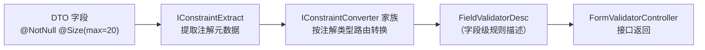

## 1. 模块定位

表单校验规则导出模块，坐标 `top.mddata.base:md-validator-starter`。把后端 DTO 上的 jakarta validation 注解（`@NotNull`、`@Size`、`@Digits`...）提取成结构化规则，暴露查询接口给前端——前端据此**动态生成表单校验**，前后端校验规则同源，不用两边各维护一份。

## 2. 源码解读

```
top.mddata.base.validator
├── annotation/EnableFormValidator.java       # 显式启用注解：@Import(ValidatorConfiguration)
├── config/ValidatorConfiguration.java       # 装配入口（非自动配置，必须显式开启）
├── component/
│   ├── FormValidatorController.java         # 查询接口：按 DTO 名返回字段校验规则
│   └── extract/                             # 注解提取
│       ├── IConstraintExtract.java          # 提取接口
│       └── DefaultConstraintExtractImpl.java # 默认实现
├── mateconstraint/                          # 注解→规则转换器（策略模式）
│   ├── IConstraintConverter.java / BaseConstraintConverter.java
│   └── impl/{Digits,MaxMin,NotNull,Range,RegEx,Other}ConstraintConverter.java
├── model/{ConstraintInfo, FieldValidatorDesc, ValidConstraint}.java
├── constraintvalidators/                     # 平台扩展的校验器（@NotEmptyPattern 等）
├── wrapper/HttpServletRequestValidatorWrapper.java
└── utils/{ValidatorUtils, ValidatorConstants}.java
```

调用链：



## 3. 可配置参数

无配置类。启用方式是注解：启动类（或配置类）加 `@EnableFormValidator`。

## 4. 扩展点

- **`IConstraintExtract`**：替换注解提取逻辑（默认实现读 jakarta validation 标准注解）。
- **`IConstraintConverter` / `BaseConstraintConverter`**：**新增自定义校验注解的规则导出**——继承 `BaseConstraintConverter` 写一个转换器即可让前端识别新注解规则。
- **`constraintvalidators`**：平台自带 `Length/NotEmpty/NotEmptyPattern/NotNull` 等校验器，业务自定义校验器照同样方式注册。

## 5. 功能扩展建议

| 想做什么 | 推荐做法 |
|---|---|
| 新增自定义校验注解 | 注解（md-annotation 风格）+ ConstraintValidator + 对应 `IConstraintConverter` 三件套 |
| 前端动态表单 | 用 FormValidatorController 的返回驱动前端校验库（规则字段见 `FieldValidatorDesc`） |
| 只想后端校验 | 直接用 jakarta validation + `@Validated`，本模块可不引入 |

## 6. 二次开发注意事项

::: warning 不会自动生效
本模块**没有**自动配置注册——忘了加 `@EnableFormValidator` 时接口不存在且无任何报错提示，最容易踩。MDP 各服务已在启动类统一标注，新服务记得带。
:::

::: warning 规则导出 ≠ 校验执行
模块只负责"导出规则"；真正的校验仍由 Spring validation 在参数绑定时执行。前端动态校验只是体验增强，安全边界不能依赖前端。
:::
