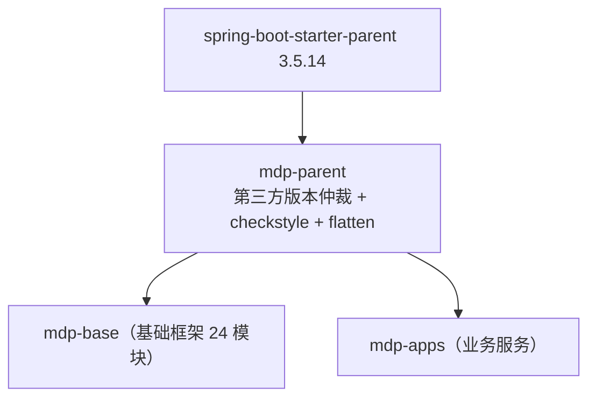

## 1. 模块定位

`mdp-parent` 是整个 MDP 后端所有工程的**依赖版本仲裁 POM + 构建规范基线**，`packaging=pom`，自身无任何 Java 代码，仅包含三个文件：

| 文件 | 作用 |
| --- | --- |
| `pom.xml` | 继承 Spring Boot 官方 parent，统一管理全部第三方依赖版本、插件与 profiles |
| `checkstyle.xml` | 全平台代码规范（命名、导入、体量、嵌套深度、Javadoc 等） |
| `suppressions.xml` | checkstyle 规则豁免清单（针对 Sa-Token 定制源码等特殊文件） |

- Maven 坐标：`top.mddata.base:mdp-parent:${revision}`（当前 `revision=1.5.0-SNAPSHOT`）
- 继承关系：`org.springframework.boot:spring-boot-starter-parent:3.5.14`
- 运行环境：**JDK 17**、UTF-8
- 下游：`mdp-base`（及其全部子模块）、`mdp-apps` 等工程均继承本 POM

## 2. 源码解读

### 2.1 dependencyManagement：BOM import 顺序敏感

`pom.xml:159-219` 按固定顺序 import 了多个官方 BOM：

1. `spring-cloud-dependencies`（2025.0.2）
2. `spring-cloud-alibaba-dependencies`（2025.0.0.0）
3. `spring-framework-bom`（6.2.12）
4. `springdoc-openapi`（2.8.5）
5. `mybatis-flex-dependencies`（1.11.7）、`sa-token-bom`（1.45.0）、`knife4j-dependencies`（4.5.0）、`dubbo-bom`（3.3.6）

::: danger BOM 顺序不能乱
`pom.xml:190` 有官方注释：**「以上几个配置的顺序不能错，否则会导致 spring、springdoc 的版本不正确」**。Maven BOM 仲裁遵循「先声明者胜出」，调整顺序会静默改变传递依赖版本，引发难以排查的 NoSuchMethodError。
:::

### 2.2 版本清单（按类别）

| 类别 | 依赖 | 版本 |
| --- | --- | --- |
| 微服务 | spring-cloud / alibaba / dubbo / nacos-client / seata / sentinel | 2025.0.2 / 2025.0.0.0 / 3.3.6 / 3.2.1 / 2.0.0 / 1.8.6 |
| 监控 | spring-boot-admin | 3.5.9 |
| 持久层 | mybatis-flex / mybatis / druid / mysql / mssql-jdbc / 达梦 DmJdbcDriver18 | 1.11.7 / 3.5.19 / 1.2.27 / 8.0.33 / 8.0.33 / 8.1.3.140 |
| 认证安全 | sa-token / JustAuth / antisamy / aj-captcha / easy-captcha | 1.45.0 / 1.16.5 / 1.7.8 / 1.4.0 / 1.6.2 |
| 接口文档 | knife4j / springdoc / smart-doc / torna-sdk | 4.5.0 / 2.8.5 / 3.1.2 / 1.0.16 |
| 消息/存储 | sms4j / x-file-storage / aliyun-oss / 华为 obs / 百度 bce / 七牛 / minio | 3.3.5 / 2.3.0 / 3.18.4 / 3.25.10 / 0.10.405 / 7.19.0 / 8.6.0 |
| 定时任务 | powerjob（worker/client/official-processors） | 5.1.2 |
| 对象转换 | mapstruct / mapstruct-plus | 1.6.3 / 1.4.2 |
| 序列化 | fastjson2 / protostuff | 2.0.62 / 1.7.4 |
| Excel | fastexcel / poi | 1.3.0 / 5.3.0 |
| 工具 | hutool / guava / lombok / commons-* / oshi / ip2region / jasypt / transmittable-thread-local / groovy / enjoy | 5.8.44 / 33.6.0-jre / 1.18.46 / … / 7.1.0 / 3.3.7 / 4.0.3 / 2.14.0 / 4.0.26 / 5.1.3 |

::: tip sms4j 大量 exclude hutool
`sms4j-*` 全系列排除了自带的 `hutool-core/log/json/http/crypto/cron/setting`，统一使用平台仲裁的 `hutool-all`，避免类冲突。自行引入 sms4j 相关依赖时请照抄 exclusion。
:::

### 2.3 maven-compiler-plugin：注解处理器链

`pom.xml:815-847`，编译参数带 `-parameters`（保留方法参数名，Spring MVC/Feign 依赖它）。`annotationProcessorPaths` 顺序：

1. `lombok`
2. `lombok-mapstruct-binding`
3. `mapstruct-processor`
4. `mapstruct-plus-processor`
5. `mybatis-flex-processor` —— 编译期生成 `XxxTableDef` 表定义类
6. `spring-boot-configuration-processor` —— 生成 `spring-configuration-metadata.json`，让 IDE 对 `mdp.*` 配置有提示（pom 注释：**一定要加，否则无法生成提示文件**）

### 2.4 其他构建约定

| 配置 | 说明 |
| --- | --- |
| `maven-resources-plugin` | `nonFilteredFileExtensions` 排除 pem/pfx/p12/key/db/xdb/字体/svg 等二进制文件被 Maven filtering 破坏 |
| `maven-checkstyle-plugin 3.3.1` | `configLocation=checkstyle.xml`、`failsOnError=true`，绑定 **validate 阶段**执行 check —— 编译前先过规范检查 |
| `flatten-maven-plugin 1.2.7` | `resolveCiFriendliesOnly` 模式，process-resources 阶段生成 `.flattened-pom.xml`，配合 `${revision}` 实现 CI 友好版本 |
| `repositories` | 阿里云镜像 + sonatype OSS |

### 2.5 profiles

| profile | 作用 |
| --- | --- |
| `dev`（默认激活） | 设置 `profile.active=dev`，供资源过滤注入 `application-dev.yml` |
| `test` / `prod` | 同上，切换环境标识 |
| `release` | 发布到 OSS 中央仓库：追加 source、javadoc（`-Xdoclint:none`）、gpg 签名插件 |

### 2.6 checkstyle.xml 规范要点

`Checker + TreeWalker` 双层结构，重点规则：

- **命名**：ConstantName、MemberName、MethodName、TypeName、PackageName、ParameterName 等
- **导入**：UnusedImports、RedundantImport、IllegalImport
- **体量**：FileLength、MethodLength、LineLength、ParameterNumber
- **嵌套深度**：NestedIfDepth、NestedForDepth、NestedTryDepth
- **常见缺陷**：EqualsHashCode、StringLiteralEquality（禁止 `==` 比较字符串）、SimplifyBoolean*、ModifierOrder、MissingSwitchDefault、UncommentedMain
- **Javadoc**：JavadocType（类型必须有文档注释）

`suppressions.xml` 对个别文件豁免（如 Sa-Token 定制源码 `SaSsoClientProcessor`/`SaSsoServerProcessor` 的 MethodName 规则），豁免清单是「哪些文件被有意破坏了规范」的线索。

## 3. 可配置参数

本模块无运行期配置。构建期可干预的参数：

| 参数 | 默认值 | 说明 |
| --- | --- | --- |
| `${revision}` | `1.5.0-SNAPSHOT` | 全平台版本号，发版时统一修改 |
| `${profile.active}` | `dev` | 通过 `-Ptest` / `-Pprod` 切换 |
| `-Dcheckstyle.skip=true` | 不跳过 | 本地快速构建时跳过规范检查 |

## 4. 扩展点

- **继承即扩展**：二开新建 Maven 工程时 `<parent>` 指向 `mdp-parent`，即获得全部版本仲裁 + checkstyle + flatten 行为，dependency 无需写版本号
- **版本覆盖**：子工程可在自己的 `<properties>` 中重定义版本号属性（如 `<hutool.version>`）实现局部升级
- **规范定制**：`checkstyle.xml`/`suppressions.xml` 可被下游覆盖（pluginManagement 中路径是相对的，子模块放同名文件即可替换）

## 5. 功能扩展建议

| 想做什么 | 推荐做法 |
| --- | --- |
| 引入新第三方依赖 | 在 `mdp-parent` 的 dependencyManagement 统一声明版本，子模块只写 GAV 不写 version |
| 升级 Spring Boot | 同时改 parent 版本与 `spring-boot.version` 属性（configuration-processor 用到），并核对 spring-cloud/alibaba 兼容矩阵 |
| 放宽某条 checkstyle 规则 | 优先在 `suppressions.xml` 按文件豁免，而不是全局关闭规则 |
| 二开工程不想继承 | 退而求其次：import `md-bom`（见 [md-bom](mdp-base/md-bom.md)）获得内部构件版本管理，但第三方版本需自行仲裁 |

## 6. 二次开发注意事项

::: warning 高频坑点
1. **BOM import 顺序**：spring-cloud → alibaba → spring-framework → springdoc 的顺序不可调整（见 2.1）。
2. **checkstyle 绑定 validate**：`mvn compile` 也会触发规范检查，代码不合规直接构建失败；CI 快速验证可加 `-Dcheckstyle.skip=true`，但提交前必须本地跑通。
3. **`${revision}` + flatten**：直接修改子模块 pom 的 version 是无效的，版本号只在 `mdp-parent` 与 `md-bom` 的 `revision` 属性处维护；`.flattened-pom.xml` 是构建产物，不要手工编辑、不要提交修改。
4. **mssql-jdbc 8.0.33 默认适配 JDK8**：pom 注释明确说明，其他 JDK 版本需自行更换对应 jar。
5. **注解处理器顺序**：lombok 必须在 mapstruct 之前（binding 桥接），新增 processor 时保持既有顺序，否则可能生成空实现。
:::
