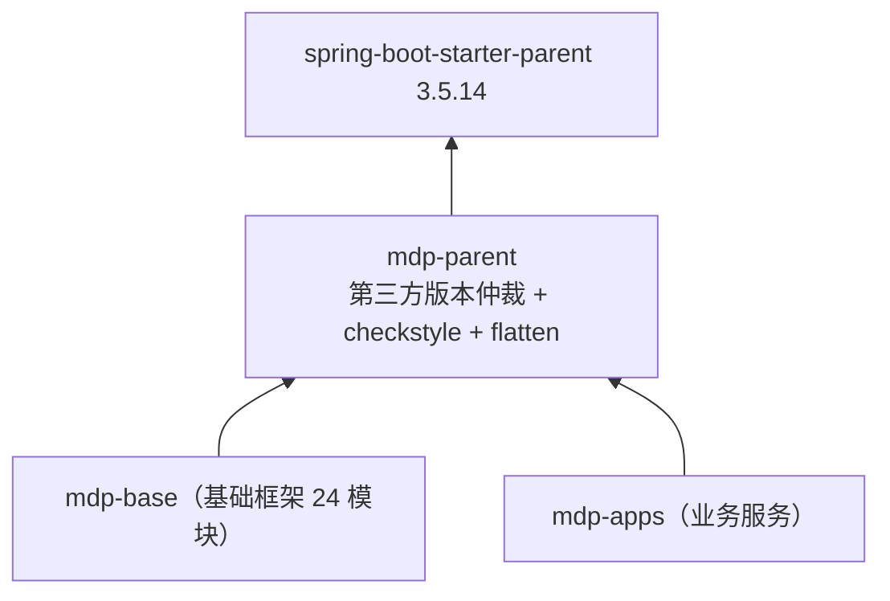

## 1. 模块定位

`mdp-parent` 是整个 MDP 后端所有工程的**依赖版本仲裁 POM + 构建规范基线**，`packaging=pom`，自身无任何 Java 代码，仅包含三个文件：

| 文件 | 作用 |
| --- | --- |
| `pom.xml` | 继承 Spring Boot 官方 parent，统一管理全部第三方依赖版本、插件与 profiles |
| `checkstyle.xml` | 全平台代码规范（命名、导入、体量、嵌套深度、Javadoc 等） |
| `suppressions.xml` | checkstyle 规则豁免清单 |

- Maven 坐标：`top.mddata.base:mdp-parent:${revision}`
- 继承关系：`org.springframework.boot:spring-boot-starter-parent:3.5.14`
- 运行环境：**JDK 17**、UTF-8
- 下游：`mdp-base`（及其全部子模块）、`mdp-apps` 等工程均继承本 POM



## 2. 源码解读

### 2.1 dependencyManagement：BOM import 顺序敏感

`pom.xml` 按固定顺序 import 了多个官方 BOM：

1. `spring-cloud-dependencies`（2025.0.2）
2. `spring-cloud-alibaba-dependencies`（2025.0.0.0）
3. `spring-framework-bom`（6.2.12）
4. `springdoc-openapi`（2.8.5）
5. `mybatis-flex-dependencies`（1.11.7）、`sa-token-bom`（1.45.0）、`knife4j-dependencies`（4.5.0）、`dubbo-bom`（3.3.6）

::: danger BOM 顺序不能乱
**「以上几个配置的顺序不能错，否则会导致 spring、springdoc 的版本不正确」**。Maven BOM 仲裁遵循「先声明者胜出」，调整顺序会静默改变传递依赖版本，引发难以排查的 NoSuchMethodError。
:::

### 2.2 版本清单（按类别）

| 类别 | 依赖 | 版本 |
| --- | --- | --- |
| 微服务 | spring-cloud / alibaba / dubbo / nacos-client / seata / sentinel | 2025.0.2 / 2025.0.0.0 / 3.3.6 / 3.2.1 / 2.0.0 / 1.8.6 |
| 监控 | spring-boot-admin | 3.5.9 |
| 持久层 | mybatis-flex / mybatis / druid / mysql / mssql-jdbc / 达梦 DmJdbcDriver18 | 1.11.7 / 3.5.19 / 1.2.27 / 8.0.33 / 8.0.33 / 8.1.3.140 |
| 认证安全 | sa-token / JustAuth / antisamy / aj-captcha / easy-captcha | 1.45.0 / 1.16.5 / 1.7.8 / 1.4.0 / 1.6.2 |
| 接口文档 | knife4j / springdoc / smart-doc / torna-sdk | 4.5.0 / 2.8.5 / 3.1.2 / 1.0.16 |
| 消息/存储 | sms4j / x-file-storage / aliyun-oss / 华为 obs / 百度 bce / 七牛 / minio | 3.3.5 / 2.3.0 / 3.18.4 / 3.25.10 / 0.10.405 / 7.19.0 / 8.6.0 |
| 定时任务 | powerjob（worker/client/official-processors） | 5.1.2 |
| 对象转换 | mapstruct / mapstruct-plus | 1.6.3 / 1.4.2 |
| 序列化 | fastjson2 / protostuff | 2.0.62 / 1.7.4 |
| Excel | fastexcel / poi | 1.3.0 / 5.3.0 |
| 工具 | hutool / guava / lombok / commons-* / oshi / ip2region / jasypt / transmittable-thread-local / groovy / enjoy | 5.8.44 / 33.6.0-jre / 1.18.46 / … / 7.1.0 / 3.3.7 / 4.0.3 / 2.14.0 / 4.0.26 / 5.1.3 |

::: tip sms4j 大量 exclude hutool
`sms4j-*` 全系列排除了自带的 `hutool-core/log/json/http/crypto/cron/setting`，统一使用平台仲裁的 `hutool-all`，避免类冲突。自行引入 sms4j 相关依赖时请照抄 exclusion。
:::

### 2.3 maven-compiler-plugin：注解处理器链

`pom.xml`，编译参数带 `-parameters`（保留方法参数名，Spring MVC/Feign 依赖它）。`annotationProcessorPaths` 顺序：

1. `lombok`

   项目中，用到了 Lombok 帮我们减少代码编写，同时用到 Mapstruct 进行 bean 转换。使用到 Lombok 和 Mapstruct 时，其要求我们在 pom.xml 添加 `annotationProcessorPaths` 配置， 此时，我们也需要把 MyBatis-Flex 的 annotation 添加到 `annotationProcessorPaths` 配置里去

2. `lombok-mapstruct-binding`

3. `mapstruct-processor`

4. `mapstruct-plus-processor`

5. `mybatis-flex-processor` —— 编译期生成 `XxxTableDef` 表定义类

   MyBatis-Flex 使用了 APT（Annotation Processing Tool）技术，在项目编译的时候，会自动根据 Entity 类定义的字段帮你生成 "ACCOUNT" 类以及 Entity 对应的 Mapper 类， 通过开发工具构建项目，或者执行 maven 编译命令: `mvn clean package` 都可以自动生成。这个原理和 lombok 一致。

6. `spring-boot-configuration-processor` —— 生成 `spring-configuration-metadata.json`，让 IDE 对 `mdp.*` 配置有提示（pom 注释：**一定要加，否则无法生成提示文件**）

### 2.4 其他构建约定

| 配置 | 说明 |
| --- | --- |
| `maven-resources-plugin` | `nonFilteredFileExtensions` 排除 pem/pfx/p12/key/db/xdb/字体/svg 等二进制文件被 Maven filtering 破坏 |
| `maven-checkstyle-plugin 3.3.1` | `configLocation=checkstyle.xml`、`failsOnError=true`，绑定 **validate 阶段**执行 check —— 编译前先过规范检查 |
| `flatten-maven-plugin 1.2.7` | `resolveCiFriendliesOnly` 模式，process-resources 阶段生成 `.flattened-pom.xml`，配合 `${revision}` 实现 CI 友好版本 |
| `repositories` | 阿里云镜像 + sonatype OSS |

### 2.5 profiles

| profile | 作用 |
| --- | --- |
| `dev`（默认激活） | 设置 `profile.active=dev`，供资源过滤注入 `application-dev.yml` |
| `test` / `prod` | 同上，切换环境标识 |
| `release` | 发布到 OSS 中央仓库：追加 source、javadoc（`-Xdoclint:none`）、gpg 签名插件 |

### 2.6 checkstyle.xml 规范要点

`Checker + TreeWalker` 双层结构。下面按规则逐个给出**最佳实践**与**错误示范**（括号内为本工程的实际限制值）：

#### 2.6.1 命名规范（ConstantName / MemberName / MethodName / TypeName / PackageName / ParameterName）

```java
// ❌ 错误示范
public class user_service { }                  // TypeName：类名必须大驼峰
private String UserName;                        // MemberName：成员变量必须小驼峰
private static final int MaxRetry = 3;          // ConstantName：常量必须全大写下划线
public void GetUser() { }                       // MethodName：方法名必须小驼峰
public void send(String user_name) { }          // ParameterName：参数名必须小驼峰
package top.Mddata.Base;                        // PackageName：包名必须全小写

// ✅ 最佳实践
public class UserService { }
private String userName;
private static final int MAX_RETRY = 3;
public void getUser() { }
public void send(String userName) { }
package top.mddata.base;
```

#### 2.6.2 导入规范（UnusedImports / RedundantImport / IllegalImport）

```java
// ❌ 错误示范
import java.util.ArrayList;          // UnusedImports：从未使用
import java.util.List;
import java.util.List;               // RedundantImport：重复导入
import sun.misc.Unsafe;              // IllegalImport：禁止引用 JDK 内部 API

// ✅ 最佳实践：只导入实际使用的类；IDE 自动 optimize import 即可保持干净
import java.util.List;
```

#### 2.6.3 体量限制（FileLength 2500 / MethodLength 300 / LineLength 10000 / ParameterNumber 8）

```java
// ❌ 错误示范：参数 9 个，超过 ParameterNumber=8
public void create(String name, Integer age, String phone, String email,
                   String address, String city, String zip, String remark, Integer status) { }

// ✅ 最佳实践：参数超过 8 个时收拢成对象
public void create(UserCreateDto dto) { }
```

- **MethodLength（300 行）**：方法超长说明职责过多，按业务步骤拆私有方法；
- **FileLength（2500 行）**：类超长说明违反单一职责，按领域拆类；
- **LineLength（10000）**：实际不限制，但保持 120~200 列内更利于代码评审比对。

#### 2.6.4 嵌套深度（NestedForDepth 2 / NestedTryDepth 3 / NestedIfDepth 10）

```java
// ❌ 错误示范：三层 for 嵌套，超过 NestedForDepth=2
for (Org org : orgs) {
    for (User user : org.getUsers()) {
        for (Role role : user.getRoles()) {        // 违规
            ...
        }
    }
}

// ✅ 最佳实践：提方法或用流式/早退压平
for (Org org : orgs) {
    processUsers(org.getUsers());
}

private void processUsers(List<User> users) {
    for (User user : users) {
        user.getRoles().forEach(this::handleRole);
    }
}
```

异常同理：嵌套 try 超 3 层说明异常边界划分有问题，按分层职责收敛异常处理。

#### 2.6.5 常见缺陷（EqualsHashCode / StringLiteralEquality / SimplifyBoolean / ModifierOrder / MissingSwitchDefault / UncommentedMain）

```java
// ❌ EqualsHashCode：只重写 equals 不重写 hashCode
public boolean equals(Object o) { ... }            // 缺 hashCode()，HashMap 语义被破坏

// ❌ StringLiteralEquality：用 == 比较字符串（比较的是引用）
if (status == "SUCCESS") { }

// ✅ 最佳实践
if ("SUCCESS".equals(status)) { }                 // 字面量放前面还防 NPE

// ❌ SimplifyBoolean：冗余布尔表达式
if (isVip == true) { }
return isDeleted ? true : false;

// ✅ 最佳实践
if (isVip) { }
return isDeleted;

// ❌ ModifierOrder：修饰符乱序
public final static String KEY = "k";

// ✅ 最佳实践：按 java.lang 规范顺序 public → static → final
public static final String KEY = "k";

// ❌ MissingSwitchDefault：switch 缺 default 分支
switch (type) {
    case ADD -> handleAdd();
    // 新增枚举值时静默漏处理
}

// ✅ 最佳实践
default -> throw new IllegalArgumentException("未知类型: " + type);   // fail fast

// ❌ UncommentedMain：遗留裸 main 方法（应删除或移到测试代码）
public static void main(String[] args) { System.out.println("test"); }
```

#### 2.6.6 Javadoc（JavadocType）

```java
// ❌ 错误示范：公共类型无文档注释（构建直接失败）
public class SmsSender { }

// ✅ 最佳实践：类上必须 Javadoc，说明职责与作者
/**
 * 短信发送服务：封装 sms4j 多渠道发送与模板参数渲染
 *
 * @author henhen6
 * @since 2026/01/15
 */
public class SmsSender { }
```

`suppressions.xml` 对个别文件豁免（如 Sa-Token 定制源码 `SaSsoClientProcessor`/`SaSsoServerProcessor` 的 MethodName 规则），如在引入第三方源码时改动源码太麻烦，可以加入豁免清单。

## 3. 可配置参数

本模块无运行期配置。构建期可干预的参数：

| 参数 | 默认值 | 说明 |
| --- | --- | --- |
| `${revision}` | `1.5.0-SNAPSHOT` | 全平台版本号，发版时统一修改 |
| `${profile.active}` | `dev` | 通过 `-Ptest` / `-Pprod` 切换 |
| `-Dcheckstyle.skip=true` | 不跳过 | 本地快速构建时跳过规范检查 |

## 4. 扩展点

- **继承即扩展**：二开新建 Maven 工程时 `<parent>` 指向 `mdp-parent`，即获得全部版本 + checkstyle + flatten 行为，dependency 无需写版本号
- **版本覆盖**：子工程可在自己的 `<properties>` 中重定义版本号属性（如 `<hutool.version>`）实现局部升级
- **规范定制**：`checkstyle.xml`/`suppressions.xml` 可被下游覆盖（pluginManagement 中路径是相对的，子模块放同名文件即可替换）

## 5. 功能扩展建议

| 想做什么 | 推荐做法 |
| --- | --- |
| 引入新第三方依赖 | 在 `mdp-parent` 的 dependencyManagement 统一声明版本，子模块只写 GAV 不写 version |
| 升级 Spring Boot | 同时改 parent 版本与 `spring-boot.version` 属性，并核对 spring-cloud/alibaba 兼容矩阵 |
| 放宽某条 checkstyle 规则 | 优先在 `suppressions.xml` 按文件豁免，而不是全局关闭规则 |
| 二开工程不想继承 | 退而求其次：import `md-bom`（见 [md-bom](mdp-base/md-bom.md)）获得内部构件版本管理，但第三方版本需自行仲裁 |

## 6. 二次开发注意事项

::: warning 高频坑点
1. **BOM import 顺序**：spring-cloud → alibaba → spring-framework → springdoc 的顺序不可调整（见 2.1）。
2. **checkstyle 绑定 validate**：`mvn compile` 也会触发规范检查，代码不合规直接构建失败；CI 快速验证可加 `-Dcheckstyle.skip=true`，但提交前必须本地跑通。
3. **`${revision}` + flatten**：直接修改子模块 pom 的 version 是无效的，版本号只在 `mdp-parent` 与 `md-bom` 的 `revision` 属性处维护；`.flattened-pom.xml` 是构建产物，不要手工编辑、不要提交修改。
4. **mssql-jdbc 8.0.33 默认适配 JDK8**：pom 注释明确说明，其他 JDK 版本需自行更换对应 jar。
5. **注解处理器顺序**：lombok 必须在 mapstruct 之前（binding 桥接），新增 processor 时保持既有顺序，否则可能生成空实现。
:::
