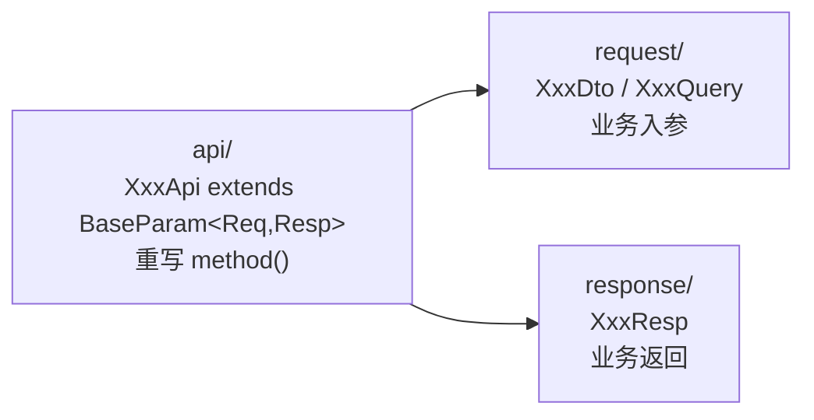

# mdp-simple-sdk（第三方业务 SDK）

## 1. 模块定位

真正交付给第三方的 API 类库：基于 mdp-sdk-core，按业务域封装 mdp-openapi 服务端 `@Open` 接口。

- Maven 坐标：`top.mddata.sdk:mdp-simple-sdk`
- 依赖：仅 `mdp-sdk-core`（测试期 junit/slf4j/logback）
- 包根：`top.mddata.sdk.simple`

## 2. 源码解读

### 2.1 三件套包约定

`package-info.java` 约定了包语义，每个业务接口由三个类组成：



| 包 | 职责 | 命名习惯 |
|---|---|---|
| `api/{域}/` | 接口封装类，继承 `BaseParam<Req, Resp>` | `XxxApi` |
| `request/{域}/` | 业务请求参数 | 写操作 `XxxDto`、查询条件 `XxxQuery` |
| `response/{域}/` | 业务响应参数 | `XxxResp` |

### 2.2 API 清单（method 值与服务端 @Open 一一对应）

**token** —— 令牌：

| API 类 | method() | 入参 → 返回 | 说明 |
|---|---|---|---|
| `AccessTokenGetApi` | `accessToken.get` | `AccessTokenGetDto`(appKey/appSecret/forceRefresh) → `AccessTokenGetResp`(accessToken/expiresIn) | **重写 `getSignEnabled()=true`，必须签名** |

**user** —— 用户：

| API 类 | method() | 入参 → 返回 |
|---|---|---|
| `UserGetByIdApi` | `user.getById` | `IdRequest` → `UserResp` |
| `UserPageApi` | `user.page` | `PageParams<UserQuery>` → `Page<UserResp>` |
| `UserBatchSaveApi` | `user.batchSave` | `UserBatchSaveDto`(list) → `UserBatchSaveResp`，支持 `setNotifyUrl` 异步回调 |
| `UserUpdateByIdApi` | `user.updateById` | `UserUpdateDto`(继承 `UserSaveDto`) → `UserResp` |

**org** —— 机构：

| API 类 | method() | 入参 → 返回 |
|---|---|---|
| `OrgGetByIdApi` | `org.getById` | `IdRequest` → `OrgResp` |
| `OrgPageApi` | `org.page` | `PageParams<OrgQuery>` → `Page<OrgResp>` |
| `OrgSaveApi` | `org.save` | `OrgSaveDto` → `OrgResp` |
| `OrgUpdateByIdApi` | `org.updateById` | `OrgUpdateDto`(继承 `OrgSaveDto`) → `OrgResp` |

**msg** —— 消息（入参均继承抽象基类 `MsgSendDto`：templateKey/paramList(`List<Kv>`)/isTiming/scheduledSendTime/bizId/bizType，`addParam(key,value)` 链式添加模板参数；返回均为 `Void`）：

| API 类 | method() | 入参 |
|---|---|---|
| `SendSmsApi` | `msg.sendSms` | `SendSmsDto`(recipientList) |
| `SendMailApi` | `msg.sendEmail` | `SendMailDto` |
| `SendNoticeApi` | `msg.sendNotice` | `SendNoticeDto` |

**demo** —— 示例（文件上传下载）：

| API 类 | method() | 入参 → 返回 |
|---|---|---|
| `DemoFileUploadApi` | `demo.upload.more` | `DemoFileUploadRequest` → `UserResp` |
| `DemoFileDownloadApi` | `demo.download` | `DemoFileDownloadRequest`(id) → `Object` |

### 2.3 标准调用流程

从 `src/test/java/top/mddata/sdk/test/BaseTest.java` 提炼（各业务测试类 `UserTest`/`OrgTest`/`MsgTest`/`TokenTest` 均照此模式）：

```java
// ① 声明客户端（一个即可）
OpenClient client = new OpenClient("{gateway-url}/api", "{appKey}", "{私钥}");

// ② 换取 accessToken 并设为默认（setUp 阶段执行一次）
AccessTokenGetApi tokenApi = new AccessTokenGetApi();
tokenApi.setBizModel(new AccessTokenGetDto()
        .setAppKey("{appKey}").setAppSecret("{appSecret}"));
Result<AccessTokenGetResp> r = client.execute(tokenApi);
client.setDefaultAccessToken(r.getData().getAccessToken());

// ③ 调用业务接口
UserPageApi api = new UserPageApi();
PageParams<UserQuery> params = new PageParams<>(1, 10);
params.setModel(new UserQuery());
api.setBizModel(params);
Result<Page<UserResp>> result = client.execute(api);

// ④ 判定结果：isSuccess() 依据 subCode 是否为空
if (result.isSuccess()) {
    result.getData().getRecords().forEach(System.out::println);
}
```

### 2.4 测试目录

| 测试类 | 验证内容 |
|---|---|
| `BaseTest` | 公共基类：client 声明 + getAccessToken() + logResult() |
| `token/TokenTest`、`user/UserTest`、`org/OrgTest`、`msg/MsgTest` | 各业务域 CRUD |
| `demo/NotifyTest` | 回调消息（AES 加解密）联调 |
| `rsa/RsaToolTest` | 密钥生成与格式转换 |
| `demo/HttpPostTest`、`demo/SdkTest` | 裸 HTTP 与历史用法（SdkTest 已注释） |

## 3. 可配置参数

无配置项。网关地址、appKey、私钥通过 `OpenClient` 构造器传入，其余行为见 [mdp-sdk-core](mdp-sdk-core.md) 的 OpenConfig 一节。

## 4. 扩展点

第三方（或平台方）新增接口封装时，照抄三件套模式：

1. `request/{域}/` 新建入参 DTO（普通 POJO，Serializable；查询条件命名 `XxxQuery`）
2. `response/{域}/` 新建返回类 `XxxResp`
3. `api/{域}/` 新建 `XxxApi extends BaseParam<Req, Resp>`，重写 `method()` 返回服务端 `@Open("xxx.yyy")` 的值
4. 特殊场景：
   - 分页接口：Req 用 `PageParams<XxxQuery>`、Resp 用 `Page<XxxResp>`
   - 按 id 查询：Req 直接复用 `IdRequest`
   - 文件下载：继承 `DownloadRequest<Req>`（`OpenClient` 检测到 `DownloadAware` 后返回 `FileResult`），配合 `client.download(...)`
   - 文件上传：`api.addFile(new UploadFile(...))`
   - 强制签名：重写 `getSignEnabled()` 返回 `true`（参照 `AccessTokenGetApi`）
   - 异步回调：`api.setNotifyUrl(...)`（参照 `UserTest.testSave`）

::: tip 服务端先行
SDK 只是壳，新增接口需先在服务端 mdp-openapi 模块用 `@Open` 发布（见 md-sop-support 文档），method 值两侧必须完全一致。
:::

## 5. 功能扩展建议

- **封装更高层的门面**：ISV 可再包一层自己的 Facade（缓存 accessToken、自动重试、异常转译），SDK 本身不内置 token 过期自动刷新，`AccessTokenGetDto.forceRefresh` 可强制换新
- **按域拆分交付**：如果只给第三方开放部分能力，可按 `api/{域}` 包裁剪交付，各域之间无相互依赖
- **新增业务域**：直接新建 `api/xxx`、`request/xxx`、`response/xxx` 三个包，遵循既有命名即可，无需改动 core

## 6. 二次开发注意事项

::: warning 测试代码含真实测试环境密钥
`BaseTest.java` 内明文写了测试环境的 appKey/appSecret/私钥。二开时：不要把生产密钥写进测试类；对外发布 SDK 前清理或占位符化这些常量。
:::

::: warning method 值是协议的一部分
`method()` 字符串与服务端 `@Open` 注解 value 强耦合，改名等同破坏兼容。已发布给第三方的 API 类不要改 method 值，如需升级用 `version()`/`setVersion()` 走多版本。
:::

- 入参 DTO 字段名即 `bizContent` JSON 的字段名，与服务端接收对象字段必须一致（fastjson2 序列化，下划线风格不互通）
- `demo.download` 的示例类 `DemoFileDownloadApi` 目前继承的是普通 `BaseParam`，未走 `DownloadAware` 分支；实现真实下载接口时应继承 `DownloadRequest`
