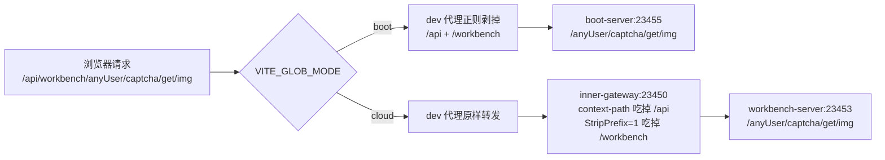

前端工程 `mdp-vben` 基于 vue-vben-admin 5.x 二次开发，技术栈为 radix-vue、Vue3、Vite、antdv-next、TypeScript、vxe-table，是一个 pnpm monorepo，内含三个独立应用：工作台、控制台、开发者中心。

详情的使用文档请参考他们的官方文档：

- vben-admin：https://doc.vben.pro/
- antdv-next： https://antdv-next.com/
- vxe-table：https://vxetable.cn/v4/

**后端无论部署成单体版还是微服务版，前端代码都不用改一行**——架构差异全部收敛在开发代理的一个开关 `VITE_GLOB_MODE` 上。本文按这条主线讲清楚「装什么、起哪个命令、怎么确认模式生效」；每个配置项的含义见[前端配置](../../config/前端配置.md)。

## 一、环境要求

| 项 | 要求 | 依据 |
| --- | ---- | ---- |
| Node | `^22.18.0 \|\| ^24.12.0`（仓库自带 `.node-version` 为 24.16.0） | `mdp-vben/package.json:108-110` |
| pnpm | `>=11.0.0`，与 `packageManager: pnpm@11.21.0` 一致 | `mdp-vben/package.json:110,112` |
| 包管理器 | **只能用 pnpm**，`preinstall` 挂了 `npx only-allow pnpm`，用 npm/yarn 会被直接拦下 | `mdp-vben/package.json:52` |

::: warning 不要用 npm install

monorepo 依赖大量 pnpm workspace 特性（`workspace:*`、`catalog:`），npm 装不上或装出来跑不了。

:::

## 二、三个应用

| 应用 | 目录 | 端口 | `VITE_GLOB_APP_ID` | 定位 |
| ---- | ---- | :--: | :--: | ---- |
| 工作台 | `apps/web-workbench` | 7700 | 1 | 统一登录入口、门户 |
| 控制台 | `apps/web-console` | 7710 | 2 | 管理端（组织、用户、权限、系统配置） |
| 开发者中心 | `apps/web-open` | 7720 | 3 | 开放平台（应用、秘钥、事件订阅） |

- 端口来自各应用的 `apps/*/.env.development:2`（`VITE_PORT`），三端只在这一个值上不同，其余开发配置完全相同。
- 三个应用是彼此独立的 dev server，**一条命令只起一个**，要三端同时跑就开三个终端。
- 三端之间靠单点登录共享会话，登录统一走工作台。

## 三、安装依赖

```shell
# 在 mdp-vben 根目录
pnpm bootstrap      # 等价于 pnpm i --registry=https://registry.npmmirror.com
```

`pnpm bootstrap` 是项目预置的国内镜像安装命令（`package.json:28`）；网络没问题时 `pnpm install` 同样可以。安装结束后 `postinstall` 会对各子包执行 `stub`，第一次会慢一些。

## 四、启动：先定后端架构，再选命令

### 1. 两种模式对应什么

| 后端架构 | `VITE_GLOB_MODE` | 代理目标 | 路径处理 | 需要启动的后端 |
| -------- | :--------------: | -------- | -------- | -------------- |
| 单体版 | `boot` | `http://localhost:23455`（boot-server） | 剥掉 `/api` 和第一段服务名 | 见[单体版启动](backend/单体版启动.md) |
| 微服务版 | `cloud` | `http://localhost:23450`（inner-gateway） | 原样转发，交给网关路由 | 见[微服务版启动](backend/微服务版启动.md) |

规则写在 `apps/*/.env.development:20` 的 `VITE_PROXY` 里——它是一段 JSON，按 `boot` / `cloud` 分成两组，启动时按当前模式取对应那组。**三个应用的这套规则完全相同**，不需要分别改。

### 2. 三种切换方式

以下命令均在 `mdp-vben` **根目录**执行。想只起某一个应用又不想每次都带 `--filter`，可以进到应用目录跑同名脚本，效果一致：

```shell
cd apps/web-workbench && pnpm dev:cloud
```

方式一，**命令行指定（推荐）**，不动任何文件：

```shell
pnpm dev:boot     # 以单体模式启动，交互式选择应用
pnpm dev:cloud    # 以微服务模式启动，交互式选择应用
```

方式二，改默认值：把 `apps/*/.env` 的 `VITE_GLOB_MODE`（出厂为 `boot`，见 `web-workbench/.env:18`、`web-console/.env:20`、`web-open/.env:21`）改成 `cloud`，之后 `pnpm dev` 就是微服务模式。

方式三，用 `dev:workbench` 这类**应用级**命令直接指定应用——注意它不带模式后缀，取的是 `.env` 的值，详见下方 warning。

三类命令实际跑的是什么、模式从哪来，汇总如下：

| 命令 | 实际执行 | 模式来源 |
| ---------- | -------- | -------- |
| `pnpm dev` / `dev:boot` / `dev:cloud` | 交互式选应用，跑对应 app 的同名脚本 | 后两者由命令行强制指定；`dev` 取 `.env` 的值 |
| `pnpm dev:workbench` / `dev:console` / `dev:open` | `pnpm -F @vben/web-xxx run dev` | **取 `.env` 的值（出厂 `boot`）** |

::: warning dev:workbench 不带模式后缀

`dev:workbench`、`dev:console`、`dev:open` 底层调的是各应用的 `dev` 脚本，模式仍是 `.env` 里的 `boot`。微服务版想单独起某一端，用应用级带后缀的脚本：

```shell
pnpm --filter @vben/web-workbench run dev:cloud
pnpm --filter @vben/web-console   run dev:cloud
pnpm --filter @vben/web-open      run dev:cloud
```

:::

**为什么命令行能盖住 `.env` 里的出厂值**

`apps/*/.env` 写的明明是 `VITE_GLOB_MODE=boot`，那 `pnpm dev:cloud` 凭什么让它按微服务跑？三步：

1. `dev:cloud` 的真实命令是 `cross-env VITE_GLOB_MODE=cloud vite --mode development`——`cross-env` 干的事就是把 `VITE_GLOB_MODE=cloud` 塞进这次启动进程的环境变量；
2. Vite 起来后先读 env 文件，读到的值是 `boot`；
3. 读完文件，Vite 再回头看一遍本进程的环境变量，凡是 `VITE_` 开头的都拿来覆盖前面的结果——于是 `cloud` 赢了。

一句话：**环境变量比 env 文件更晚参与合并，所以优先级最高**。本项目里这个键的完整覆盖顺序如下（越靠下越优先）：

| 顺序 | 来源 | `VITE_GLOB_MODE` 的值 | 说明 |
| :--: | ---- | --------------------- | ---- |
| 1 | `.env` | `boot` | 项目出厂默认，三个应用各有一处 |
| 2 | `.env.development` | （没写这个键） | 三端只在这里改 `VITE_PORT` |
| 3 | 进程环境变量 | `cloud` | 由 `dev:cloud` 的 `cross-env` 注入 |

所以 `dev:boot` / `dev:cloud` 是**一次性的**，不改动任何文件；要永久换模式才去动 `.env`。本次到底生效了哪个模式不用猜——看启动日志那行代理地址（本节第 4 步）。

> 想核对源码：Vite 的 `loadEnv` 按 `.env` → `.env.local` → `.env.development` → `.env.development.local` 顺序合并文件（后者覆盖前者，本项目未使用 `.local` 文件），最后再用 `process.env` 里 `VITE_` 开头的变量覆盖一遍；取值的位置在 `apps/web-workbench/vite.config.ts:93,103`。

### 3. 启动与访问

执行 `pnpm dev`（或 `dev:boot` / `dev:cloud`），用上下键选择要启动的应用，回车确认：


想跳过交互直接指定应用，用应用级命令（模式取 `.env` 的值）：

```shell
# 启动工作台
pnpm dev:workbench
# 启动控制台
pnpm dev:console
# 启动开发者中心
pnpm dev:open
```

浏览器访问对应端口：

```shell
# 访问工作台
http://localhost:7700/
# 访问控制台
http://localhost:7710/
# 访问开发者中心
http://localhost:7720/
```

::: info 截图与最新版文案略有差异

截图里的选择提示是英文 `Select the app you need to run [dev]:`，当前源码（`scripts/turbo-run/src/run.ts:29`）已中文化为「选择要启动的应用」。交互方式没有变化。

:::

### 4. 用一行日志确认模式生效

`vite.config.ts` 在组装代理时会把生效规则打进启动日志（`apps/web-workbench/vite.config.ts:36-42`），启动后先看这一行：

```
# boot 模式下应看到
代理配置为：请求的URL前缀为[/api]开头的接口,[/api/[A-Za-z0-9]+]被替换为[],并代理到后台地址：[http://localhost:23455]

# cloud 模式下应看到
代理配置为：请求的URL前缀为[/api]开头的接口,[/api]被替换为[/api],并代理到后台地址：[http://localhost:23450]
```

目标端口是 23455 还是 23450，一眼就能判断模式和后端架构对不对得上；接口报错时先回来看这行，比翻浏览器 Network 快。

## 五、为什么前端代码不用改

以工作台取图形验证码为例，前端实际发出的地址是 `/api` + `/workbench/anyUser/captcha/get/img`，**服务段 `/workbench` 是拼在请求路径里的**，两种模式的区别只是「由谁把它去掉」：



| 环节 | 路径 | 依据 |
| ---- | ---- | ---- |
| 服务段常量 | `WORKBENCH = '/workbench'`、`CONSOLE = '/console'`、`OPEN = '/open'` | `packages/constants/src/enums/commonEnum.ts:4-14` |
| 接口路径拼服务段 | `const ServicePrefix = ServicePrefixEnum.WORKBENCH` → `/workbench/anyUser/captcha/...` | `apps/web-workbench/src/api/common/captcha.ts:7-8` |
| 请求 baseURL | `VITE_GLOB_API_URL=/api` | `apps/web-workbench/src/api/request.ts:22,123` |
| boot 剥两段 | `rewriteBefore: "/api/[A-Za-z0-9]+"` → `rewriteAfter: ""` | `apps/web-workbench/.env.development:27-32` |
| cloud 交给网关 | `Path=/workbench/**` + `StripPrefix=1`，网关 `context-path: /api` | Nacos `inner-gateway-server.yml` |
| 后端只有一份映射 | `@RequestMapping("/anyUser/captcha")`，**不含服务段** | `workbench-web/.../controller/CaptchaController.java:42` |

结论：服务段是「给网关看的路由标签」，单体版没网关，就靠 dev 代理（生产靠 Nginx）把它剥掉。所以后端 controller 一套映射通吃两种部署，前端也不需要按架构改代码。

## 六、生产打包

```shell
# 同样在 mdp-vben 根目录执行
# 全量构建三个应用
pnpm build
# 只构建某一个应用
pnpm build:workbench    # 或 build:console、build:open
```

产物在 `apps/<应用>/dist`，纯静态文件，任意静态服务器都能托管。

::: warning 生产环境的架构差异不在前端，在反向代理

`VITE_PROXY` 只作用于 Vite 开发服务器，**打包后不生效**——`build:boot` 与 `build:cloud` 的产物在功能上等价。生产的单体/微服务差异要在 Nginx（或网关自身）上复刻第四节的代理规则：

```nginx
# 微服务版：/api 原样转发给 inner-gateway，由它按服务段路由
location /api/ {
    proxy_pass http://127.0.0.1:23450;
}

# 单体版：必须像 dev 代理一样剥掉 /api 和第一段服务名，boot-server 才匹配得上
location /api/ {
    rewrite ^/api/[A-Za-z0-9]+/(.*)$ /$1 break;
    proxy_pass http://127.0.0.1:23455;
}
```

以上为最小示例，`proxy_set_header`、超时、跨域等按现场补充。仓库自带的 `scripts/deploy/nginx.conf` 只做静态资源托管，**没有 `/api` 反代**，直接拿去用会表现为「页面能打开、接口全 404」。

:::

另外，前端路由是 hash 模式（`apps/*/.env` 的 `VITE_ROUTER_HISTORY=hash`），所以后端单点登录配置里的登录页、授权页地址必须带 `/#/`，例如 `http://localhost:7700/#/auth/login`，见[单点登录客户端配置](../../config/单点登录客户端配置.md)。

## 七、常见问题

| 现象 | 原因与处理 |
| ---- | ---------- |
| 页面能打开，所有接口 404 / 502 | 模式与后端架构不匹配：看第四节的代理日志，boot 却指向 23450（或反之）。改用 `dev:boot` / `dev:cloud`，或确认后端进程已启动 |
| 微服务版下部分接口 404、登录正常 | 用了 `dev:workbench` 这类不带后缀的命令，实际是 boot 模式（见第四节 warning）。改 `pnpm --filter @vben/web-xxx run dev:cloud` |
| 提示端口被占用、访问到另一个应用 | 三个 dev server 分别占 7700/7710/7720，若手工改成相同值，Vite 会自动顺延到别的端口。改回各应用 `.env.development:2` |
| 用自定义域名访问被拒绝（Invalid Host header） | 工作台在 `vite.config.ts:100-102` 显式绑定 `host: 'localhost'` 且 `allowedHosts` 只允许 `127.0.0.1`、`localhost`。需要域名访问时自行加白名单 |
| 控制台点「开发者中心」跳不动 | `VITE_GLOB_OPEN_PLATFORM_URL` 指向的地址不对（开发为 `http://localhost:7720`，`.env.production` 里是占位域名，部署前必须改） |
| 登录报「非法 client」 | `VITE_GLOB_APP_KEY` 与后端 `sa-token.sso-clients` 的 key 不一致，见[前端配置](../../config/前端配置.md) |
| 想要离线跑页面、不连后端 | 项目预置的 Nitro Mock 默认关闭（`.env.development:8` `VITE_NITRO_MOCK=false`），改成 `true` 可走本地 mock，但真实业务接口仍需后端 |
